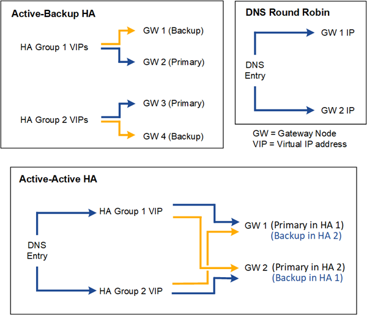

= Opciones de configuración para grupos de alta disponibilidad
:allow-uri-read: 
:icons: font
:imagesdir: ../media/

[role="lead"]
Los siguientes diagramas proporcionan ejemplos de diferentes formas en las que se pueden configurar grupos de HA.  Cada opción tiene ventajas y desventajas.

En los diagramas, el azul indica la interfaz principal en el grupo HA y el amarillo indica la interfaz de respaldo en el grupo HA.

La tabla resume los beneficios de cada configuración de HA que se muestra en el diagrama.

[cols="1a,2a,2a"]
|===
| Configuración | Ventajas | Desventajas 

 a| 
Alta disponibilidad de respaldo activo
 a| 
* Administrado por StorageGRID sin dependencias externas.
* Conmutación por error rápida.

 a| 
* Solo un nodo en un grupo HA está activo.  Al menos un nodo por grupo HA estará inactivo.

 a| 
DNS Round Robin
 a| 
* Aumento del rendimiento agregado.
* No hay hosts inactivos.

 a| 
* Conmutación por error lenta, que podría depender del comportamiento del cliente.
* Requiere configuración de hardware fuera de StorageGRID.
* Necesita un control de salud implementado por el cliente.

 a| 
HA activo-activo
 a| 
* El tráfico se distribuye entre varios grupos de alta disponibilidad.
* Alto rendimiento agregado que escala con la cantidad de grupos de HA.
* Conmutación por error rápida.

 a| 
* Más complejo de configurar.
* Requiere configuración de hardware fuera de StorageGRID.
* Necesita un control de salud implementado por el cliente.

|===