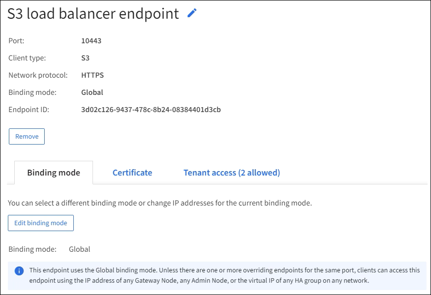

= Configurar los puntos finales del balanceador de carga
:allow-uri-read: 
:icons: font
:imagesdir: ../media/

[role="lead"]
Los puntos finales del balanceador de carga determinan los puertos y los protocolos de red que los clientes S3 pueden usar cuando se conectan al balanceador de carga StorageGRID en los nodos de puerta de enlace y de administración.  También puede utilizar puntos finales para acceder al Administrador de red, al Administrador de inquilinos o a ambos.

TIP: Se han eliminado los detalles rápidos de esta versión del sitio de documentación. Ver https://docs.netapp.com/us-en/storagegrid-118/admin/configuring-client-connections.html["Configurar conexiones de cliente S3 y Swift"^] .

.Antes de empezar
* Ha iniciado sesión en Grid Manager mediante unlink:../admin/web-browser-requirements.html["navegador web compatible"] .
* Tú tienes ellink:admin-group-permissions.html["Permiso de acceso root"] .
* Usted ha revisado ellink:managing-load-balancing.html["Consideraciones para el equilibrio de carga"] .
* Si anteriormente reasignó un puerto que desea utilizar para el punto final del balanceador de carga, debelink:../maintain/removing-port-remaps.html["Se eliminó la reasignación del puerto"] .
* Ha creado todos los grupos de alta disponibilidad (HA) que planea utilizar.  Se recomiendan los grupos HA, pero no son obligatorios. Ver link:managing-high-availability-groups.html["Administrar grupos de alta disponibilidad"] .
* Si el punto final del balanceador de carga será utilizado porlink:../admin/manage-s3-select-for-tenant-accounts.html["Inquilinos de S3 para S3 Select"] , no debe utilizar las direcciones IP o FQDN de ningún nodo físico.  Solo se permiten dispositivos de servicios y nodos de software basados en VMware para los puntos finales del equilibrador de carga utilizados para S3 Select.
* Ha configurado todas las interfaces VLAN que planea utilizar. Ver link:configure-vlan-interfaces.html["Configurar interfaces VLAN"] .
* Si está creando un punto final HTTPS (recomendado), tiene la información del certificado del servidor.
+

NOTE: Los cambios en un certificado de punto final pueden tardar hasta 15 minutos en aplicarse a todos los nodos.

+
** Para cargar un certificado, necesita el certificado del servidor, la clave privada del certificado y, opcionalmente, un paquete de CA.
** Para generar un certificado, necesita todos los nombres de dominio y direcciones IP que los clientes S3 usarán para acceder al punto final.  También debes conocer el tema (Nombre Distinguido).
** Si desea utilizar el certificado API S3 de StorageGRID (que también se puede usar para conexiones directas a nodos de almacenamiento), ya ha reemplazado el certificado predeterminado con un certificado personalizado firmado por una autoridad de certificación externa. Ver link:../admin/configuring-custom-server-certificate-for-storage-node.html["Configurar certificados de API S3"] .

== Crear un punto final de balanceador de carga

Cada punto final del balanceador de carga del cliente S3 especifica un puerto, un tipo de cliente (S3) y un protocolo de red (HTTP o HTTPS). Los puntos finales del balanceador de carga de la interfaz de administración especifican un puerto, un tipo de interfaz y una red de cliente no confiable.

=== Acceder al asistente

.Pasos
. Seleccione *CONFIGURACIÓN* > *Red* > *Puntos finales del balanceador de carga*.
. Para crear un punto final para un cliente S3 o Swift, seleccione la pestaña *Cliente S3 o Swift*.
. Para crear un punto final para acceder al Administrador de red, al Administrador de inquilinos o a ambos, seleccione la pestaña *Interfaz de administración*.
. Seleccione *Crear*.

=== Ingrese los detalles del punto final

.Pasos
. Seleccione las instrucciones adecuadas para ingresar detalles para el tipo de punto final que desea crear.

[role="tabbed-block"]
====
.Cliente S3 o Swift
--
[cols="1a,3a"]
|===
| Campo | Descripción 

 a| 
Nombre
 a| 
Un nombre descriptivo para el punto final, que aparecerá en la tabla de la página Puntos finales del balanceador de carga.

 a| 
Puerto
 a| 
El puerto StorageGRID que desea utilizar para equilibrar la carga.  Este campo tiene como valor predeterminado 10433 para el primer punto final que cree, pero puede ingresar cualquier puerto externo no utilizado del 1 al 65535.

Si ingresa *80* o *8443*, el punto final se configura solo en los nodos de puerta de enlace, a menos que haya liberado el puerto 8443.  Luego, puede usar el puerto 8443 como punto final S3, y el puerto se configurará tanto en los nodos de puerta de enlace como en los de administración.

 a| 
Tipo de cliente
 a| 
El tipo de aplicación cliente que utilizará este punto final, ya sea *S3* o *Swift*.

 a| 
Protocolo de red
 a| 
El protocolo de red que utilizarán los clientes cuando se conecten a este punto final.

* Seleccione *HTTPS* para una comunicación segura y cifrada con TLS (recomendado).  Debe adjuntar un certificado de seguridad antes de poder guardar el punto final.
* Seleccione *HTTP* para una comunicación menos segura y sin cifrar.  Utilice HTTP únicamente para una cuadrícula que no sea de producción.

|===
--
.Interfaz de gestión
--
[cols="1a,3a"]
|===
| Campo | Descripción 

 a| 
Nombre
 a| 
Un nombre descriptivo para el punto final, que aparecerá en la tabla de la página Puntos finales del balanceador de carga.

 a| 
Puerto
 a| 
El puerto StorageGRID que desea utilizar para acceder al Administrador de Grid, al Administrador de inquilinos o a ambos.

* Administrador de red: *8443*
* Gerente de inquilinos: *9443*
* Tanto el administrador de la red como el administrador de inquilinos: *443*

*Nota*: Puede utilizar estos puertos preestablecidos u otros puertos disponibles.

 a| 
Tipo de interfaz
 a| 
Seleccione el botón de opción para la interfaz StorageGRID a la que accederá mediante este punto final.

 a| 
Red de clientes no confiables
 a| 
Seleccione *Sí* si este punto final debe ser accesible para redes de clientes que no son de confianza.  De lo contrario, seleccione *No*.

Cuando selecciona *Sí*, el puerto se abre en todas las redes de cliente que no son de confianza.

*Nota*: Solo puede configurar un puerto para que esté abierto o cerrado para redes de clientes que no sean de confianza cuando crea el punto final del balanceador de carga.

|===
--
====
. Seleccione *Continuar*.

=== Seleccionar un modo de enlace

.Pasos
. Seleccione un modo de enlace para el punto final para controlar cómo se accede a él utilizando cualquier dirección IP o utilizando direcciones IP e interfaces de red específicas.
+
Algunos modos de enlace están disponibles para puntos finales de cliente o puntos finales de interfaz de administración.  Aquí se enumeran todos los modos para ambos tipos de puntos finales.

+
[cols="1a,3a"]
|===
| Modo | Descripción 

 a| 
Global (predeterminado para puntos finales del cliente)
 a| 
Los clientes pueden acceder al punto final utilizando la dirección IP de cualquier nodo de puerta de enlace o nodo de administración, la dirección IP virtual (VIP) de cualquier grupo de alta disponibilidad en cualquier red o un FQDN correspondiente.

Utilice la configuración *Global* a menos que necesite restringir la accesibilidad de este punto final.

 a| 
IP virtuales de grupos de alta disponibilidad
 a| 
Los clientes deben usar una dirección IP virtual (o FQDN correspondiente) de un grupo de HA para acceder a este punto final.

Todos los puntos finales con este modo de enlace pueden usar el mismo número de puerto, siempre que los grupos de HA que seleccione para los puntos finales no se superpongan.

 a| 
Interfaces de nodo
 a| 
Los clientes deben utilizar las direcciones IP (o FQDN correspondientes) de las interfaces de nodo seleccionadas para acceder a este punto final.

 a| 
Tipo de nodo (solo puntos finales del cliente)
 a| 
Según el tipo de nodo que seleccione, los clientes deben usar la dirección IP (o FQDN correspondiente) de cualquier nodo de administración o la dirección IP (o FQDN correspondiente) de cualquier nodo de puerta de enlace para acceder a este punto final.

 a| 
Todos los nodos de administración (predeterminado para los puntos finales de la interfaz de administración)
 a| 
Los clientes deben usar la dirección IP (o FQDN correspondiente) de cualquier nodo de administración para acceder a este punto final.

|===
+
Si más de un punto final usa el mismo puerto, StorageGRID usa este orden de prioridad para decidir qué punto final usar: *IP virtuales de grupos de alta disponibilidad* > *Interfaces de nodo* > *Tipo de nodo* > *Global*.

+
Si está creando puntos finales de interfaz de administración, solo se permiten nodos de administración.

. Si seleccionó *IP virtuales de grupos de HA*, seleccione uno o más grupos de HA.
+
Si está creando puntos finales de interfaz de administración, seleccione VIP asociados únicamente con nodos de administración.

. Si seleccionó *Interfaces de nodo*, seleccione una o más interfaces de nodo para cada nodo de administración o nodo de puerta de enlace que desee asociar con este punto final.
. Si seleccionó *Tipo de nodo*, seleccione Nodos de administración, que incluye tanto el nodo de administración principal como cualquier nodo de administración no principal, o Nodos de puerta de enlace.

=== Controlar el acceso de los inquilinos

NOTE: Un punto final de interfaz de administración puede controlar el acceso de los inquilinos solo cuando el punto final tiene la<<enter-endpoint-details,Tipo de interfaz del administrador de inquilinos>> .

.Pasos
. Para el paso *Acceso de inquilino*, seleccione una de las siguientes opciones:
+
[cols="1a,2a"]
|===
| Campo | Descripción 

 a| 
Permitir a todos los inquilinos (predeterminado)
 a| 
Todas las cuentas de inquilinos pueden usar este punto final para acceder a sus depósitos.

Debe seleccionar esta opción si aún no ha creado ninguna cuenta de inquilino.  Después de agregar cuentas de inquilino, puede editar el punto final del balanceador de carga para permitir o bloquear cuentas específicas.

 a| 
Permitir inquilinos seleccionados
 a| 
Solo las cuentas de inquilinos seleccionadas pueden usar este punto final para acceder a sus depósitos.

 a| 
Bloquear inquilinos seleccionados
 a| 
Las cuentas de inquilinos seleccionadas no pueden usar este punto final para acceder a sus depósitos.  Todos los demás inquilinos pueden utilizar este punto final.

|===
. Si está creando un punto final *HTTP*, no necesita adjuntar un certificado.  Seleccione *Crear* para agregar el nuevo punto final del balanceador de carga.  Luego, ve a<<after-you-finish,Después de terminar>> .  De lo contrario, seleccione *Continuar* para adjuntar el certificado.

=== Adjuntar certificado

.Pasos
. Si está creando un punto final *HTTPS*, seleccione el tipo de certificado de seguridad que desea adjuntar al punto final.
+
El certificado protege las conexiones entre los clientes S3 y el servicio Load Balancer en los nodos de administración o de puerta de enlace.

+
** *Subir certificado*.  Seleccione esta opción si tiene certificados personalizados para cargar.
** *Generar certificado*.  Seleccione esta opción si tiene los valores necesarios para generar un certificado personalizado.
** *Utilice el certificado StorageGRID S3*.  Seleccione esta opción si desea utilizar el certificado API S3 global, que también se puede usar para conexiones directas a nodos de almacenamiento.
+
No puede seleccionar esta opción a menos que haya reemplazado el certificado API S3 predeterminado, que está firmado por la CA de la red, con un certificado personalizado firmado por una autoridad de certificación externa. Ver link:../admin/configuring-custom-server-certificate-for-storage-node.html["Configurar certificados de API S3"] .

** *Utilizar certificado de interfaz de administración*.  Seleccione esta opción si desea utilizar el certificado de interfaz de administración global, que también se puede utilizar para conexiones directas a los nodos de administración.

. Si no está utilizando el certificado StorageGRID S3, cargue o genere el certificado.
+
[role="tabbed-block"]
====
.Subir certificado
--
.. Seleccione *Subir certificado*.
.. Cargue los archivos de certificado de servidor necesarios:
+
*** *Certificado de servidor*: el archivo de certificado de servidor personalizado en codificación PEM.
*** *Clave privada del certificado*: El archivo de clave privada del certificado del servidor personalizado(`.key` ).
+

NOTE: Las claves privadas EC deben tener 224 bits o más.  Las claves privadas RSA deben tener 2048 bits o más.

*** *Paquete CA*: un único archivo opcional que contiene los certificados de cada autoridad de certificación (CA) emisora intermedia.  El archivo debe contener cada uno de los archivos de certificado CA codificados en PEM, concatenados en el orden de la cadena de certificados.

.. Expande *Detalles del certificado* para ver los metadatos de cada certificado que hayas cargado.  Si cargó un paquete de CA opcional, cada certificado se muestra en su propia pestaña.
+
*** Seleccione *Descargar certificado* para guardar el archivo de certificado o seleccione *Descargar paquete de CA* para guardar el paquete de certificados.
+
Especifique el nombre del archivo del certificado y la ubicación de descarga.  Guarde el archivo con la extensión `.pem` .

+
Por ejemplo:  `storagegrid_certificate.pem`

*** Seleccione *Copiar certificado PEM* o *Copiar paquete CA PEM* para copiar el contenido del certificado y pegarlo en otro lugar.

.. Seleccione *Crear*. + Se crea el punto final del equilibrador de carga.  El certificado personalizado se utiliza para todas las nuevas conexiones posteriores entre los clientes S3 o la interfaz de administración y el punto final.

--
.Generar certificado
--
.. Seleccione *Generar certificado*.
.. Especifique la información del certificado:
+
[cols="1a,3a"]
|===
| Campo | Descripción 

 a| 
Nombre de dominio
 a| 
Uno o más nombres de dominio completos para incluir en el certificado.  Utilice un * como comodín para representar varios nombres de dominio.

 a| 
Propiedad intelectual
 a| 
Una o más direcciones IP para incluir en el certificado.

 a| 
Asunto (opcional)
 a| 
Sujeto X.509 o nombre distinguido (DN) del propietario del certificado.

Si no se ingresa ningún valor en este campo, el certificado generado utiliza el primer nombre de dominio o dirección IP como nombre común del sujeto (CN).

 a| 
Días válidos
 a| 
Número de días después de su creación que expira el certificado.

 a| 
Agregar extensiones de uso de claves
 a| 
Si se selecciona (predeterminado y recomendado), las extensiones de uso de clave y uso de clave extendido se agregan al certificado generado.

Estas extensiones definen el propósito de la clave contenida en el certificado.

*Nota*: Deje esta casilla de verificación seleccionada a menos que experimente problemas de conexión con clientes más antiguos cuando los certificados incluyan estas extensiones.

|===
.. Seleccione *Generar*.
.. Seleccione *Detalles del certificado* para ver los metadatos del certificado generado.
+
*** Seleccione *Descargar certificado* para guardar el archivo del certificado.
+
Especifique el nombre del archivo del certificado y la ubicación de descarga.  Guarde el archivo con la extensión `.pem` .

+
Por ejemplo:  `storagegrid_certificate.pem`

*** Seleccione *Copiar certificado PEM* para copiar el contenido del certificado y pegarlo en otro lugar.

.. Seleccione *Crear*.
+
Se crea el punto final del equilibrador de carga.  El certificado personalizado se utiliza para todas las nuevas conexiones posteriores entre los clientes S3 o la interfaz de administración y este punto final.

--
====

=== Después de terminar

.Pasos
. Si utiliza un DNS, asegúrese de que el DNS incluya un registro para asociar el nombre de dominio completo (FQDN) de StorageGRID a cada dirección IP que los clientes usarán para realizar conexiones.
+
La dirección IP que ingrese en el registro DNS depende de si está utilizando un grupo HA de nodos de equilibrio de carga:

+
** Si ha configurado un grupo de alta disponibilidad, los clientes se conectarán a las direcciones IP virtuales de ese grupo de alta disponibilidad.
** Si no utiliza un grupo de alta disponibilidad, los clientes se conectarán al servicio StorageGRID Load Balancer mediante la dirección IP de un nodo de puerta de enlace o de administración.
+
También debe asegurarse de que el registro DNS haga referencia a todos los nombres de dominio de punto final requeridos, incluidos todos los nombres comodín.

. Proporcionar a los clientes S3 la información necesaria para conectarse al punto final:
+
** Número de puerto
** Nombre de dominio completo o dirección IP
** Cualquier detalle del certificado requerido

== Ver y editar puntos finales del balanceador de carga

Puede ver los detalles de los puntos finales del balanceador de carga existentes, incluidos los metadatos del certificado para un punto final seguro.  Puede cambiar ciertas configuraciones para un punto final.

* Para ver información básica de todos los puntos finales del balanceador de carga, revise las tablas en la página Puntos finales del balanceador de carga.
* Para ver todos los detalles sobre un punto final específico, incluidos los metadatos del certificado, seleccione el nombre del punto final en la tabla.  La información mostrada varía según el tipo de punto final y cómo esté configurado.
+

* Para editar un punto final, utilice el menú *Acciones* en la página Puntos finales del balanceador de carga.
+

NOTE: Si pierde el acceso a Grid Manager mientras edita el puerto de un punto final de la interfaz de administración, actualice la URL y el puerto para recuperar el acceso.

+

TIP: Después de editar un punto final, es posible que deba esperar hasta 15 minutos para que los cambios se apliquen a todos los nodos.

+
[cols="1a, 2a,2a"]
|===
| Tarea | Menú de acciones | Página de detalles 

 a| 
Editar el nombre del punto final
 a| 
.. Seleccione la casilla de verificación para el punto final.
.. Seleccione *Acciones* > *Editar nombre del punto final*.
.. Introduzca el nuevo nombre.
.. Seleccione *Guardar*.

 a| 
.. Seleccione el nombre del punto final para mostrar los detalles.
.. Seleccione el icono de ediciónimage:../media/icon_edit_tm.png["Icono de edición"] .
.. Introduzca el nuevo nombre.
.. Seleccione *Guardar*.

 a| 
Editar el puerto del punto final
 a| 
.. Seleccione la casilla de verificación para el punto final.
.. Seleccione *Acciones* > *Editar puerto de punto final*
.. Introduzca un número de puerto válido.
.. Seleccione *Guardar*.

 a| 
_n / A_

 a| 
Editar el modo de enlace del punto final
 a| 
.. Seleccione la casilla de verificación para el punto final.
.. Seleccione *Acciones* > *Editar modo de enlace de punto final*.
.. Actualice el modo de enlace según sea necesario.
.. Seleccione *Guardar cambios*.

 a| 
.. Seleccione el nombre del punto final para mostrar los detalles.
.. Seleccione *Editar modo de enlace*.
.. Actualice el modo de enlace según sea necesario.
.. Seleccione *Guardar cambios*.

 a| 
Editar el certificado del punto final
 a| 
.. Seleccione la casilla de verificación para el punto final.
.. Seleccione *Acciones* > *Editar certificado de punto final*.
.. Cargue o genere un nuevo certificado personalizado o comience a utilizar el certificado S3 global, según sea necesario.
.. Seleccione *Guardar cambios*.

 a| 
.. Seleccione el nombre del punto final para mostrar los detalles.
.. Seleccione la pestaña *Certificado*.
.. Seleccione *Editar certificado*.
.. Cargue o genere un nuevo certificado personalizado o comience a utilizar el certificado S3 global, según sea necesario.
.. Seleccione *Guardar cambios*.

 a| 
Editar el acceso de los inquilinos
 a| 
.. Seleccione la casilla de verificación para el punto final.
.. Seleccione *Acciones* > *Editar acceso de inquilino*.
.. Elija una opción de acceso diferente, seleccione o elimine inquilinos de la lista, o haga ambas cosas.
.. Seleccione *Guardar cambios*.

 a| 
.. Seleccione el nombre del punto final para mostrar los detalles.
.. Seleccione la pestaña *Acceso de inquilinos*.
.. Seleccione *Editar acceso de inquilino*.
.. Elija una opción de acceso diferente, seleccione o elimine inquilinos de la lista, o haga ambas cosas.
.. Seleccione *Guardar cambios*.

|===

== Eliminar puntos finales del balanceador de carga

Puede eliminar uno o más puntos finales mediante el menú *Acciones*, o puede eliminar un solo punto final desde la página de detalles.

CAUTION: Para evitar interrupciones del cliente, actualice cualquier aplicación cliente S3 afectada antes de eliminar un punto final del balanceador de carga.  Actualice cada cliente para conectarse usando un puerto asignado a otro punto final del balanceador de carga.  Asegúrese de actualizar también cualquier información del certificado requerida.

NOTE: Si pierde el acceso a Grid Manager mientras elimina un punto final de la interfaz de administración, actualice la URL.

* Para eliminar uno o más puntos finales:
+
.. Desde la página Balanceador de carga, seleccione la casilla de verificación para cada punto final que desee eliminar.
.. Seleccione *Acciones* > *Eliminar*.
.. Seleccione *Aceptar*.

* Para eliminar un punto final de la página de detalles:
+
.. Desde la página Balanceador de carga, seleccione el nombre del punto final.
.. Seleccione *Eliminar* en la página de detalles.
.. Seleccione *Aceptar*.

