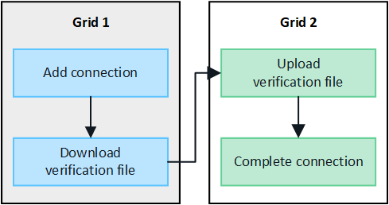

= Crear conexiones de federación de red
:allow-uri-read: 
:icons: font
:imagesdir: ../media/

[role="lead"]
Puede crear una conexión de federación de red entre dos sistemas StorageGRID si desea clonar detalles de inquilinos y replicar datos de objetos.

Como se muestra en la figura, la creación de una conexión de federación de red incluye pasos en ambas redes.  Añade la conexión en una cuadrícula y complétala en la otra cuadrícula.  Puedes empezar desde cualquiera de las cuadrículas.

.Antes de empezar
* Usted ha revisado ellink:grid-federation-overview.html["Consideraciones y requisitos"] para configurar conexiones de federación de red.
* Si planea utilizar nombres de dominio completos (FQDN) para cada cuadrícula en lugar de direcciones IP o VIP, sabe qué nombres usar y ha confirmado que el servidor DNS de cada cuadrícula tiene las entradas adecuadas.
* Estás usando unlink:../admin/web-browser-requirements.html["navegador web compatible"] .
* Tiene permiso de acceso de root y la contraseña de aprovisionamiento para ambas redes.

== Agregar conexión

Realice estos pasos en cualquiera de los dos sistemas StorageGRID .

.Pasos
. Sign in en el Administrador de cuadrícula desde el nodo de administración principal en cualquiera de las cuadrículas.
. Seleccione *CONFIGURACIÓN* > *Sistema* > *Federación de red*.
. Seleccione *Agregar conexión*.
. Introduzca detalles para la conexión.
+
[cols="1a,2a"]
|===
| Campo | Descripción 

 a| 
Nombre de la conexión
 a| 
Un nombre único para ayudarle a reconocer esta conexión, por ejemplo, "Cuadrícula 1-Cuadrícula 2".

 a| 
FQDN o IP para esta cuadrícula
 a| 
Uno de los siguientes:

** El FQDN de la red en la que está conectado actualmente
** Una dirección VIP de un grupo HA en esta red
** Una dirección IP de un nodo de administración o de puerta de enlace en esta red.  La IP puede estar en cualquier red a la que pueda acceder la red de destino.

 a| 
Puerto
 a| 
El puerto que desea utilizar para esta conexión.  Puede ingresar cualquier número de puerto no utilizado del 23000 al 23999.

Ambas redes en esta conexión utilizarán el mismo puerto.  Debe asegurarse de que ningún nodo de ninguna de las redes utilice este puerto para otras conexiones.

 a| 
Días de validez del certificado para esta red
 a| 
El número de días que desea que los certificados de seguridad para esta red en la conexión sean válidos.  El valor predeterminado es 730 días (2 años), pero puede ingresar cualquier valor entre 1 y 762 días.

StorageGRID genera automáticamente certificados de cliente y servidor para cada cuadrícula cuando guarda la conexión.

 a| 
Frase de contraseña de aprovisionamiento para esta red
 a| 
La contraseña de aprovisionamiento para la red en la que ha iniciado sesión.

 a| 
FQDN o IP para la otra red
 a| 
Uno de los siguientes:

** El FQDN de la red a la que desea conectarse
** Una dirección VIP de un grupo HA en la otra red
** Una dirección IP de un nodo de administración o de puerta de enlace en la otra red.  La IP puede estar en cualquier red a la que la red de origen pueda acceder.

|===
. Seleccione *Guardar y continuar*.
. Para el paso Descargar archivo de verificación, seleccione *Descargar archivo de verificación*.
+
Una vez completada la conexión en la otra red, ya no podrás descargar el archivo de verificación de ninguna de las redes.

. Localice el archivo descargado(`_connection-name_.grid-federation` ) y guárdelo en un lugar seguro.
+

CAUTION: Este archivo contiene secretos (enmascarados como `***` ) y otros detalles confidenciales y deben almacenarse y transmitirse de forma segura.

. Seleccione *Cerrar* para regresar a la página de federación de Grid.
. Confirme que se muestra la nueva conexión y que su *Estado de conexión* es *Esperando para conectar*.
. Proporcionar el `_connection-name_.grid-federation` archivo al administrador de la red para la otra red.

== Conexión completa

Realice estos pasos en el sistema StorageGRID al que se está conectando (la otra red).

.Pasos
. Sign in en Grid Manager desde el nodo de administración principal.
. Seleccione *CONFIGURACIÓN* > *Sistema* > *Federación de red*.
. Seleccione *Cargar archivo de verificación* para acceder a la página de carga.
. Seleccione *Subir archivo de verificación*.  Luego, busque y seleccione el archivo que se descargó de la primera cuadrícula.(`_connection-name_.grid-federation` ).
+
Se muestran los detalles de la conexión.

. Opcionalmente, ingrese un número diferente de días válidos para los certificados de seguridad de esta cuadrícula.  La entrada *Días de validez del certificado* tiene como valor predeterminado el que ingresó en la primera cuadrícula, pero cada cuadrícula puede usar fechas de vencimiento diferentes.
+
En general, utilice la misma cantidad de días para los certificados en ambos lados de la conexión.

+

CAUTION: Si los certificados en cualquiera de los extremos de la conexión caducan, la conexión dejará de funcionar y las replicaciones quedarán pendientes hasta que se actualicen los certificados.

. Ingrese la contraseña de aprovisionamiento para la red en la que está conectado actualmente.
. Seleccione *Guardar y probar*.
+
Se generan los certificados y se prueba la conexión.  Si la conexión es válida, aparece un mensaje de éxito y la nueva conexión aparece en la página de federación de Grid.  El *Estado de conexión* será *Conectado*.

+
Si aparece un mensaje de error, solucione cualquier problema. Ver link:grid-federation-troubleshoot.html["Solucionar errores de federación de red"] .

. Vaya a la página de federación de Grid en la primera cuadrícula y actualice el navegador.  Confirme que el *Estado de conexión* ahora es *Conectado*.
. Una vez establecida la conexión, elimine de forma segura todas las copias del archivo de verificación.
+
Si edita esta conexión, se creará un nuevo archivo de verificación.  El archivo original no se puede reutilizar.

.Después de terminar
* Revise las consideraciones paralink:grid-federation-manage-tenants.html["gestión de inquilinos permitidos"] .
* link:creating-tenant-account.html["Crear una o más cuentas de inquilino nuevas"], asigne el permiso *Usar conexión de federación de red* y seleccione la nueva conexión.
* link:grid-federation-manage-connection.html["Administrar la conexión"]según sea necesario.  Puede editar valores de conexión, probar una conexión, rotar certificados de conexión o eliminar una conexión.
* link:../monitor/grid-federation-monitor-connections.html["Monitorizar la conexión"]como parte de sus actividades normales de monitoreo de StorageGRID .
* link:grid-federation-troubleshoot.html["Solucionar problemas de conexión"], incluida la resolución de alertas y errores relacionados con la clonación de cuentas y la replicación entre redes.

