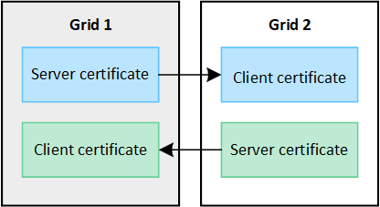

= ¿Qué es la federación de red?
:allow-uri-read: 
:icons: font
:imagesdir: ../media/

[role="lead"]
Puede utilizar la federación de red para clonar inquilinos y replicar sus objetos entre dos sistemas StorageGRID para la recuperación ante desastres.

== ¿Qué es una conexión de federación de red?

Una conexión de federación de red es una conexión bidireccional, confiable y segura entre los nodos de administración y de puerta de enlace en dos sistemas StorageGRID .

== Flujo de trabajo para la federación de redes

El diagrama de flujo de trabajo resume los pasos para configurar una conexión de federación de red entre dos redes.

image::../media/grid-federation-workflow.png[Flujo de trabajo de conexión de la federación de red]

== Consideraciones y requisitos para las conexiones de federación de red

* Las cuadrículas utilizadas para la federación de cuadrículas deben ejecutar versiones de StorageGRID que sean idénticas o que no tengan más de una diferencia de versión importante entre ellas.
+
Para obtener detalles sobre los requisitos de la versión, consulte lalink:../release-notes/index.html["Notas de la versión"] .

* Una red puede tener una o más conexiones de federación de redes a otras redes.  Cada conexión de federación de red es independiente de cualquier otra conexión.  Por ejemplo, si la Red 1 tiene una conexión con la Red 2 y una segunda conexión con la Red 3, no hay ninguna conexión implícita entre la Red 2 y la Red 3.
* Las conexiones de la federación de red son bidireccionales.  Una vez establecida la conexión, puedes supervisarla y administrarla desde cualquiera de las redes.
* Debe existir al menos una conexión de federación de red antes de poder usarlink:grid-federation-what-is-account-clone.html["clon de cuenta"] olink:grid-federation-what-is-cross-grid-replication.html["replicación entre redes"] .

=== Requisitos de red y dirección IP

* Las conexiones de federación de red pueden ocurrir en la red de red, la red de administración o la red de cliente.
* Una conexión de federación de red conecta una red con otra red.  La configuración de cada red especifica un punto final de federación de red en la otra red que consta de nodos de administración, nodos de puerta de enlace o ambos.
* La mejor práctica es conectarlink:managing-high-availability-groups.html["grupos de alta disponibilidad (HA)"] de nodos de puerta de enlace y de administración en cada red.  El uso de grupos de alta disponibilidad ayuda a garantizar que las conexiones de la federación de red permanecerán en línea si los nodos no están disponibles.  Si falla la interfaz activa en cualquiera de los grupos HA, la conexión puede usar una interfaz de respaldo.
* No se recomienda crear una conexión de federación de red que utilice la dirección IP de un solo nodo de administración o nodo de puerta de enlace.  Si el nodo deja de estar disponible, la conexión de la federación de red también dejará de estar disponible.
* link:grid-federation-what-is-cross-grid-replication.html["Replicación entre redes"]La creación de objetos requiere que los nodos de almacenamiento en cada red puedan acceder a los nodos de administración y de puerta de enlace configurados en la otra red.  Para cada cuadrícula, confirme que todos los nodos de almacenamiento tengan una ruta de alto ancho de banda como los nodos de administración o los nodos de puerta de enlace utilizados para la conexión.

=== Utilice FQDN para equilibrar la carga de la conexión

Para un entorno de producción, utilice nombres de dominio completos (FQDN) para identificar cada cuadrícula en la conexión.  Luego, crea las entradas DNS apropiadas, de la siguiente manera:

* El FQDN para Grid 1 asignado a una o más direcciones IP virtuales (VIP) para grupos de HA en Grid 1 o a la dirección IP de uno o más nodos de administración o de puerta de enlace en Grid 1.
* El FQDN para Grid 2 asignado a una o más direcciones VIP para Grid 2 o a la dirección IP de uno o más nodos de administración o de puerta de enlace en Grid 2.

Cuando se utilizan varias entradas DNS, las solicitudes para utilizar la conexión se equilibran de la siguiente manera:

* Las entradas DNS que se asignan a las direcciones VIP de varios grupos de HA se equilibran entre los nodos activos en los grupos de HA.
* Las entradas DNS que se asignan a las direcciones IP de varios nodos de administración o nodos de puerta de enlace se equilibran entre los nodos asignados.

=== Requisitos del puerto

Al crear una conexión de federación de red, puede especificar cualquier número de puerto no utilizado del 23000 al 23999.  Ambas redes en esta conexión utilizarán el mismo puerto.

Debe asegurarse de que ningún nodo de ninguna de las redes utilice este puerto para otras conexiones.

=== Requisitos del certificado

Cuando configura una conexión de federación de red, StorageGRID genera automáticamente cuatro certificados SSL:

* Certificados de servidor y cliente para autenticar y cifrar la información enviada desde la red 1 a la red 2
* Certificados de servidor y cliente para autenticar y cifrar la información enviada desde la red 2 a la red 1

De forma predeterminada, los certificados son válidos durante 730 días (2 años).  Cuando estos certificados se acercan a su fecha de vencimiento, la alerta *Vencimiento del certificado de federación de red* le recuerda que debe rotar los certificados, lo que puede hacer utilizando el Administrador de red.

CAUTION: Si los certificados en cualquiera de los extremos de la conexión expiran, la conexión dejará de funcionar.  La replicación de datos quedará pendiente hasta que se actualicen los certificados.

.Más información
* link:grid-federation-create-connection.html["Crear conexiones de federación de red"]
* link:grid-federation-manage-connection.html["Administrar conexiones de federación de red"]
* link:grid-federation-troubleshoot.html["Solucionar errores de federación de red"]

