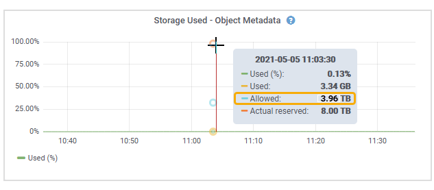

= Administrar el almacenamiento de metadatos de objetos
:allow-uri-read: 
:icons: font
:imagesdir: ../media/

[role="lead"]
La capacidad de metadatos de objetos de un sistema StorageGRID controla la cantidad máxima de objetos que se pueden almacenar en ese sistema.  Para garantizar que su sistema StorageGRID tenga espacio adecuado para almacenar nuevos objetos, debe comprender dónde y cómo StorageGRID almacena los metadatos de los objetos.

== ¿Qué son los metadatos de un objeto?

Los metadatos de un objeto son cualquier información que describe un objeto.  StorageGRID utiliza metadatos de objetos para rastrear las ubicaciones de todos los objetos en la red y administrar el ciclo de vida de cada objeto a lo largo del tiempo.

Para un objeto en StorageGRID, los metadatos del objeto incluyen los siguientes tipos de información:

* Metadatos del sistema, incluido un ID único para cada objeto (UUID), el nombre del objeto, el nombre del depósito S3, el nombre o ID de la cuenta del inquilino, el tamaño lógico del objeto, la fecha y hora en que se creó el objeto por primera vez y la fecha y hora en que se modificó el objeto por última vez.
* Cualquier par clave-valor de metadatos de usuario personalizados asociados con el objeto.
* Para los objetos S3, cualquier par clave-valor de etiqueta de objeto asociado con el objeto.
* Para copias de objetos replicados, la ubicación de almacenamiento actual de cada copia.
* Para las copias de objetos con código de borrado, la ubicación de almacenamiento actual de cada fragmento.
* Para las copias de objetos en un grupo de almacenamiento en la nube, la ubicación del objeto, incluido el nombre del depósito externo y el identificador único del objeto.
* Para objetos segmentados y objetos multiparte, identificadores de segmento y tamaños de datos.

== ¿Cómo se almacenan los metadatos de los objetos?

StorageGRID mantiene los metadatos de los objetos en una base de datos Cassandra, que se almacena independientemente de los datos de los objetos.  Para proporcionar redundancia y proteger los metadatos de los objetos contra pérdidas, StorageGRID almacena tres copias de los metadatos de todos los objetos del sistema en cada sitio.

Esta figura representa los nodos de almacenamiento en dos sitios.  Cada sitio tiene la misma cantidad de metadatos de objetos, y los metadatos de cada sitio se subdividen entre todos los nodos de almacenamiento de ese sitio.

image::../media/metadata_space_across_sites.png[Espacio de metadatos en los sitios]

== ¿Dónde se almacenan los metadatos de los objetos?

Esta figura representa los volúmenes de almacenamiento para un solo nodo de almacenamiento.

image::../media/metadata_space_storage_node.png[Nodo de almacenamiento de espacio de metadatos]

Como se muestra en la figura, StorageGRID reserva espacio para los metadatos de objetos en el volumen de almacenamiento 0 de cada nodo de almacenamiento.  Utiliza el espacio reservado para almacenar metadatos de objetos y realizar operaciones esenciales de la base de datos.  Cualquier espacio restante en el volumen de almacenamiento 0 y todos los demás volúmenes de almacenamiento en el nodo de almacenamiento se utilizan exclusivamente para datos de objetos (copias replicadas y fragmentos con código de borrado).

La cantidad de espacio que se reserva para los metadatos de objetos en un nodo de almacenamiento en particular depende de varios factores, que se describen a continuación.

== Configuración de espacio reservado para metadatos

El _Espacio reservado para metadatos_ es una configuración de todo el sistema que representa la cantidad de espacio que se reservará para los metadatos en el volumen 0 de cada nodo de almacenamiento.  Como se muestra en la tabla, el valor predeterminado de esta configuración se basa en:

* La versión del software que estaba utilizando cuando instaló StorageGRID inicialmente.
* La cantidad de RAM en cada nodo de almacenamiento.

[cols="1a,1a,1a"]
|===
| Versión utilizada para la instalación inicial de StorageGRID | Cantidad de RAM en los nodos de almacenamiento | Configuración predeterminada del espacio reservado para metadatos 

 a| 
11,5 a 11,9
 a| 
128 GB o más en cada nodo de almacenamiento de la red
 a| 
8 TB (8000 GB)

 a| 
 a| 
Menos de 128 GB en cualquier nodo de almacenamiento de la red
 a| 
3 TB (3000 GB)

 a| 
11.1 a 11.4
 a| 
128 GB o más en cada nodo de almacenamiento en cualquier sitio
 a| 
4 TB (4000 GB)

 a| 
 a| 
Menos de 128 GB en cualquier nodo de almacenamiento en cada sitio
 a| 
3 TB (3000 GB)

 a| 
11.0 o anterior
 a| 
Cualquier cantidad
 a| 
2 TB (2000 GB)

|===

=== Ver la configuración del espacio reservado de metadatos

Siga estos pasos para ver la configuración del espacio reservado de metadatos para su sistema StorageGRID .

.Pasos
. Seleccione *CONFIGURACIÓN* > *Sistema* > *Configuración de almacenamiento*.
. En la página de configuración de almacenamiento, expanda la sección *Espacio reservado de metadatos*.

Para StorageGRID 11.8 o superior, el valor del espacio reservado de metadatos debe ser de al menos 100 GB y no más de 1 PB.

La configuración predeterminada para una nueva instalación de StorageGRID 11.6 o superior en la que cada nodo de almacenamiento tiene 128 GB o más de RAM es 8000 GB (8 TB).

== Espacio reservado real para metadatos

A diferencia de la configuración de espacio reservado de metadatos de todo el sistema, el _espacio reservado real_ para los metadatos de objetos se determina para cada nodo de almacenamiento.  Para cualquier nodo de almacenamiento determinado, el espacio reservado real para metadatos depende del tamaño del volumen 0 del nodo y de la configuración del espacio reservado de metadatos de todo el sistema.

[cols="1a,1a"]
|===
| Tamaño del volumen 0 para el nodo | Espacio reservado real para metadatos 

 a| 
Menos de 500 GB (uso no productivo)
 a| 
10% del volumen 0

 a| 
500 GB o más + o + Nodos de almacenamiento solo de metadatos
 a| 
El menor de estos valores:

* Volumen 0
* Configuración de espacio reservado para metadatos

*Nota*: Solo se requiere una rangedb para los nodos de almacenamiento de solo metadatos.

|===

=== Ver el espacio reservado real para metadatos

Siga estos pasos para ver el espacio reservado real para metadatos en un nodo de almacenamiento en particular.

.Pasos
. Desde el Administrador de red, seleccione *NODOS* > *_Nodo de almacenamiento_*.
. Seleccione la pestaña *Almacenamiento*.
. Coloque el cursor sobre el gráfico Almacenamiento utilizado - Metadatos del objeto y localice el valor *Reservado real*.
+
image::../media/storage_used_object_metadata_actual_reserved.png[Almacenamiento utilizado - Metadatos del objeto - Reservado real]

En la captura de pantalla, el valor *real reservado* es 8 TB.  Esta captura de pantalla es para un nodo de almacenamiento grande en una nueva instalación de StorageGRID 11.6.  Debido a que la configuración de espacio reservado de metadatos de todo el sistema es menor que el volumen 0 para este nodo de almacenamiento, el espacio reservado real para este nodo es igual a la configuración de espacio reservado de metadatos.

== Ejemplo de espacio de metadatos reservado real

Supongamos que instala un nuevo sistema StorageGRID utilizando la versión 11.7 o posterior.  Para este ejemplo, supongamos que cada nodo de almacenamiento tiene más de 128 GB de RAM y que el volumen 0 del nodo de almacenamiento 1 (SN1) es de 6 TB.  Basándonos en estos valores:

* El espacio reservado para metadatos de todo el sistema está establecido en 8 TB.  (Este es el valor predeterminado para una nueva instalación de StorageGRID 11.6 o superior si cada nodo de almacenamiento tiene más de 128 GB de RAM).
* El espacio reservado real para metadatos para SN1 es de 6 TB.  (Todo el volumen está reservado porque el volumen 0 es más pequeño que la configuración *Espacio reservado de metadatos*).

== Espacio de metadatos permitido

El espacio reservado real de cada nodo de almacenamiento para metadatos se subdivide en el espacio disponible para metadatos de objetos (el _espacio de metadatos permitido_) y el espacio requerido para operaciones esenciales de la base de datos (como compactación y reparación) y futuras actualizaciones de hardware y software.  El espacio de metadatos permitido determina la capacidad general del objeto.

image::../media/metadata_allowed_space_volume_0.png[Metadatos permitidos espacio volumen 0]

La siguiente tabla muestra cómo StorageGRID calcula el *espacio de metadatos permitido* para diferentes nodos de almacenamiento, en función de la cantidad de memoria del nodo y el espacio reservado real para metadatos.

[cols="1a,1a,2a,2a"]
|===

 a| 
 a| 
 a| 
*Cantidad de memoria en el nodo de almacenamiento*

 a| 
 a| 
 a| 
< 128 GB
 a| 
>= 128 GB

 a| 
*Espacio reservado real para metadatos*
 a| 
<= 4 TB
 a| 
60% del espacio real reservado para metadatos, hasta un máximo de 1,32 TB
 a| 
60% del espacio real reservado para metadatos, hasta un máximo de 1,98 TB

 a| 
> 4 TB
 a| 
(Espacio reservado real para metadatos − 1 TB) × 60 %, hasta un máximo de 1,32 TB
 a| 
(Espacio reservado real para metadatos − 1 TB) × 60 %, hasta un máximo de 3,96 TB

|===

=== Ver el espacio de metadatos permitido

Siga estos pasos para ver el espacio de metadatos permitido para un nodo de almacenamiento.

.Pasos
. Desde el Administrador de cuadrícula, seleccione *NODOS*.
. Seleccione el nodo de almacenamiento.
. Seleccione la pestaña *Almacenamiento*.
. Coloque el cursor sobre el gráfico de metadatos del objeto Almacenamiento utilizado y localice el valor *Permitido*.
+

En la captura de pantalla, el valor *Permitido* es 3,96 TB, que es el valor máximo para un nodo de almacenamiento cuyo espacio reservado real para metadatos es más de 4 TB.

El valor *Permitido* corresponde a esta métrica de Prometheus:

`storagegrid_storage_utilization_metadata_allowed_bytes`

== Ejemplo de espacio de metadatos permitido

Supongamos que instala un sistema StorageGRID utilizando la versión 11.6.  Para este ejemplo, supongamos que cada nodo de almacenamiento tiene más de 128 GB de RAM y que el volumen 0 del nodo de almacenamiento 1 (SN1) es de 6 TB.  Basándonos en estos valores:

* El espacio reservado para metadatos de todo el sistema está establecido en 8 TB.  (Este es el valor predeterminado para StorageGRID 11.6 o superior cuando cada nodo de almacenamiento tiene más de 128 GB de RAM).
* El espacio reservado real para metadatos para SN1 es de 6 TB.  (Todo el volumen está reservado porque el volumen 0 es más pequeño que la configuración *Espacio reservado de metadatos*).
* El espacio permitido para metadatos en SN1 es de 3 TB, según el cálculo que se muestra en la<<table-allowed-space-for-metadata,tabla de espacio permitido para metadatos>> :(Espacio reservado real para metadatos − 1 TB) × 60 %, hasta un máximo de 3,96 TB.

== Cómo los nodos de almacenamiento de diferentes tamaños afectan la capacidad de los objetos

Como se describió anteriormente, StorageGRID distribuye uniformemente los metadatos de los objetos entre los nodos de almacenamiento en cada sitio.  Por este motivo, si un sitio contiene nodos de almacenamiento de diferentes tamaños, el nodo más pequeño del sitio determina la capacidad de metadatos del sitio.

Consideremos el siguiente ejemplo:

* Tiene una cuadrícula de un solo sitio que contiene tres nodos de almacenamiento de diferentes tamaños.
* La configuración de *Espacio reservado para metadatos* es 4 TB.
* Los nodos de almacenamiento tienen los siguientes valores para el espacio de metadatos reservado real y el espacio de metadatos permitido.
+
[cols="1a,1a,1a,1a"]
|===
| Nodo de almacenamiento | Tamaño del volumen 0 | Espacio de metadatos reservado real | Espacio de metadatos permitido 

 a| 
SN1
 a| 
2,2 TB
 a| 
2,2 TB
 a| 
1,32 TB

 a| 
SN2
 a| 
5 TB
 a| 
4 TB
 a| 
1,98 TB

 a| 
SN3
 a| 
6 TB
 a| 
4 TB
 a| 
1,98 TB

|===

Debido a que los metadatos de los objetos se distribuyen de manera uniforme entre los nodos de almacenamiento de un sitio, cada nodo en este ejemplo solo puede contener 1,32 TB de metadatos.  Los 0,66 TB adicionales de espacio de metadatos permitido para SN2 y SN3 no se pueden utilizar.

image::../media/metadata_space_three_storage_nodes.png[Espacio de metadatos Tres nodos de almacenamiento]

De manera similar, debido a que StorageGRID mantiene todos los metadatos de objetos de un sistema StorageGRID en cada sitio, la capacidad general de metadatos de un sistema StorageGRID está determinada por la capacidad de metadatos de objetos del sitio más pequeño.

Y como la capacidad de metadatos de un objeto controla el recuento máximo de objetos, cuando un nodo se queda sin capacidad de metadatos, la cuadrícula queda prácticamente llena.

.Información relacionada
* Para aprender a monitorear la capacidad de metadatos de objetos para cada nodo de almacenamiento, consulte las instrucciones paralink:../monitor/index.html["Monitoreo de StorageGRID"] .
* Para aumentar la capacidad de metadatos de objetos para su sistema,link:../expand/index.html["expandir una cuadrícula"] agregando nuevos nodos de almacenamiento.

