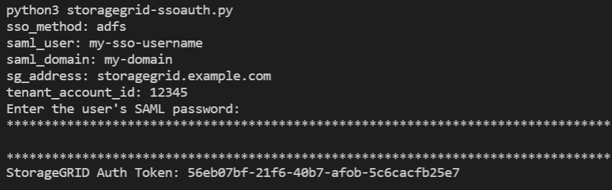

= Utilice la API si el inicio de sesión único está habilitado (Active Directory)
:allow-uri-read: 
:icons: font
:imagesdir: ../media/

[role="lead"]
Si tieneslink:../admin/configuring-sso.html["Inicio de sesión único (SSO) configurado y habilitado"] y utiliza Active Directory como proveedor de SSO, debe emitir una serie de solicitudes de API para obtener un token de autenticación que sea válido para la API de administración de Grid o la API de administración de inquilinos.

== Sign in en la API si el inicio de sesión único está habilitado

Estas instrucciones se aplican si utiliza Active Directory como proveedor de identidad SSO.

.Antes de empezar
* Conoce el nombre de usuario y la contraseña de SSO de un usuario federado que pertenece a un grupo de usuarios de StorageGRID .
* Si desea acceder a la API de administración de inquilinos, debe conocer el ID de la cuenta del inquilino.

.Acerca de esta tarea
Para obtener un token de autenticación, puede utilizar uno de los siguientes ejemplos:

* El `storagegrid-ssoauth.py` Script de Python, que se encuentra en el directorio de archivos de instalación de StorageGRID(`./rpms` para Red Hat Enterprise Linux, `./debs` para Ubuntu o Debian, y `./vsphere` para VMware).
* Un ejemplo de flujo de trabajo de solicitudes curl.
+
El flujo de trabajo curl puede expirar si lo realiza demasiado lento.  Es posible que veas el error: `A valid SubjectConfirmation was not found on this Response` .

+

NOTE: El flujo de trabajo curl de ejemplo no protege la contraseña para que otros usuarios no la vean.

Si tiene un problema de codificación de URL, es posible que vea el error: `Unsupported SAML version` .

.Pasos
. Seleccione uno de los siguientes métodos para obtener un token de autenticación:
+
** Utilice el `storagegrid-ssoauth.py` Script de Python.  Vaya al paso 2.
** Utilice solicitudes curl.  Vaya al paso 3.

. Si desea utilizar el `storagegrid-ssoauth.py` script, pasa el script al intérprete de Python y ejecuta el script.
+
Cuando se le solicite, ingrese valores para los siguientes argumentos:

+
** El método SSO.  Introduzca ADFS o adfs.
** El nombre de usuario de SSO
** El dominio donde está instalado StorageGRID
** La dirección de StorageGRID
** El ID de la cuenta del inquilino, si desea acceder a la API de administración de inquilinos.
+

+
El token de autorización de StorageGRID se proporciona en la salida.  Ahora puedes usar el token para otras solicitudes, de manera similar a como usarías la API si no se estuviera utilizando SSO.

. Si desea utilizar solicitudes curl, utilice el siguiente procedimiento.
+
.. Declare las variables necesarias para iniciar sesión.
+
[source, bash]
----
export SAMLUSER='my-sso-username'
export SAMLPASSWORD='my-password'
export SAMLDOMAIN='my-domain'
export TENANTACCOUNTID='12345'
export STORAGEGRID_ADDRESS='storagegrid.example.com'
export AD_FS_ADDRESS='adfs.example.com'
----
+

NOTE: Para acceder a la API de administración de red, utilice 0 como `TENANTACCOUNTID` .

.. Para recibir una URL de autenticación firmada, emita una solicitud POST a `/api/v3/authorize-saml` y elimine la codificación JSON adicional de la respuesta.
+
Este ejemplo muestra una solicitud POST para una URL de autenticación firmada para `TENANTACCOUNTID` .  Los resultados se transmitirán a `python -m json.tool` para eliminar la codificación JSON.

+
[source, bash]
----
curl -X POST "https://$STORAGEGRID_ADDRESS/api/v3/authorize-saml" \
  -H "accept: application/json" -H  "Content-Type: application/json" \
  --data "{\"accountId\": \"$TENANTACCOUNTID\"}" | python -m json.tool
----
+
La respuesta para este ejemplo incluye una URL firmada que está codificada como URL, pero no incluye la capa de codificación JSON adicional.

+
[listing]
----
{
    "apiVersion": "3.0",
    "data": "https://adfs.example.com/adfs/ls/?SAMLRequest=fZHLbsIwEEV%2FJTuv7...sSl%2BfQ33cvfwA%3D&RelayState=12345",
    "responseTime": "2018-11-06T16:30:23.355Z",
    "status": "success"
}
----
.. Guardar el `SAMLRequest` de la respuesta para su uso en comandos posteriores.
+
[source, bash]
----
export SAMLREQUEST='fZHLbsIwEEV%2FJTuv7...sSl%2BfQ33cvfwA%3D'
----
.. Obtenga una URL completa que incluya el ID de solicitud del cliente de AD FS.
+
Una opción es solicitar el formulario de inicio de sesión utilizando la URL de la respuesta anterior.

+
[source, bash]
----
curl "https://$AD_FS_ADDRESS/adfs/ls/?SAMLRequest=$SAMLREQUEST&RelayState=$TENANTACCOUNTID" | grep 'form method="post" id="loginForm"'
----
+
La respuesta incluye el ID de la solicitud del cliente:

+
[listing]
----
<form method="post" id="loginForm" autocomplete="off" novalidate="novalidate" onKeyPress="if (event && event.keyCode == 13) Login.submitLoginRequest();" action="/adfs/ls/?
SAMLRequest=fZHRToMwFIZfhb...UJikvo77sXPw%3D%3D&RelayState=12345&client-request-id=00000000-0000-0000-ee02-0080000000de" >
----
.. Guarde el ID de la solicitud del cliente de la respuesta.
+
[source, bash]
----
export SAMLREQUESTID='00000000-0000-0000-ee02-0080000000de'
----
.. Envía tus credenciales a la acción del formulario de la respuesta anterior.
+
[source, bash]
----
curl -X POST "https://$AD_FS_ADDRESS/adfs/ls/?SAMLRequest=$SAMLREQUEST&RelayState=$TENANTACCOUNTID&client-request-id=$SAMLREQUESTID" \
--data "UserName=$SAMLUSER@$SAMLDOMAIN&Password=$SAMLPASSWORD&AuthMethod=FormsAuthentication" --include
----
+
AD FS devuelve una redirección 302, con información adicional en los encabezados.

+

NOTE: Si la autenticación multifactor (MFA) está habilitada para su sistema SSO, la publicación del formulario también contendrá la segunda contraseña u otras credenciales.

+
[listing]
----
HTTP/1.1 302 Found
Content-Length: 0
Content-Type: text/html; charset=utf-8
Location: https://adfs.example.com/adfs/ls/?SAMLRequest=fZHRToMwFIZfhb...UJikvo77sXPw%3D%3D&RelayState=12345&client-request-id=00000000-0000-0000-ee02-0080000000de
Set-Cookie: MSISAuth=AAEAADAvsHpXk6ApV...pmP0aEiNtJvWY=; path=/adfs; HttpOnly; Secure
Date: Tue, 06 Nov 2018 16:55:05 GMT
----
.. Guardar el `MSISAuth` cookie de la respuesta.
+
[source, bash]
----
export MSISAuth='AAEAADAvsHpXk6ApV...pmP0aEiNtJvWY='
----
.. Envía una solicitud GET a la ubicación especificada con las cookies del POST de autenticación.
+
[source, bash]
----
curl "https://$AD_FS_ADDRESS/adfs/ls/?SAMLRequest=$SAMLREQUEST&RelayState=$TENANTACCOUNTID&client-request-id=$SAMLREQUESTID" \
--cookie "MSISAuth=$MSISAuth" --include
----
+
Los encabezados de respuesta contendrán información de la sesión de AD FS para su uso posterior al cerrar sesión, y el cuerpo de la respuesta contiene SAMLResponse en un campo de formulario oculto.

+
[listing]
----
HTTP/1.1 200 OK
Cache-Control: no-cache,no-store
Pragma: no-cache
Content-Length: 5665
Content-Type: text/html; charset=utf-8
Expires: -1
Server: Microsoft-HTTPAPI/2.0
P3P: ADFS doesn't have P3P policy, please contact your site's admin for more details
Set-Cookie: SamlSession=a3dpbnRlcnMtUHJpbWFyeS1BZG1pbi0xNzgmRmFsc2Umcng4NnJDZmFKVXFxVWx3bkl1MnFuUSUzZCUzZCYmJiYmXzE3MjAyZTA5LThmMDgtNDRkZC04Yzg5LTQ3NDUxYzA3ZjkzYw==; path=/adfs; HttpOnly; Secure
Set-Cookie: MSISAuthenticated=MTEvNy8yMDE4IDQ6MzI6NTkgUE0=; path=/adfs; HttpOnly; Secure
Set-Cookie: MSISLoopDetectionCookie=MjAxOC0xMS0wNzoxNjozMjo1OVpcMQ==; path=/adfs; HttpOnly; Secure
Date: Wed, 07 Nov 2018 16:32:59 GMT

<form method="POST" name="hiddenform" action="https://storagegrid.example.com:443/api/saml-response">
  <input type="hidden" name="SAMLResponse" value="PHNhbWxwOlJlc3BvbnN...1scDpSZXNwb25zZT4=" /><input type="hidden" name="RelayState" value="12345" />
----
.. Guardar el `SAMLResponse` del campo oculto:
+
[source, bash]
----
export SAMLResponse='PHNhbWxwOlJlc3BvbnN...1scDpSZXNwb25zZT4='
----
.. Usando lo guardado `SAMLResponse` , crear un StorageGRID``/api/saml-response`` solicitud para generar un token de autenticación de StorageGRID .
+
Para `RelayState` , use el ID de la cuenta del inquilino o use 0 si desea iniciar sesión en la API de administración de Grid.

+
[source, bash]
----
curl -X POST "https://$STORAGEGRID_ADDRESS:443/api/saml-response" \
  -H "accept: application/json" \
  --data-urlencode "SAMLResponse=$SAMLResponse" \
  --data-urlencode "RelayState=$TENANTACCOUNTID" \
  | python -m json.tool
----
+
La respuesta incluye el token de autenticación.

+
[listing]
----
{
    "apiVersion": "3.0",
    "data": "56eb07bf-21f6-40b7-af0b-5c6cacfb25e7",
    "responseTime": "2018-11-07T21:32:53.486Z",
    "status": "success"
}
----
.. Guarde el token de autenticación en la respuesta como `MYTOKEN` .
+
[source, bash]
----
export MYTOKEN="56eb07bf-21f6-40b7-af0b-5c6cacfb25e7"
----
+
Ya puedes utilizar `MYTOKEN` para otras solicitudes, de forma similar a como usarías la API si no se estuviera utilizando SSO.

== Cerrar sesión en la API si el inicio de sesión único está habilitado

Si se ha habilitado el inicio de sesión único (SSO), debe emitir una serie de solicitudes de API para cerrar sesión en la API de administración de red o en la API de administración de inquilinos.  Estas instrucciones se aplican si está utilizando Active Directory como proveedor de identidad SSO

.Acerca de esta tarea
Si es necesario, puede cerrar sesión en la API de StorageGRID cerrando la sesión desde la página de cierre de sesión única de su organización.  O bien, puede activar el cierre de sesión único (SLO) desde StorageGRID, lo que requiere un token portador de StorageGRID válido.

.Pasos
. Para generar una solicitud de cierre de sesión firmada, pase `cookie "sso=true" a la API de SLO:
+
[source, bash]
----
curl -k -X DELETE "https://$STORAGEGRID_ADDRESS/api/v3/authorize" \
-H "accept: application/json" \
-H "Authorization: Bearer $MYTOKEN" \
--cookie "sso=true" \
| python -m json.tool
----
+
Se devuelve una URL de cierre de sesión:

+
[listing]
----
{
    "apiVersion": "3.0",
    "data": "https://adfs.example.com/adfs/ls/?SAMLRequest=fZDNboMwEIRfhZ...HcQ%3D%3D",
    "responseTime": "2018-11-20T22:20:30.839Z",
    "status": "success"
}
----
. Guardar la URL de cierre de sesión.
+
[source, bash]
----
export LOGOUT_REQUEST='https://adfs.example.com/adfs/ls/?SAMLRequest=fZDNboMwEIRfhZ...HcQ%3D%3D'
----
. Envíe una solicitud a la URL de cierre de sesión para activar SLO y redirigir nuevamente a StorageGRID.
+
[source, bash]
----
curl --include "$LOGOUT_REQUEST"
----
+
Se devuelve la respuesta 302.  La ubicación de redireccionamiento no es aplicable al cierre de sesión exclusivo de API.

+
[listing]
----
HTTP/1.1 302 Found
Location: https://$STORAGEGRID_ADDRESS:443/api/saml-logout?SAMLResponse=fVLLasMwEPwVo7ss%...%23rsa-sha256
Set-Cookie: MSISSignoutProtocol=U2FtbA==; expires=Tue, 20 Nov 2018 22:35:03 GMT; path=/adfs; HttpOnly; Secure
----
. Eliminar el token portador de StorageGRID .
+
La eliminación del token portador de StorageGRID funciona de la misma manera que sin SSO.  Si no se proporciona la cookie "sso=true", el usuario cierra la sesión de StorageGRID sin afectar el estado de SSO.

+
[source, bash]
----
curl -X DELETE "https://$STORAGEGRID_ADDRESS/api/v3/authorize" \
-H "accept: application/json" \
-H "Authorization: Bearer $MYTOKEN" \
--include
----
+
A `204 No Content` La respuesta indica que el usuario ahora ha cerrado la sesión.

+
[listing]
----
HTTP/1.1 204 No Content
----

