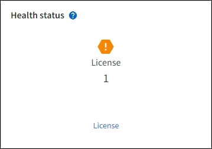

= Ver la información de la licencia de StorageGRID
:allow-uri-read: 
:icons: font
:imagesdir: ../media/

[role="lead"]
Puede ver la información de la licencia de su sistema StorageGRID , como la capacidad máxima de almacenamiento de su red, siempre que sea necesario.

.Antes de empezar
Ha iniciado sesión en Grid Manager mediante unlink:../admin/web-browser-requirements.html["navegador web compatible"] .

.Acerca de esta tarea
Si hay un problema con la licencia de software para este sistema StorageGRID , la tarjeta de estado de salud en el panel incluye un ícono de estado de licencia y un enlace *Licencia*.  El número indica el número de problemas relacionados con la licencia.

.Pasos
. Acceda a la página de Licencia realizando una de las siguientes acciones:
+
** Seleccione *MANTENIMIENTO* > *Sistema* > *Licencia*.
** Desde la tarjeta de estado de salud en el panel de control, seleccione el ícono de estado de licencia o el enlace *Licencia*.
+
Este enlace solo aparece si hay un problema con la licencia.

. Ver los detalles de solo lectura de la licencia actual:
+
** ID del sistema StorageGRID , que es el número de identificación único para esta instalación de StorageGRID
** Número de serie de la licencia
** Tipo de licencia, ya sea *Perpetua* o *Suscripción*
** Capacidad de almacenamiento licenciada de la red
** Capacidad de almacenamiento admitida
** Fecha de finalización de la licencia.  *N/A* aparece para una licencia perpetua.
** Fecha de finalización del soporte
+
Esta fecha se lee del archivo de licencia actual y podría estar desactualizada si extendió o renovó el contrato de servicio de soporte después de obtener el archivo de licencia.  Para actualizar este valor, consultelink:updating-storagegrid-license-information.html["Actualizar la información de la licencia de StorageGRID"] .  También puede ver la fecha de finalización real del contrato utilizando Active IQ.

** Contenido del archivo de texto de la licencia

