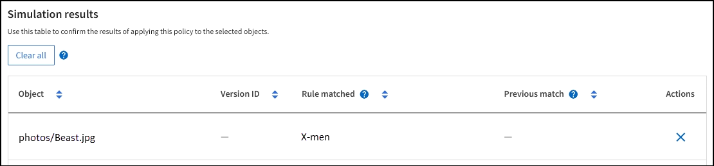

= Ejemplo de simulaciones de políticas de ILM
:allow-uri-read: 
:icons: font
:imagesdir: ../media/

[role="lead"]
Los ejemplos de simulaciones de políticas ILM proporcionan pautas para estructurar y modificar simulaciones para su entorno.

== Ejemplo 1: Verificar reglas al simular una política ILM

Este ejemplo describe cómo verificar reglas al simular una política.

En este ejemplo, se simula la *política ILM de ejemplo* contra los objetos ingeridos en dos buckets.  La política incluye tres reglas, como sigue:

* La primera regla, *Dos copias, dos años para el contenedor a*, se aplica únicamente a los objetos del contenedor a.
* La segunda regla, *Objetos EC > 1 MB*, se aplica a todos los buckets, pero filtra los objetos mayores de 1 MB.
* La tercera regla, *Dos copias, dos centros de datos*, es la regla predeterminada.  No incluye ningún filtro y no utiliza el tiempo de referencia no actual.

Después de simular la política, confirme que cada objeto coincida con la regla correcta.

image::../media/simulate_policy_screen.png[Simular resultados de políticas]

En este ejemplo:

* `bucket-a/bucket-a object.pdf`coincidió correctamente con la primera regla, que filtra los objetos en `bucket-a` .
* `bucket-b/test object greater than 1 MB.pdf`está en `bucket-b` , por lo que no coincidía con la primera regla.  En cambio, la segunda regla coincidió correctamente, ya que filtra objetos de más de 1 MB.
* `bucket-b/test object less than 1 MB.pdf`no coincidió con los filtros de las dos primeras reglas, por lo que se colocará por la regla predeterminada, que no incluye filtros.

== Ejemplo 2: Reordenar reglas al simular una política ILM

Este ejemplo muestra cómo se pueden reordenar las reglas para cambiar los resultados al simular una política.

En este ejemplo, se está simulando la política *Demo*.  Esta política, que tiene como objetivo encontrar objetos que tengan metadatos de usuario series=x-men, incluye tres reglas, como sigue:

* La primera regla, *PNGs*, filtra los nombres de clave que terminan en `.png` .
* La segunda regla, *X-men*, se aplica solo a los objetos del inquilino A y filtra para `series=x-men` metadatos del usuario.
* La última regla, *Dos copias, dos centros de datos*, es la regla predeterminada, que coincide con cualquier objeto que no coincida con las dos primeras reglas.

.Pasos
. Después de agregar las reglas y guardar la política, seleccione *Simular*.
. En el campo *Objeto*, ingrese la clave de objeto/depósito S3 para un objeto de prueba y seleccione *Simular*.
+
Aparecen los resultados de la simulación, que muestran que `Havok.png` El objeto coincidió con la regla *PNGs*.

+
image::../media/simulate_reorder_rules_pngs_result.png[Ejemplo 2: Reordenamiento de reglas al simular una política ILM]

+
Sin embargo, `Havok.png` Estaba destinado a probar la regla de los *X-men*.

. Para resolver el problema, reordene las reglas.
+
.. Seleccione *Finalizar* para cerrar la ventana Simular política ILM.
.. Seleccione *Editar* para editar la política.
.. Arrastre la regla *X-men* a la parte superior de la lista.
.. Seleccione *Guardar*.

. Seleccione *Simular*.
+
Los objetos que probó anteriormente se vuelven a evaluar en función de la política actualizada y se muestran los nuevos resultados de la simulación.  En el ejemplo, la columna Regla coincidente muestra que `Havok.png` El objeto ahora coincide con la regla de metadatos de X-Men, como se esperaba.  La columna Coincidencia anterior muestra que la regla PNG coincidió con el objeto en la simulación anterior.

+
image::../media/simulate_reorder_rules_correct_result.png[Ejemplo 2: Reordenamiento de reglas al simular una política ILM]

== Ejemplo 3: Corregir una regla al simular una política ILM

Este ejemplo muestra cómo simular una política, corregir una regla en la política y continuar la simulación.

En este ejemplo, se está simulando la política *Demo*.  Esta política tiene como objetivo encontrar objetos que tengan `series=x-men` metadatos del usuario.  Sin embargo, se produjeron resultados inesperados al simular esta política contra la `Beast.jpg` objeto.  En lugar de coincidir con la regla de metadatos de X-Men, el objeto coincidió con la regla predeterminada: Dos copias, dos centros de datos.

image::../media/simulate_results_for_object_wrong_metadata.png[Ejemplo 3: Corrección de una regla al simular una política ILM]

Cuando un objeto de prueba no coincide con la regla esperada en la política, debe examinar cada regla en la política y corregir cualquier error.

.Pasos
. Seleccione *Finalizar* para cerrar el cuadro de diálogo Simular política.  En la página de detalles de la política, seleccione *Diagrama de retención*.  Luego, seleccione *Expandir todo* o *Ver detalles* para cada regla según sea necesario.
. Revise la cuenta de inquilino de la regla, el tiempo de referencia y los criterios de filtrado.
+
A modo de ejemplo, supongamos que los metadatos para la regla de X-men se ingresaron como "x-men01" en lugar de "x-men".

. Para resolver el error, corrija la regla de la siguiente manera:
+
** Si la regla es parte de la política, puede clonar la regla o eliminarla de la política y luego editarla.
** Si la regla es parte de la política activa, debe clonar la regla.  No se puede editar ni eliminar una regla de la política activa.

. Realice la simulación nuevamente.
+
En este ejemplo, la regla corregida de los X-Men ahora coincide con la `Beast.jpg` objeto basado en el `series=x-men` metadatos del usuario, como se esperaba.

+

