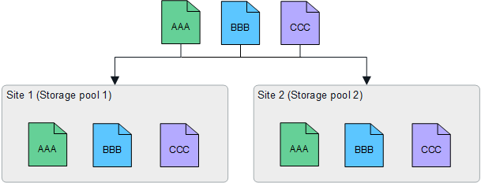

= Habilitar la protección contra pérdida de sitios
:allow-uri-read: 
:icons: font
:imagesdir: ../media/

[role="lead"]
Si su implementación de StorageGRID incluye más de un sitio, puede usar codificación de replicación y borrado con grupos de almacenamiento configurados adecuadamente para habilitar la protección contra pérdida de sitios.

La codificación de replicación y borrado requiere diferentes configuraciones de grupo de almacenamiento:

* Para utilizar la replicación para la protección contra pérdida del sitio, utilice los grupos de almacenamiento específicos del sitio que se crean automáticamente durante la instalación de StorageGRID .  Luego crea reglas ILM conlink:create-ilm-rule-define-placements.html["instrucciones de colocación"] que especifican múltiples grupos de almacenamiento para que se coloque una copia de cada objeto en cada sitio.
* Para utilizar la codificación de borrado para la protección contra pérdida del sitio,link:guidelines-for-creating-storage-pools.html#guidelines-for-storage-pools-used-for-erasure-coded-copies["crear grupos de almacenamiento que consten de varios sitios"] .  Luego, cree reglas ILM que utilicen un grupo de almacenamiento compuesto por varios sitios y cualquier esquema de codificación de borrado disponible.

CAUTION: Al configurar su implementación de StorageGRID para la protección contra pérdida de sitios, también debe tener en cuenta los efectos delink:data-protection-options-for-ingest.html["opciones de ingesta"] ylink:../s3/consistency-controls.html["consistencia"] .

== Ejemplo de replicación

De forma predeterminada, se crea un grupo de almacenamiento para cada sitio durante la instalación de StorageGRID .  Tener grupos de almacenamiento que constan de un solo sitio le permite configurar reglas ILM que utilizan la replicación para la protección contra pérdida del sitio. En este ejemplo:

* El grupo de almacenamiento 1 contiene el Sitio 1
* El grupo de almacenamiento 2 contiene el Sitio 2
* La regla ILM contiene dos colocaciones:
+
** Almacenar objetos replicando 1 copia en el Sitio 1
** Almacenar objetos replicando 1 copia en el Sitio 2

Ubicación de las reglas de ILM:

Si se pierde un sitio, hay copias de los objetos disponibles en el otro sitio.

== Ejemplo de codificación de borrado

Tener grupos de almacenamiento que constan de más de un sitio por grupo de almacenamiento le permite configurar reglas ILM que utilizan codificación de borrado para la protección contra pérdida de sitios. En este ejemplo:

* El grupo de almacenamiento 1 contiene los sitios 1 a 3
* La regla ILM contiene una ubicación: almacenar objetos mediante codificación de borrado utilizando un esquema EC 4+2 en el grupo de almacenamiento 1, que contiene tres sitios

Ubicación de las reglas de ILM:

En este ejemplo:

* La regla ILM utiliza un esquema de codificación de borrado 4+2.
* Cada objeto se divide en cuatro fragmentos de datos iguales y se calculan dos fragmentos de paridad a partir de los datos del objeto.
* Cada uno de los seis fragmentos se almacena en un nodo diferente en tres sitios de centros de datos para brindar protección de datos ante fallas de nodos o pérdidas de sitios.

NOTE: Se permite la codificación de borrado en grupos de almacenamiento que contengan cualquier cantidad de sitios _excepto_ dos sitios.

Regla ILM que utiliza el esquema de codificación de borrado 4+2:

image::../media/ec_three_sites_4_plus_2_site_loss_example_template.png[Almacenar objetos mediante codificación de borrado utilizando un esquema EC 4+2 en 3 sitios]

Si se pierde un sitio, aún se pueden recuperar los datos:

image::../media/ec_three_sites_4_plus_2_site_loss_example.png[Codificación de borrado 4+2 Esquema CE 1 sitio perdido]
