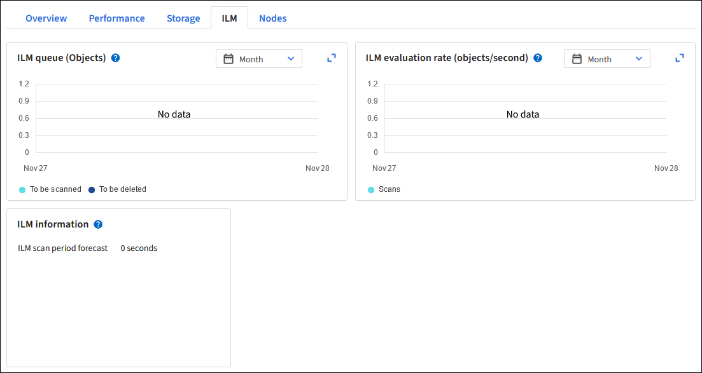

= Trabajar con políticas y reglas de ILM
:allow-uri-read: 
:icons: font
:imagesdir: ../media/

[role="lead"]
A medida que cambian sus requisitos de almacenamiento, es posible que necesite implementar políticas adicionales o modificar las reglas de ILM asociadas con una política.  Puede ver las métricas de ILM para determinar el rendimiento del sistema.

.Antes de empezar
* Ha iniciado sesión en Grid Manager mediante unlink:../admin/web-browser-requirements.html["navegador web compatible"] .
* Tieneslink:../admin/admin-group-permissions.html["permisos de acceso específicos"] .

== Ver las políticas de ILM

Para ver las políticas ILM activas e inactivas y el historial de activación de políticas:

. Seleccione *ILM* > *Políticas*.
. Seleccione *Políticas* para ver una lista de políticas activas e inactivas.  La tabla enumera el nombre de cada política, las etiquetas a las que está asignada la política y si la política está activa o inactiva.
. Seleccione *Historial de activación* para ver una lista de las fechas de inicio y finalización de la activación de las políticas.
. Seleccione un nombre de política para ver los detalles de la política.
+

NOTE: Si visualiza los detalles de una política cuyo estado es Editado o Eliminado, aparece un mensaje que explica que está visualizando la versión de la política que estuvo activa durante el período de tiempo especificado y que desde entonces ha sido editada o eliminada.

== Editar una política de ILM

Sólo puedes editar una política inactiva.  Si desea editar una política activa, desactívela o cree un clon y edítelo.

Para editar una política:

. Seleccione *ILM* > *Políticas*.
. Seleccione la casilla de verificación de la política que desea editar y luego seleccione *Editar*.
. Edite la política siguiendo las instrucciones enlink:creating-ilm-policy.html["Crear políticas ILM"] .
. Simule la política antes de reactivarla.

CAUTION: Una política ILM que se haya configurado incorrectamente puede provocar una pérdida irrecuperable de datos.  Antes de activar una política ILM, revise cuidadosamente la política ILM y sus reglas ILM y luego simule la política ILM.  Confirme siempre que la política ILM funcionará según lo previsto.

== Clonar una política de ILM

Para clonar una política ILM:

. Seleccione *ILM* > *Políticas*.
. Seleccione la casilla de verificación de la política que desea clonar y luego seleccione *Clonar*.
. Cree una nueva política a partir de la política que ha clonado siguiendo las instrucciones enlink:creating-ilm-policy.html["Crear políticas ILM"] .

CAUTION: Una política ILM que se haya configurado incorrectamente puede provocar una pérdida irrecuperable de datos.  Antes de activar una política ILM, revise cuidadosamente la política ILM y sus reglas ILM y luego simule la política ILM.  Confirme siempre que la política ILM funcionará según lo previsto.

== Eliminar una política de ILM

Solo puedes eliminar una política ILM si está inactiva.  Para eliminar una política:

. Seleccione *ILM* > *Políticas*.
. Seleccione la casilla de verificación de la política inactiva que desea eliminar.
. Seleccione *Eliminar*.

== Ver detalles de las reglas de ILM

Para ver los detalles de una regla ILM, incluido el diagrama de retención y las instrucciones de ubicación de la regla:

. Seleccione *ILM* > *Reglas*.
. Seleccione el nombre de la regla cuyos detalles desea ver. Ejemplo:
+
image::../media/ilm_rule_details_page.png[Página de detalles de la regla ILM]

Además, puede utilizar la página de detalles para clonar, editar o eliminar una regla.  No puedes editar ni eliminar una regla si se utiliza en alguna política.

== Clonar una regla ILM

Puede clonar una regla existente si desea crear una nueva regla que utilice algunas de las configuraciones de la regla existente.  Si necesita editar una regla que se utiliza en alguna política, debe clonar la regla y realizar cambios en el clon.  Después de realizar cambios en el clon, puede eliminar la regla original de la política y reemplazarla con la versión modificada según sea necesario.

NOTE: No se puede clonar una regla ILM si se creó utilizando StorageGRID versión 10.2 o anterior.

.Pasos
. Seleccione *ILM* > *Reglas*.
. Seleccione la casilla de verificación de la regla que desea clonar y luego seleccione *Clonar*.  Alternativamente, seleccione el nombre de la regla y luego seleccione *Clonar* en la página de detalles de la regla.
. Actualice la regla clonada siguiendo los pasos para<<Editar una regla de ILM,editar una regla ILM>> ylink:create-ilm-rule-enter-details.html#use-advanced-filters-in-ilm-rules["Uso de filtros avanzados en las reglas de ILM"] .
+
Al clonar una regla ILM, debe ingresar un nuevo nombre.

== Editar una regla de ILM

Es posible que necesite editar una regla ILM para cambiar un filtro o una instrucción de ubicación.

No puedes editar una regla si se utiliza en alguna política de ILM.  En cambio, puedes<<clone-ilm-rule,clonar la regla>> y realizar los cambios necesarios en la copia clonada.

CAUTION: Una política ILM que se haya configurado incorrectamente puede provocar una pérdida irrecuperable de datos.  Antes de activar una política ILM, revise cuidadosamente la política ILM y sus reglas ILM y luego simule la política ILM.  Confirme siempre que la política ILM funcionará según lo previsto.

.Pasos
. Seleccione *ILM* > *Reglas*.
. Confirme que la regla que desea editar no se utiliza en ninguna política de ILM.
. Si la regla que desea editar no está en uso, seleccione la casilla de verificación de la regla y seleccione *Acciones* > *Editar*.  Alternativamente, seleccione el nombre de la regla y luego seleccione *Editar* en la página de detalles de la regla.
. Complete los pasos del asistente Editar regla de ILM.  Según sea necesario, siga los pasos paralink:create-ilm-rule-enter-details.html["creando una regla ILM"] ylink:create-ilm-rule-enter-details.html#use-advanced-filters-in-ilm-rules["Uso de filtros avanzados en las reglas de ILM"] .
+
Al editar una regla ILM, no puedes cambiar su nombre.

== Eliminar una regla ILM

Para mantener manejable la lista de reglas ILM actuales, elimine cualquier regla ILM que probablemente no utilice.

.Pasos
Para eliminar una regla ILM que se utiliza actualmente en una política activa:

. Clonar la política.
. Eliminar la regla ILM del clon de política.
. Guarde, simule y active la nueva política para asegurarse de que los objetos estén protegidos como se espera.
. Vaya a los pasos para eliminar una regla ILM que se utiliza actualmente en una política inactiva.

Para eliminar una regla ILM que se utiliza actualmente en una política inactiva:

. Seleccione la política inactiva.
. Eliminar la regla ILM de la política o<<remove-ilm-policy,eliminar la política>> .
. Vaya a los pasos para eliminar una regla ILM que no se utiliza actualmente.

Para eliminar una regla ILM que no se utiliza actualmente:

. Seleccione *ILM* > *Reglas*.
. Confirme que la regla que desea eliminar no se utiliza en ninguna política.
. Si la regla que desea eliminar no está en uso, selecciónela y seleccione *Acciones* > *Eliminar*.  Puede seleccionar varias reglas y eliminarlas todas al mismo tiempo.
. Seleccione *Sí* para confirmar que desea eliminar la regla ILM.

== Ver métricas de ILM

Puede ver métricas de ILM, como la cantidad de objetos en la cola y la tasa de evaluación.  Puede supervisar estas métricas para determinar el rendimiento del sistema.  Una cola o tasa de evaluación grande podría indicar que el sistema no puede mantener el ritmo de la tasa de ingesta, que la carga de las aplicaciones cliente es excesiva o que existe alguna condición anormal.

.Pasos
. Seleccione *Panel de control* > *ILM*.
+

NOTE: Debido a que el panel se puede personalizar, es posible que la pestaña ILM no esté disponible.

. Supervise las métricas en la pestaña ILM.
+
Puedes seleccionar el signo de interrogaciónimage:../media/icon_nms_question.png["icono de signo de interrogación"] para ver una descripción de los elementos en la pestaña ILM.

+

