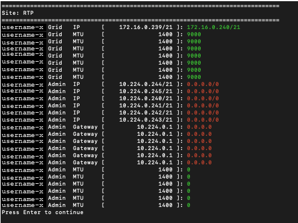
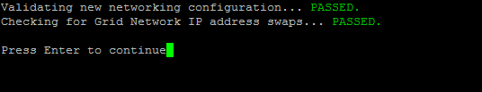

= Cambiar las direcciones IP de todos los nodos de la red
:allow-uri-read: 
:icons: font
:imagesdir: ../media/

[role="lead"]
Si necesita cambiar la dirección IP de la red de todos los nodos de la red, debe seguir este procedimiento especial.  No es posible realizar un cambio de IP de la red de cuadrícula completa utilizando el procedimiento para cambiar nodos individuales.

.Antes de empezar
* Tú tienes el `Passwords.txt` archivo.

Para garantizar que la red se inicie correctamente, debe realizar todos los cambios al mismo tiempo.

NOTE: Este procedimiento se aplica únicamente a la red Grid.  No puede utilizar este procedimiento para cambiar direcciones IP en las redes de administrador o cliente.

Si desea cambiar las direcciones IP y la MTU de los nodos en un solo sitio, siga laslink:changing-nodes-network-configuration.html["Cambiar la configuración de la red del nodo"] instrucciones.

.Pasos
. Planifique con anticipación los cambios que necesita realizar fuera de la herramienta Cambiar IP, como cambios en DNS o NTP y cambios en la configuración de inicio de sesión único (SSO), si se utiliza.
+

NOTE: Si los servidores NTP existentes no serán accesibles a la red en las nuevas direcciones IP, agregue los nuevos servidores NTP antes de realizar el procedimiento de cambio de IP.

+

NOTE: Si los servidores DNS existentes no serán accesibles a la red en las nuevas direcciones IP, agregue los nuevos servidores DNS antes de realizar el procedimiento de cambio de IP.

+

NOTE: Si SSO está habilitado para su sistema StorageGRID y se configuraron confianzas de usuario confiable mediante direcciones IP del nodo de administración (en lugar de nombres de dominio completos, como se recomienda), prepárese para actualizar o reconfigurar estas confianzas de usuario confiable en los Servicios de federación de Active Directory (AD FS) inmediatamente después de cambiar las direcciones IP. Ver link:../admin/configuring-sso.html["Configurar el inicio de sesión único"] .

+

NOTE: Si es necesario, agregue la nueva subred para las nuevas direcciones IP.

. Inicie sesión en el nodo de administración principal:
+
.. Introduzca el siguiente comando: `ssh admin@_primary_Admin_Node_IP_`
.. Introduzca la contraseña que aparece en el `Passwords.txt` archivo.
.. Introduzca el siguiente comando para cambiar a root: `su -`
.. Introduzca la contraseña que aparece en el `Passwords.txt` archivo.

+
Cuando inicia sesión como root, el mensaje cambia de `$` a `#` .

. Inicie la herramienta Cambiar IP ingresando el siguiente comando: `change-ip`
. Introduzca la contraseña de aprovisionamiento cuando se le solicite.
+
Aparece el menú principal.  De forma predeterminada, el `Selected nodes` El campo está configurado en `all` .

+
image::../media/change_ip_tool_main_menu.png[Captura de pantalla que muestra la pantalla de bienvenida de la herramienta de cambio de IP]

. En el menú principal, seleccione *2* para editar la información de IP/máscara de subred, puerta de enlace y MTU para todos los nodos.
+
.. Seleccione *1* para realizar cambios en la red Grid.
+
Después de realizar su selección, el mensaje muestra los nombres de los nodos, el nombre de la red de cuadrícula, el tipo de datos (IP/máscara, puerta de enlace o MTU) y los valores actuales.

+
Editar la dirección IP, la longitud del prefijo, la puerta de enlace o la MTU de una interfaz configurada por DHCP cambiará la interfaz a estática.  Se muestra una advertencia antes de cada interfaz configurada por DHCP.

+
Interfaces configuradas como `fixed` No se puede editar.

.. Para establecer un nuevo valor, ingréselo en el formato que se muestra para el valor actual.
.. Después de editar todos los nodos que desea cambiar, ingrese *q* para regresar al menú principal.
+
Sus cambios se conservan hasta que se borren o apliquen.

. Revise sus cambios seleccionando una de las siguientes opciones:
+
** *5*: Muestra ediciones en la salida que están aisladas para mostrar solo el elemento modificado.  Los cambios se resaltan en verde (adiciones) o rojo (eliminaciones), como se muestra en el ejemplo de salida:
+

** *6*: Muestra ediciones en la salida que muestran la configuración completa.  Los cambios se resaltan en verde (adiciones) o rojo (eliminaciones).
+

NOTE: Algunas interfaces de línea de comandos pueden mostrar adiciones y eliminaciones utilizando el formato tachado.  La visualización correcta depende de que su cliente terminal admita las secuencias de escape VT100 necesarias.

. Seleccione la opción *7* para validar todos los cambios.
+
Esta validación garantiza que no se violen las reglas de la red Grid, como no utilizar subredes superpuestas.

+
En este ejemplo, la validación devolvió errores.

+
image::../media/change_ip_tool_validate_sample_error_messages.gif[captura de pantalla descrita por el texto circundante]

+
En este ejemplo, la validación pasó.

+

. Una vez pasada la validación, seleccione *10* para aplicar la nueva configuración de red.
. Seleccione *etapa* para aplicar los cambios la próxima vez que se reinicien los nodos.
+

NOTE: Debes seleccionar *etapa*.  No realice un reinicio continuo, ya sea manualmente o seleccionando *aplicar* en lugar de *etapa*; la red no se iniciará correctamente.

. Una vez completados los cambios, seleccione *0* para salir de la herramienta Cambiar IP.
. Apague todos los nodos simultáneamente.
+

NOTE: Es necesario apagar toda la red para que todos los nodos queden inactivos al mismo tiempo.

. Realice los cambios de red físicos o virtuales que sean necesarios.
. Verifique que todos los nodos de la red estén inactivos.
. Encienda todos los nodos.
. Después de que la red se inicie correctamente:
+
.. Si agregó nuevos servidores NTP, elimine los valores del servidor NTP antiguo.
.. Si agregó nuevos servidores DNS, elimine los valores del servidor DNS antiguo.

. Descargue el nuevo paquete de recuperación desde Grid Manager.
+
.. Seleccione *MANTENIMIENTO* > *Sistema* > *Paquete de recuperación*.
.. Introduzca la contraseña de aprovisionamiento.

.Información relacionada
* link:adding-to-or-changing-subnet-lists-on-grid-network.html["Agregar o cambiar listas de subredes en Grid Network"]
* link:shutting-down-grid-node.html["Apagar el nodo de la red"]

