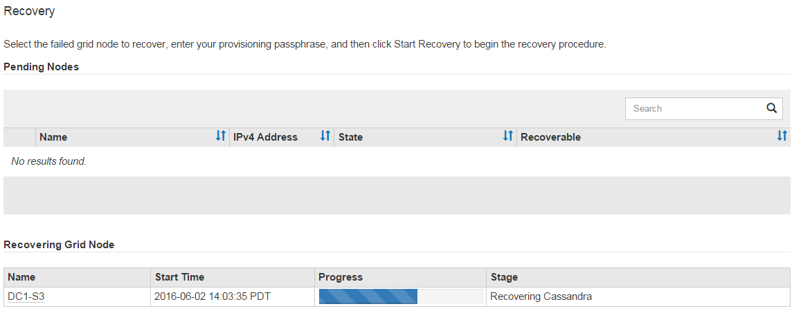

= Volver a montar y reformatear los volúmenes de almacenamiento del dispositivo (pasos manuales)
:allow-uri-read: 
:icons: font
:imagesdir: ../media/

[role="lead"]
Debe ejecutar manualmente dos scripts para volver a montar los volúmenes de almacenamiento preservados y reformatear cualquier volumen de almacenamiento fallido.  El primer script vuelve a montar los volúmenes que están formateados correctamente como volúmenes de almacenamiento StorageGRID .  El segundo script reformatea cualquier volumen no montado, reconstruye la base de datos de Cassandra, si es necesario, e inicia los servicios.

.Antes de empezar
* Ya ha reemplazado el hardware de todos los volúmenes de almacenamiento fallidos que sabe que requieren reemplazo.
+
Ejecutando el `sn-remount-volumes` El script podría ayudarle a identificar volúmenes de almacenamiento fallidos adicionales.

* Ha verificado que no se está realizando un desmantelamiento de un nodo de almacenamiento o ha pausado el procedimiento de desmantelamiento del nodo. (En el Administrador de red, seleccione *MANTENIMIENTO* > *Tareas* > *Desmantelamiento*.)
* Has comprobado que no hay ninguna expansión en curso. (En el Administrador de cuadrícula, seleccione *MANTENIMIENTO* > *Tareas* > *Expansión*.)

CAUTION: Comuníquese con el soporte técnico si más de un nodo de almacenamiento está fuera de línea o si un nodo de almacenamiento en esta red se ha reconstruido en los últimos 15 días. No corras el `sn-recovery-postinstall.sh` guion.  La reconstrucción de Cassandra en dos o más nodos de almacenamiento con una diferencia de 15 días entre sí podría provocar la pérdida de datos.

.Acerca de esta tarea
Para completar este procedimiento, realice estas tareas de alto nivel:

* Inicie sesión en el nodo de almacenamiento recuperado.
* Ejecutar el `sn-remount-volumes` script para volver a montar volúmenes de almacenamiento formateados correctamente.  Cuando se ejecuta este script, hace lo siguiente:
+
** Monta y desmonta cada volumen de almacenamiento para reproducir el diario XFS.
** Realiza una comprobación de consistencia de archivos XFS.
** Si el sistema de archivos es consistente, determina si el volumen de almacenamiento es un volumen de almacenamiento StorageGRID con el formato correcto.
** Si el volumen de almacenamiento está formateado correctamente, vuelve a montar el volumen de almacenamiento.  Todos los datos existentes en el volumen permanecen intactos.

* Revise la salida del script y resuelva cualquier problema.
* Ejecutar el `sn-recovery-postinstall.sh` guion.  Cuando este script se ejecuta, hace lo siguiente.
+

CAUTION: No reinicie un nodo de almacenamiento durante la recuperación antes de ejecutarlo `sn-recovery-postinstall.sh` (paso 4) para reformatear los volúmenes de almacenamiento fallidos y restaurar los metadatos de los objetos.  Reiniciar el nodo de almacenamiento antes `sn-recovery-postinstall.sh` Completa las causas de errores en los servicios que intentan iniciarse y provoca que los nodos del dispositivo StorageGRID salgan del modo de mantenimiento.

+
** Reformatea cualquier volumen de almacenamiento que `sn-remount-volumes` No se pudo montar el script o se encontró que estaba formateado incorrectamente.
+

NOTE: Si se reformatea un volumen de almacenamiento, se perderán todos los datos de ese volumen.  Debe realizar un procedimiento adicional para restaurar datos de objetos desde otras ubicaciones en la cuadrícula, asumiendo que las reglas ILM se configuraron para almacenar más de una copia de objeto.

** Reconstruye la base de datos de Cassandra en el nodo, si es necesario.
** Inicia los servicios en el nodo de almacenamiento.

.Pasos
. Inicie sesión en el nodo de almacenamiento recuperado:
+
.. Introduzca el siguiente comando: `ssh admin@_grid_node_IP_`
.. Introduzca la contraseña que aparece en el `Passwords.txt` archivo.
.. Introduzca el siguiente comando para cambiar a root: `su -`
.. Introduzca la contraseña que aparece en el `Passwords.txt` archivo.

+
Cuando inicia sesión como root, el mensaje cambia de `$` a `#` .

. Ejecute el primer script para volver a montar cualquier volumen de almacenamiento formateado correctamente.
+

NOTE: Si todos los volúmenes de almacenamiento son nuevos y necesitan formatearse, o si todos los volúmenes de almacenamiento han fallado, puede omitir este paso y ejecutar el segundo script para reformatear todos los volúmenes de almacenamiento sin montar.

+
.. Ejecute el script: `sn-remount-volumes`
+
Este script puede tardar horas en ejecutarse en volúmenes de almacenamiento que contienen datos.

.. Mientras se ejecuta el script, revise el resultado y responda las indicaciones.
+

NOTE: Según sea necesario, puede utilizar el `tail -f` Comando para monitorear el contenido del archivo de registro del script(`/var/local/log/sn-remount-volumes.log` ) .  El archivo de registro contiene información más detallada que la salida de la línea de comandos.

+
[listing]
----
root@SG:~ # sn-remount-volumes
The configured LDR noid is 12632740

====== Device /dev/sdb ======
Mount and unmount device /dev/sdb and checking file system consistency:
The device is consistent.
Check rangedb structure on device /dev/sdb:
Mount device /dev/sdb to /tmp/sdb-654321 with rangedb mount options
This device has all rangedb directories.
Found LDR node id 12632740, volume number 0 in the volID file
Attempting to remount /dev/sdb
Device /dev/sdb remounted successfully

====== Device /dev/sdc ======
Mount and unmount device /dev/sdc and checking file system consistency:
Error: File system consistency check retry failed on device /dev/sdc.
You can see the diagnosis information in the /var/local/log/sn-remount-volumes.log.

This volume could be new or damaged. If you run sn-recovery-postinstall.sh, this volume and any data on this volume will be deleted. If you only had two copies of object data, you will temporarily have only a single copy.
StorageGRID will attempt to restore data redundancy by making additional replicated copies or EC fragments, according to the rules in the active ILM policies.

Don't continue to the next step if you believe that the data remaining on this volume can't be rebuilt from elsewhere in the grid (for example, if your ILM policy uses a rule that makes only one copy or if volumes have failed on multiple nodes). Instead, contact support to determine how to recover your data.

====== Device /dev/sdd ======
Mount and unmount device /dev/sdd and checking file system consistency:
Failed to mount device /dev/sdd
This device could be an uninitialized disk or has corrupted superblock.
File system check might take a long time. Do you want to continue? (y or n) [y/N]? y

Error: File system consistency check retry failed on device /dev/sdd.
You can see the diagnosis information in the /var/local/log/sn-remount-volumes.log.

This volume could be new or damaged. If you run sn-recovery-postinstall.sh, this volume and any data on this volume will be deleted. If you only had two copies of object data, you will temporarily have only a single copy.
StorageGRID will attempt to restore data redundancy by making additional replicated copies or EC fragments, according to the rules in the active ILM policies.

Don't continue to the next step if you believe that the data remaining on this volume can't be rebuilt from elsewhere in the grid (for example, if your ILM policy uses a rule that makes only one copy or if volumes have failed on multiple nodes). Instead, contact support to determine how to recover your data.

====== Device /dev/sde ======
Mount and unmount device /dev/sde and checking file system consistency:
The device is consistent.
Check rangedb structure on device /dev/sde:
Mount device /dev/sde to /tmp/sde-654321 with rangedb mount options
This device has all rangedb directories.
Found LDR node id 12000078, volume number 9 in the volID file
Error: This volume does not belong to this node. Fix the attached volume and re-run this script.
----
+
En el ejemplo de salida, un volumen de almacenamiento se volvió a montar correctamente y tres volúmenes de almacenamiento tuvieron errores.

+
*** `/dev/sdb`Pasó la verificación de consistencia del sistema de archivos XFS y tenía una estructura de volumen válida, por lo que se volvió a montar correctamente.  Se conservan los datos de los dispositivos que se vuelven a montar mediante el script.
*** `/dev/sdc`No se pudo pasar la comprobación de consistencia del sistema de archivos XFS porque el volumen de almacenamiento era nuevo o estaba dañado.
*** `/dev/sdd`No se pudo montar porque el disco no se inicializó o el superbloque del disco estaba dañado.  Cuando el script no puede montar un volumen de almacenamiento, le pregunta si desea ejecutar la verificación de consistencia del sistema de archivos.
+
**** Si el volumen de almacenamiento está conectado a un nuevo disco, responda *N* a la pregunta.  No es necesario comprobar el sistema de archivos en un disco nuevo.
**** Si el volumen de almacenamiento está conectado a un disco existente, responda *Y* a la pregunta.  Puede utilizar los resultados de la comprobación del sistema de archivos para determinar el origen de la corrupción.  Los resultados se guardan en el `/var/local/log/sn-remount-volumes.log` archivo de registro.

*** `/dev/sde`Pasó la verificación de consistencia del sistema de archivos XFS y tenía una estructura de volumen válida; sin embargo, el ID del nodo LDR en el `volID` El archivo no coincide con el ID de este nodo de almacenamiento (el `configured LDR noid` (mostrado en la parte superior).  Este mensaje indica que este volumen pertenece a otro nodo de almacenamiento.

. Revise la salida del script y resuelva cualquier problema.
+

CAUTION: Si un volumen de almacenamiento no pasó la verificación de consistencia del sistema de archivos XFS o no se pudo montar, revise cuidadosamente los mensajes de error en la salida.  Debes comprender las implicaciones de ejecutar el `sn-recovery-postinstall.sh` guión en estos volúmenes.

+
.. Verifique que los resultados incluyan una entrada para todos los volúmenes esperados.  Si no aparece algún volumen, vuelva a ejecutar el script.
.. Revise los mensajes de todos los dispositivos montados.  Asegúrese de que no haya errores que indiquen que un volumen de almacenamiento no pertenece a este nodo de almacenamiento.
+
En el ejemplo, la salida de /dev/sde incluye el siguiente mensaje de error:

+
[listing]
----
Error: This volume does not belong to this node. Fix the attached volume and re-run this script.
----
+

CAUTION: Si se informa que un volumen de almacenamiento pertenece a otro nodo de almacenamiento, comuníquese con el soporte técnico.  Si ejecuta el `sn-recovery-postinstall.sh` script, el volumen de almacenamiento se formateará, lo que podría provocar pérdida de datos.

.. Si no se pudo montar algún dispositivo de almacenamiento, anote el nombre del dispositivo y repárelo o reemplácelo.
+

NOTE: Debe reparar o reemplazar cualquier dispositivo de almacenamiento que no se haya podido montar.

+
Utilizará el nombre del dispositivo para buscar el ID del volumen, que es una entrada obligatoria cuando ejecuta el `repair-data` script para restaurar datos de objetos al volumen (el siguiente procedimiento).

.. Después de reparar o reemplazar todos los dispositivos que no se pueden montar, ejecute el `sn-remount-volumes` Ejecute el script nuevamente para confirmar que se hayan vuelto a montar todos los volúmenes de almacenamiento que se pueden volver a montar.
+

CAUTION: Si un volumen de almacenamiento no se puede montar o está formateado incorrectamente y continúa con el siguiente paso, se eliminarán el volumen y todos los datos que contenga.  Si tenía dos copias de datos de objetos, solo tendrá una copia hasta que complete el siguiente procedimiento (restauración de datos de objetos).

+

CAUTION: No corras el `sn-recovery-postinstall.sh` script si cree que los datos restantes en un volumen de almacenamiento fallido no se pueden reconstruir desde otro lugar en la red (por ejemplo, si su política ILM usa una regla que solo hace una copia o si los volúmenes han fallado en varios nodos).  En su lugar, comuníquese con el soporte técnico para determinar cómo recuperar sus datos.

. Ejecutar el `sn-recovery-postinstall.sh` guion: `sn-recovery-postinstall.sh`
+
Este script reformatea cualquier volumen de almacenamiento que no se pudo montar o que se encontró que estaba formateado incorrectamente; reconstruye la base de datos Cassandra en el nodo, si es necesario; e inicia los servicios en el nodo de almacenamiento.

+
Tenga en cuenta lo siguiente:

+
** El script podría tardar horas en ejecutarse.
** En general, debes dejar la sesión SSH en paz mientras se ejecuta el script.
** No presione *Ctrl+C* mientras la sesión SSH esté activa.
** El script se ejecutará en segundo plano si ocurre una interrupción en la red y finaliza la sesión SSH, pero puede ver el progreso desde la página de Recuperación.
** Si el nodo de almacenamiento utiliza el servicio RSM, es posible que el script parezca detenerse durante 5 minutos mientras se reinician los servicios del nodo.  Se espera este retraso de 5 minutos cada vez que el servicio RSM se inicia por primera vez.
+

NOTE: El servicio RSM está presente en los nodos de almacenamiento que incluyen el servicio ADC.

+

NOTE: Algunos procedimientos de recuperación de StorageGRID utilizan Reaper para manejar las reparaciones de Cassandra.  Las reparaciones se producen automáticamente tan pronto como se hayan iniciado los servicios relacionados o requeridos.  Es posible que notes que la salida del script menciona "reaper" o "reparación de Cassandra".  Si ve un mensaje de error que indica que la reparación ha fallado, ejecute el comando indicado en el mensaje de error.

. Como el `sn-recovery-postinstall.sh` El script se ejecuta y supervisa la página de Recuperación en el Administrador de Grid.
+
La barra de progreso y la columna Etapa en la página Recuperación proporcionan un estado de alto nivel del `sn-recovery-postinstall.sh` guion.

+

. Despues de la `sn-recovery-postinstall.sh` Una vez que el script haya iniciado servicios en el nodo, puede restaurar los datos del objeto en cualquier volumen de almacenamiento que haya sido formateado por el script.
+
El script le pregunta si desea utilizar el proceso de restauración de volumen de Grid Manager.

+
** En la mayoría de los casos, deberíaslink:../maintain/restoring-volume.html["restaurar datos de objetos usando Grid Manager"] .  Respuesta `y` para utilizar el Administrador de cuadrícula.
** En casos excepcionales, como cuando se lo solicita el soporte técnico o cuando sabe que el nodo de reemplazo tiene menos volúmenes disponibles para el almacenamiento de objetos que el nodo original, debelink:restoring-object-data-to-storage-volume-for-appliance.html["restaurar datos de objetos manualmente"] utilizando el `repair-data` guion.  Si se aplica uno de estos casos, responda `n` .
+
[NOTE]
====
Si respondes `n` para utilizar el proceso de restauración de volumen de Grid Manager (restaurar datos de objetos manualmente):

*** No es posible restaurar datos de objetos mediante Grid Manager.
*** Puede supervisar el progreso de los trabajos de restauración manual utilizando Grid Manager.

====
+
Después de realizar la selección, el script se completa y se muestran los siguientes pasos para recuperar los datos del objeto.  Después de revisar estos pasos, presione cualquier tecla para regresar a la línea de comando.

