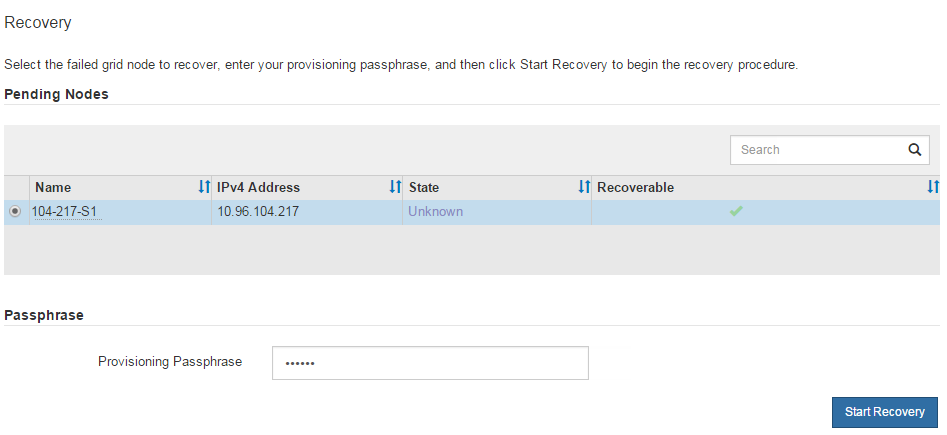

= Seleccione Iniciar recuperación para configurar el nodo de administración no principal
:allow-uri-read: 
:icons: font
:imagesdir: ../media/

[role="lead"]
Después de reemplazar un nodo de administración no principal, debe seleccionar Iniciar recuperación en el Administrador de red para configurar el nuevo nodo como reemplazo del nodo fallido.

.Antes de empezar
* Ha iniciado sesión en Grid Manager mediante unlink:../admin/web-browser-requirements.html["navegador web compatible"] .
* Tú tienes ellink:../admin/admin-group-permissions.html["Permiso de mantenimiento o acceso root"] .
* Tienes la contraseña de aprovisionamiento.
* Ha implementado y configurado el nodo de reemplazo.

.Pasos
. Desde el Administrador de red, seleccione *MANTENIMIENTO* > *Tareas* > *Recuperación*.
. Seleccione el nodo de la cuadrícula que desea recuperar en la lista de Nodos pendientes.
+
Los nodos aparecen en la lista después de fallar, pero no puedes seleccionar un nodo hasta que se haya reinstalado y esté listo para la recuperación.

. Introduzca la *contraseña de aprovisionamiento*.
. Haga clic en *Iniciar recuperación*.
+

. Supervise el progreso de la recuperación en la tabla Nodo de cuadrícula en recuperación.
+

NOTE: Mientras se ejecuta el procedimiento de recuperación, puede hacer clic en *Restablecer* para iniciar una nueva recuperación.  Aparece un cuadro de diálogo que indica que el nodo quedará en un estado indeterminado si restablece el procedimiento.

+
image::../media/recovery_reset_warning.gif[Captura de pantalla que muestra el cuadro de diálogo de advertencia de recuperación de restablecimiento]

+
Si desea volver a intentar la recuperación después de restablecer el procedimiento, debe restaurar el nodo a un estado preinstalado, de la siguiente manera:

+
** *VMware*: eliminar el nodo de red virtual implementado.  Luego, cuando esté listo para reiniciar la recuperación, vuelva a implementar el nodo.
** *Linux*: reinicie el nodo ejecutando este comando en el host Linux: `storagegrid node force-recovery _node-name_`
** *Dispositivo*: Si desea volver a intentar la recuperación después de restablecer el procedimiento, debe restaurar el nodo del dispositivo a un estado preinstalado ejecutando `sgareinstall` en el nodo. Ver link:preparing-appliance-for-reinstallation-platform-replacement-only.html["Preparar el dispositivo para la reinstalación (solo reemplazo de plataforma)"] .

. Si el inicio de sesión único (SSO) está habilitado para su sistema StorageGRID y la confianza de usuario autenticado para el nodo de administración que recuperó estaba configurada para usar el certificado de interfaz de administración predeterminado, actualice (o elimine y vuelva a crear) la confianza de usuario autenticado del nodo en los Servicios de federación de Active Directory (AD FS).  Utilice el nuevo certificado de servidor predeterminado que se generó durante el proceso de recuperación del nodo de administración.
+

NOTE: Para configurar una relación de confianza entre usuarios, consultelink:../admin/configuring-sso.html["Configurar el inicio de sesión único"] . Para acceder al certificado de servidor predeterminado, inicie sesión en el shell de comandos del nodo de administración. Ir a la `/var/local/mgmt-api` directorio y seleccione el `server.crt` archivo.

