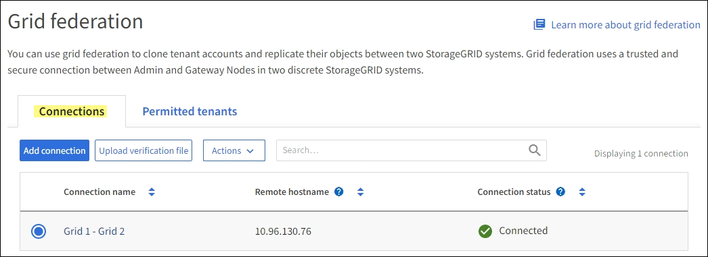

= Supervisar las conexiones de la federación de red
:allow-uri-read: 
:icons: font
:imagesdir: ../media/

[role="lead"]
Puede monitorear información básica sobre todoslink:../admin/grid-federation-overview.html["conexiones de federación de red"] , información detallada sobre una conexión específica o métricas de Prometheus sobre operaciones de replicación entre redes.  Puedes monitorear una conexión desde cualquiera de las redes.

.Antes de empezar
* Ha iniciado sesión en el Administrador de cuadrícula en cualquiera de las cuadrículas mediante unlink:../admin/web-browser-requirements.html["navegador web compatible"] .
* Tú tienes ellink:../admin/admin-group-permissions.html["Permiso de acceso root"] para la red en la que ha iniciado sesión.

== Ver todas las conexiones

La página de federación de red muestra información básica sobre todas las conexiones de federación de red y sobre todas las cuentas de inquilinos que tienen permiso para usar conexiones de federación de red.

.Pasos
. Seleccione *CONFIGURACIÓN* > *Sistema* > *Federación de red*.
+
Aparece la página de federación de Grid.

. Para ver información básica de todas las conexiones en esta cuadrícula, seleccione la pestaña *Conexiones*.
+
Desde esta pestaña, puedes:

+
** link:../admin/grid-federation-create-connection.html["Crear una nueva conexión"] .
** Seleccione una conexión existente alink:../admin/grid-federation-manage-connection.html["editar o probar"] .

+

. Para ver información básica de todas las cuentas de inquilinos en esta red que tienen el permiso *Usar conexión de federación de red*, seleccione la pestaña *Inquilinos permitidos*.
+
Desde esta pestaña, puedes:

+
** link:../monitor/monitoring-tenant-activity.html["Ver la página de detalles de cada inquilino permitido"] .
** Ver la página de detalles de cada conexión. Ver <<view-specific-connection,Ver una conexión específica>> .
** Seleccione un inquilino permitido ylink:../admin/grid-federation-manage-tenants.html["eliminar el permiso"] .
** Verifique si hay errores de replicación entre redes y borre el último error, si lo hay. Ver link:../admin/grid-federation-troubleshoot.html["Solucionar errores de federación de red"] .
+
image::../media/grid-federation-permitted-tenants-tab.png[Pestaña de inquilinos permitidos de la federación de red]

== [[view-specific-connection]]Ver una conexión específica

Puede ver los detalles de una conexión de federación de red específica.

.Pasos
. Seleccione cualquiera de las pestañas de la página de federación de Grid y luego seleccione el nombre de la conexión de la tabla.
+
Desde la página de detalles de la conexión, puedes:

+
** Vea información básica sobre el estado de la conexión, incluidos los nombres de host locales y remotos, el puerto y el estado de la conexión.
** Seleccione una conexión alink:../admin/grid-federation-manage-connection.html["editar, probar o eliminar"] .

. Al ver una conexión específica, seleccione la pestaña *Inquilinos permitidos* para ver detalles sobre los inquilinos permitidos para la conexión.
+
Desde esta pestaña, puedes:

+
** link:../monitor/monitoring-tenant-activity.html["Ver la página de detalles de cada inquilino permitido"] .
** link:../admin/grid-federation-manage-tenants.html["Quitar el permiso de un inquilino"]para utilizar la conexión.
** Verifique si hay errores de replicación entre redes y borre el último error. Ver link:../admin/grid-federation-troubleshoot.html["Solucionar errores de federación de red"] .
+
image::../media/grid-federation-permitted-tenants-tab-for-connection.png[Pestaña de inquilinos permitidos por la federación de red para la conexión]

. Al ver una conexión específica, seleccione la pestaña *Certificados* para ver los certificados de servidor y cliente generados por el sistema para esta conexión.
+
Desde esta pestaña, puedes:

+
** link:../admin/grid-federation-manage-connection.html["Rotar certificados de conexión"] .
** Seleccione *Servidor* o *Cliente* para ver o descargar el certificado asociado o copiar el certificado PEM.
+
image::../media/grid-federation-certificates-tab.png[pestaña de certificados de federación de red]

== Revisar las métricas de replicación entre redes

Puede utilizar el panel de replicación entre redes en Grafana para ver las métricas de Prometheus sobre las operaciones de replicación entre redes en su red.

.Pasos
. Desde el Administrador de cuadrícula, seleccione *SOPORTE* > *Herramientas* > *Métricas*.
+

NOTE: Las herramientas disponibles en la página Métricas están destinadas a ser utilizadas por el soporte técnico.  Algunas funciones y elementos del menú de estas herramientas no son funcionales intencionalmente y están sujetos a cambios.  Ver la lista delink:../monitor/commonly-used-prometheus-metrics.html["Métricas de Prometheus de uso común"] .

. En la sección Grafana de la página, seleccione *Replicación de cuadrícula cruzada*.
+
Para obtener instrucciones detalladas, consultelink:../monitor/reviewing-support-metrics.html["Revisar las métricas de soporte"] .

. Para volver a intentar la replicación de objetos que no se pudieron replicar, consultelink:../admin/grid-federation-retry-failed-replication.html["Identificar y reintentar operaciones de replicación fallidas"] .

