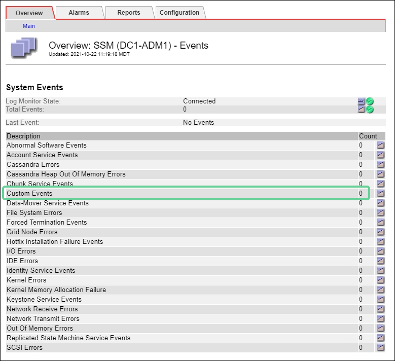
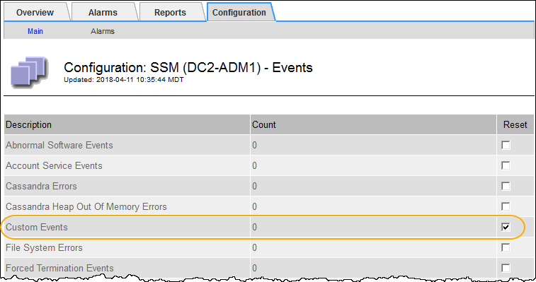

= Monitorear eventos
:allow-uri-read: 
:icons: font
:imagesdir: ../media/

[role="lead"]
Puede supervisar eventos detectados por un nodo de la red, incluidos eventos personalizados que haya creado para rastrear eventos que se registran en el servidor syslog.  El mensaje Último evento que se muestra en el Administrador de cuadrícula proporciona más información sobre el evento más reciente.

Los mensajes de eventos también se enumeran en el `/var/local/log/bycast-err.log` archivo de registro. Ver ellink:logs-files-reference.html["Referencia de archivos de registro"] .

La alarma SMTT (Total de eventos) puede activarse repetidamente por problemas como problemas de red, cortes de energía o actualizaciones.  Esta sección contiene información sobre cómo investigar eventos para que pueda comprender mejor por qué se produjeron estas alarmas.  Si se produjo un evento debido a un problema conocido, es seguro restablecer los contadores de eventos.

.Pasos
. Revise los eventos del sistema para cada nodo de la red:
+
.. Seleccione *SOPORTE* > *Herramientas* > *Topología de cuadrícula*.
.. Seleccione *_sitio_* > *_nodo de cuadrícula_* > *SSM* > *Eventos* > *Descripción general* > *Principal*.

. Genere una lista de mensajes de eventos anteriores para ayudar a aislar problemas que ocurrieron en el pasado:
+
.. Seleccione *SOPORTE* > *Herramientas* > *Topología de cuadrícula*.
.. Seleccione *_sitio_* > *_nodo de cuadrícula_* > *SSM* > *Eventos* > *Informes*.
.. Seleccionar *Texto*.
+
El atributo *Último evento* no se muestra en ellink:using-charts-and-reports.html["vista de gráficos"] .  Para verlo:

.. Cambiar *Atributo* a *Último evento*.
.. Opcionalmente, seleccione un período de tiempo para la *Consulta rápida*.
.. Seleccione *Actualizar*.
+
image::../media/events_report.gif[Página de eventos]

== Crear eventos de syslog personalizados

Los eventos personalizados le permiten rastrear todos los eventos de usuario de nivel crítico, error, daemon y kernel registrados en el servidor syslog.  Un evento personalizado puede ser útil para monitorear la ocurrencia de mensajes de registro del sistema (y, por lo tanto, eventos de seguridad de red y fallas de hardware).

.Acerca de esta tarea
Considere crear eventos personalizados para monitorear problemas recurrentes.  Las siguientes consideraciones se aplican a los eventos personalizados.

* Después de crear un evento personalizado, se supervisa cada una de sus ocurrencias.
* Para crear un evento personalizado basado en palabras clave en el `/var/local/log/messages` archivos, los registros en esos archivos deben ser:
+
** Generado por el kernel
** Generado por el demonio o programa de usuario en el nivel de error o crítico

*Nota:* No todas las entradas en el `/var/local/log/messages` Los archivos se combinarán a menos que cumplan los requisitos establecidos anteriormente.

.Pasos
. Seleccione *SOPORTE* > *Alarmas (heredadas)* > *Eventos personalizados*.
. Haga clic en *Editar*image:../media/icon_nms_edit.gif["icono de lápiz"] (o *Insertar*image:../media/icon_nms_insert.gif["icono más"] si este no es el primer evento).
. Introduzca una cadena de evento personalizada, por ejemplo, apagado
+
image::../media/custom_events.png[Captura de pantalla que muestra dónde ingresar la cadena de evento personalizada]

. Seleccione *Aplicar cambios*.
. Seleccione *SOPORTE* > *Herramientas* > *Topología de cuadrícula*.
. Seleccione *_nodo de cuadrícula_* > *SSM* > *Eventos*.
. Localice la entrada de Eventos personalizados en la tabla Eventos y supervise el valor de *Count*.
+
Si el recuento aumenta, se activará un evento personalizado que estás monitoreando en ese nodo de la cuadrícula.

+

== Restablecer el recuento de eventos personalizados a cero

Si desea restablecer el contador solo para eventos personalizados, debe utilizar la página Topología de cuadrícula en el menú Soporte.

Al reiniciar un contador, la alarma se activará en el siguiente evento.  Por el contrario, cuando se reconoce una alarma, dicha alarma solo se vuelve a activar si se alcanza el siguiente nivel de umbral.

.Pasos
. Seleccione *SOPORTE* > *Herramientas* > *Topología de cuadrícula*.
. Seleccione *_grid node_* > *SSM* > *Eventos* > *Configuración* > *Principal*.
. Seleccione la casilla de verificación *Restablecer* para Eventos personalizados.
+

. Seleccione *Aplicar cambios*.

