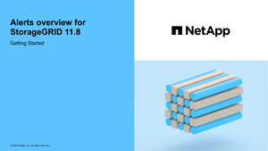

= Monitorear la salud del sistema
:allow-uri-read: 
:icons: font
:imagesdir: ../media/

[role="lead"]
Supervise el estado general de su sistema StorageGRID diariamente.

.Acerca de esta tarea
El sistema StorageGRID puede seguir funcionando cuando partes de la red no están disponibles.  Los problemas potenciales indicados por alertas no son necesariamente problemas con las operaciones del sistema.  Investigar los problemas resumidos en la tarjeta de estado de salud del panel de control de Grid Manager.

Para recibir notificaciones de alertas tan pronto como se activen, puede https://docs.netapp.com/us-en/storagegrid-appliances/installconfig/setting-up-email-notifications-for-alerts.html["Configurar notificaciones por correo electrónico para alertas"^] olink:using-snmp-monitoring.html["configurar trampas SNMP"] .

image::../media/health_status_card.png[Tarjeta de estado de salud - panel de control]

Cuando existen problemas, aparecen enlaces que le permiten ver detalles adicionales:

[cols="1a,2a"]
|===
| Enlace | Aparece cuando... 

 a| 
Detalles de la cuadrícula
 a| 
Todos los nodos están desconectados (estado de conexión desconocido o administrativamente inactivo).

 a| 
Alertas actuales (críticas, graves, leves)
 a| 
Las alertas son<<Ver alertas actuales y resueltas,actualmente activo>> .

 a| 
Alertas resueltas recientemente
 a| 
Alertas activadas la semana pasada<<Ver alertas actuales y resueltas,ya estan resueltos>> .

 a| 
Licencia
 a| 
Hay un problema con la licencia de software para este sistema StorageGRID . Puede link:../admin/updating-storagegrid-license-information.html["Actualice la información de la licencia según sea necesario"] Es

|===

== Supervisar los estados de conexión de los nodos

Si uno o más nodos se desconectan de la red, las operaciones críticas de StorageGRID podrían verse afectadas.  Supervise los estados de conexión de los nodos y solucione cualquier problema rápidamente.

[cols="1a,3a,3a"]
|===
| Icono | Descripción | Acción requerida 

 a| 
image:../media/icon_alarm_blue_unknown.png["icono de signo de interrogación azul"]
 a| 
*No conectado - Desconocido*

Por una razón desconocida, un nodo se desconecta o los servicios en el nodo dejan de funcionar inesperadamente.  Por ejemplo, es posible que se haya detenido un servicio en el nodo o que el nodo haya perdido su conexión a la red debido a un corte de energía o una interrupción inesperada.

También podría activarse la alerta *No se puede comunicar con el nodo*.  También podrían estar activas otras alertas.
 a| 
Requiere atención inmediata. <<Ver alertas actuales y resueltas,Seleccione cada alerta>> y siga las acciones recomendadas.

Por ejemplo, es posible que necesite reiniciar un servicio que se ha detenido o reiniciar el host del nodo.

*Nota*: Un nodo puede aparecer como Desconocido durante las operaciones de apagado administrado.  Puedes ignorar el estado Desconocido en estos casos.

 a| 
image:../media/icon_alarm_gray_administratively_down.png["icono de signo de interrogación gris"]
 a| 
*No conectado - Administrativamente caído*

Por una razón esperada, el nodo no está conectado a la red.

Por ejemplo, el nodo, o los servicios en el nodo, se han apagado correctamente, el nodo se está reiniciando o se está actualizando el software.  También podrían estar activas una o más alertas.

Dependiendo del problema subyacente, estos nodos a menudo vuelven a estar en línea sin ninguna intervención.
 a| 
Determinar si hay alguna alerta que afecte a este nodo.

Si una o más alertas están activas,<<Ver alertas actuales y resueltas,seleccione cada alerta>> y siga las acciones recomendadas.

 a| 
image:../media/icon_alert_green_checkmark.png["Icono de alerta de marca de verificación verde"]
 a| 
*Conectado*

El nodo está conectado a la red.
 a| 
No se requiere ninguna acción

|===

== Ver alertas actuales y resueltas

*Alertas actuales*: cuando se activa una alerta, se muestra un ícono de alerta en el panel.  También se muestra un icono de alerta para el nodo en la página Nodos.  Silink:email-alert-notifications.html["Las notificaciones de alerta por correo electrónico están configuradas"] También se enviará una notificación por correo electrónico, a menos que se haya silenciado la alerta.

*Alertas resueltas*: puede buscar y ver un historial de alertas que se han resuelto.

Opcionalmente has visto el vídeo: https://netapp.hosted.panopto.com/Panopto/Pages/Viewer.aspx?id=2eea81c5-8323-417f-b0a0-b1ff008506c1["Vídeo: Descripción general de las alertas"^]

[link=https://netapp.hosted.panopto.com/Panopto/Pages/Viewer.aspx?id=2eea81c5-8323-417f-b0a0-b1ff008506c1]

La siguiente tabla describe la información que se muestra en el Administrador de cuadrícula para las alertas actuales y resueltas.

[cols="1a,3a"]
|===
| Encabezado de columna | Descripción 

 a| 
Nombre o título
 a| 
El nombre de la alerta y su descripción.

 a| 
Gravedad
 a| 
La gravedad de la alerta.  Para las alertas actuales, si se agrupan varias alertas, la fila de título muestra cuántas instancias de esa alerta ocurren en cada nivel de gravedad.

image:../media/icon_alert_red_critical.png["Icono de alerta rojo crítico"]*Crítico*: Existe una condición anormal que ha detenido las operaciones normales de un nodo o servicio de StorageGRID .  Debes abordar el problema subyacente inmediatamente.  Si no se resuelve el problema podría producirse una interrupción del servicio y pérdida de datos.

image:../media/icon_alert_orange_major.png["Icono de alerta naranja mayor"]*Importante*: Existe una condición anormal que está afectando las operaciones actuales o acercándose al umbral de una alerta crítica.  Debe investigar las alertas principales y abordar cualquier problema subyacente para garantizar que la condición anormal no detenga el funcionamiento normal de un nodo o servicio de StorageGRID .

image:../media/icon_alert_yellow_minor.png["Icono de alerta amarillo menor"]*Menor*: El sistema está funcionando normalmente, pero existe una condición anormal que podría afectar la capacidad del sistema para funcionar si continúa.  Debes supervisar y resolver las alertas menores que no desaparecen por sí solas para garantizar que no provoquen un problema más grave.

 a| 
Tiempo activado
 a| 
*Alertas actuales*: La fecha y hora en que se activó la alerta en su hora local y en UTC.  Si se agrupan varias alertas, la fila de título muestra los tiempos de la instancia más reciente de la alerta (_newest_) y la instancia más antigua de la alerta (_oldest_).

*Alertas resueltas*: Hace cuánto tiempo se activó la alerta.

 a| 
Sitio/Nodo
 a| 
El nombre del sitio y el nodo donde se produce o se ha producido la alerta.

 a| 
Estado
 a| 
Si la alerta está activa, silenciada o resuelta.  Si se agrupan varias alertas y se selecciona *Todas las alertas* en el menú desplegable, la fila de título muestra cuántas instancias de esa alerta están activas y cuántas instancias se han silenciado.

 a| 
Tiempo resuelto (solo alertas resueltas)
 a| 
¿Cuánto tiempo hace que se resolvió la alerta?

 a| 
Valores actuales o _valores de datos_
 a| 
El valor de la métrica que provocó que se activara la alerta.  Para algunas alertas, se muestran valores adicionales para ayudarlo a comprender e investigar la alerta.  Por ejemplo, los valores que se muestran para una alerta de *Almacenamiento de datos de objetos bajo* incluyen el porcentaje de espacio en disco utilizado, la cantidad total de espacio en disco y la cantidad de espacio en disco utilizado.

*Nota:* Si se agrupan varias alertas actuales, los valores actuales no se muestran en la fila de título.

 a| 
Valores activados (solo alertas resueltas)
 a| 
El valor de la métrica que provocó que se activara la alerta.  Para algunas alertas, se muestran valores adicionales para ayudarlo a comprender e investigar la alerta.  Por ejemplo, los valores que se muestran para una alerta de *Almacenamiento de datos de objetos bajo* incluyen el porcentaje de espacio en disco utilizado, la cantidad total de espacio en disco y la cantidad de espacio en disco utilizado.

|===
.Pasos
. Seleccione el enlace *Alertas actuales* o *Alertas resueltas* para ver una lista de alertas en esas categorías.  También puede ver los detalles de una alerta seleccionando *Nodos* > *_nodo_* > *Descripción general* y luego seleccionando la alerta en la tabla Alertas.
+
De forma predeterminada, las alertas actuales se muestran de la siguiente manera:

+
** Las alertas activadas más recientemente se muestran primero.
** Varias alertas del mismo tipo se muestran como un grupo.
** Las alertas que han sido silenciadas no se muestran.
** Para una alerta específica en un nodo específico, si se alcanzan los umbrales para más de un nivel de gravedad, solo se muestra la alerta más grave.  Es decir, si se alcanzan los umbrales de alerta para los niveles de gravedad menor, mayor y crítico, solo se muestra la alerta crítica.
+
La página de alertas actuales se actualiza cada dos minutos.

. Para expandir grupos de alertas, seleccione el cursor hacia abajoimage:../media/icon_alert_caret_down.png["icono de cursor hacia abajo"] .  Para contraer alertas individuales en un grupo, seleccione el símbolo hacia arribaimage:../media/icon_alert_caret_up.png["Icono de cursor hacia arriba"] , o seleccione el nombre del grupo.
. Para mostrar alertas individuales en lugar de grupos de alertas, desmarque la casilla *Alertas de grupo*.
. Para ordenar las alertas actuales o los grupos de alertas, seleccione las flechas arriba/abajoimage:../media/icon_alert_sort_column.png["Icono de flechas de ordenamiento"] en cada encabezado de columna.
+
** Cuando se selecciona *Alertas de grupo*, se ordenan tanto los grupos de alertas como las alertas individuales dentro de cada grupo.  Por ejemplo, es posible que desees ordenar las alertas de un grupo por *Hora de activación* para encontrar la instancia más reciente de una alerta específica.
** Cuando se borra *Alertas de grupo*, se ordena toda la lista de alertas.  Por ejemplo, es posible que desee ordenar todas las alertas por *Nodo/Sitio* para ver todas las alertas que afectan a un nodo específico.

. Para filtrar las alertas actuales por estado (*Todas las alertas*, *Activas* o *Silenciadas*), utilice el menú desplegable en la parte superior de la tabla.
+
Ver link:silencing-alert-notifications.html["Silenciar notificaciones de alerta"] .

. Para ordenar las alertas resueltas:
+
** Seleccione un período de tiempo en el menú desplegable *Cuando se activa*.
** Seleccione uno o más niveles de gravedad del menú desplegable *Gravedad*.
** Seleccione una o más reglas de alerta predeterminadas o personalizadas del menú desplegable *Regla de alerta* para filtrar las alertas resueltas relacionadas con una regla de alerta específica.
** Seleccione uno o más nodos del menú desplegable *Nodo* para filtrar las alertas resueltas relacionadas con un nodo específico.

. Para ver los detalles de una alerta específica, seleccione la alerta.  Un cuadro de diálogo proporciona detalles y acciones recomendadas para la alerta que seleccionó.
. (Opcional) Para una alerta específica, seleccione silenciar esta alerta para silenciar la regla de alerta que provocó que se activara esta alerta.
+
Debes tener ellink:../admin/admin-group-permissions.html["Administrar alertas o permisos de acceso root"] para silenciar una regla de alerta.

+

CAUTION: Tenga cuidado al decidir silenciar una regla de alerta.  Si se silencia una regla de alerta, es posible que no detecte un problema subyacente hasta que impida que se complete una operación crítica.

. Para ver las condiciones actuales de la regla de alerta:
+
.. Desde los detalles de la alerta, seleccione *Ver condiciones*.
+
Aparece una ventana emergente que enumera la expresión de Prometheus para cada gravedad definida.

.. Para cerrar la ventana emergente, haga clic en cualquier lugar fuera de la misma.

. Opcionalmente, seleccione *Editar regla* para editar la regla de alerta que provocó que se activara esta alerta.
+
Debes tener ellink:../admin/admin-group-permissions.html["Administrar alertas o permisos de acceso root"] para editar una regla de alerta.

+

CAUTION: Tenga cuidado al decidir editar una regla de alerta.  Si cambia los valores de activación, es posible que no detecte un problema subyacente hasta que impida que se complete una operación crítica.

. Para cerrar los detalles de la alerta, seleccione *Cerrar*.

