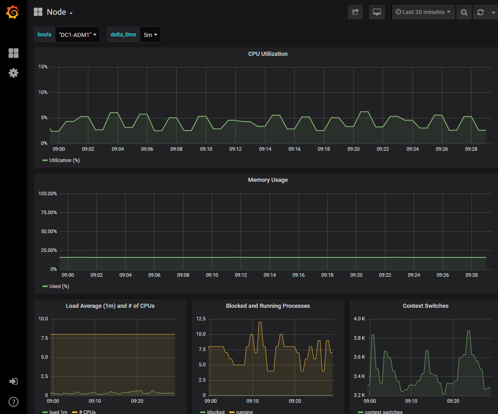

= Ejecutar diagnósticos
:allow-uri-read: 
:icons: font
:imagesdir: ../media/

[role="lead"]
Al solucionar un problema, puede trabajar con el soporte técnico para ejecutar diagnósticos en su sistema StorageGRID y revisar los resultados.

* link:reviewing-support-metrics.html["Revisar las métricas de soporte"]
* link:commonly-used-prometheus-metrics.html["Métricas de Prometheus de uso común"]

.Antes de empezar
* Ha iniciado sesión en Grid Manager mediante unlink:../admin/web-browser-requirements.html["navegador web compatible"] .
* Tieneslink:../admin/admin-group-permissions.html["permisos de acceso específicos"] .

.Acerca de esta tarea
La página Diagnóstico realiza un conjunto de comprobaciones de diagnóstico sobre el estado actual de la red.  Cada comprobación de diagnóstico puede tener uno de tres estados:

* image:../media/icon_alert_green_checkmark.png["Icono de alerta Marca de verificación verde"]*Normal*: Todos los valores están dentro del rango normal.
* image:../media/icon_alert_yellow_minor.png["Icono de alerta amarillo menor"]*Atención*: Uno o más de los valores están fuera del rango normal.
* image:../media/icon_alert_red_critical.png["Icono de alerta rojo crítico"]*Precaución*: Uno o más de los valores están significativamente fuera del rango normal.

Los estados de diagnóstico son independientes de las alertas actuales y podrían no indicar problemas operativos con la red.  Por ejemplo, una verificación de diagnóstico podría mostrar el estado de Precaución incluso si no se ha activado ninguna alerta.

.Pasos
. Seleccione *SOPORTE* > *Herramientas* > *Diagnóstico*.
+
Aparece la página Diagnóstico y enumera los resultados de cada verificación de diagnóstico.  Los resultados se ordenan por gravedad (Precaución, Atención y Normal).  Dentro de cada gravedad, los resultados se ordenan alfabéticamente.

+
En este ejemplo, todos los diagnósticos tienen un estado normal.

+
image::../media/support_diagnostics_page.png[Página de diagnóstico de soporte]

. Para obtener más información sobre un diagnóstico específico, haga clic en cualquier parte de la fila.
+
Aparecen detalles sobre el diagnóstico y sus resultados actuales.  Se enumeran los siguientes detalles:

+
** *Estado*: El estado actual de este diagnóstico: Normal, Atención o Precaución.
** *Consulta de Prometheus*: si se utiliza para el diagnóstico, la expresión de Prometheus que se utilizó para generar los valores de estado.  (No se utiliza una expresión de Prometeo para todos los diagnósticos).
** *Umbrales*: Si están disponibles para el diagnóstico, los umbrales definidos por el sistema para cada estado de diagnóstico anormal.  (Los valores de umbral no se utilizan para todos los diagnósticos).
+

NOTE: No puedes cambiar estos umbrales.

** *Valores de estado*: una tabla que muestra el estado y el valor del diagnóstico en todo el sistema StorageGRID . En este ejemplo, se muestra la utilización actual de la CPU para cada nodo en un sistema StorageGRID . Todos los valores de los nodos están por debajo de los umbrales de Atención y Precaución, por lo que el estado general del diagnóstico es Normal.

+
image::../media/support_diagnostics_cpu_utilization.png[Diagnóstico de soporte de utilización de CPU]

. *Opcional*: Para ver los gráficos de Grafana relacionados con este diagnóstico, haga clic en el enlace *Panel de Grafana*.
+
Este enlace no se muestra para todos los diagnósticos.

+
Aparece el panel de Grafana relacionado. En este ejemplo, el panel de nodo aparece mostrando la utilización de la CPU a lo largo del tiempo para este nodo, así como otros gráficos de Grafana para el nodo.

+

NOTE: También puede acceder a los paneles de Grafana prediseñados desde la sección Grafana de la página *SOPORTE* > *Herramientas* > *Métricas*.

+

. *Opcional*: Para ver un gráfico de la expresión de Prometheus a lo largo del tiempo, haga clic en *Ver en Prometheus*.
+
Aparece un gráfico de Prometeo de la expresión utilizada en el diagnóstico.

+
image::../media/support_diagnostics_prometheus_png.png[Página de soporte de diagnóstico de Prometheus]

