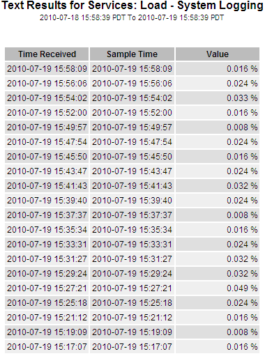
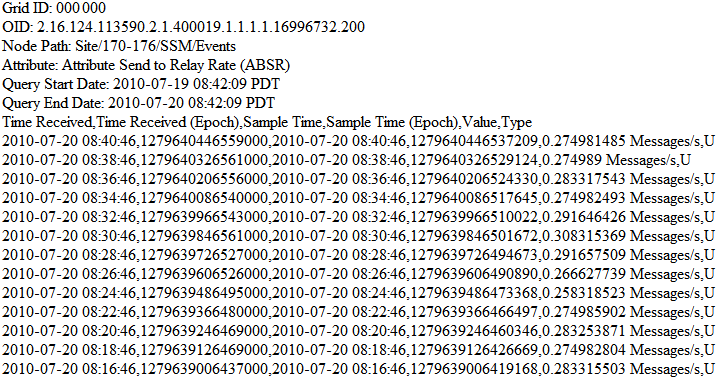

= Utilice informes de texto
:allow-uri-read: 
:icons: font
:imagesdir: ../media/

[role="lead"]
Los informes de texto muestran una representación textual de los valores de datos de atributos que han sido procesados por el servicio NMS.  Hay dos tipos de informes generados según el período de tiempo sobre el que esté informando: informes de texto sin procesar para períodos inferiores a una semana e informes de texto agregados para períodos superiores a una semana.

== Informes de texto sin procesar

Un informe de texto sin formato muestra detalles sobre el atributo seleccionado:

* Hora de recepción: fecha y hora locales en que el servicio NMS procesó un valor de muestra de los datos de un atributo.
* Hora de muestra: fecha y hora locales en las que se muestreó o modificó un valor de atributo en la fuente.
* Valor: Valor del atributo en el momento de la muestra.

== Informes de texto agregados

Un informe de texto agregado muestra datos durante un período de tiempo más largo (normalmente una semana) que un informe de texto sin procesar.  Cada entrada es el resultado de resumir múltiples valores de atributos (un agregado de valores de atributos) por parte del servicio NMS a lo largo del tiempo en una única entrada con valores promedio, máximos y mínimos que se derivan de la agregación.

Cada entrada muestra la siguiente información:

* Hora agregada: última fecha y hora local en que el servicio NMS agregó (recopiló) un conjunto de valores de atributos modificados.
* Valor promedio: el promedio del valor del atributo durante el período de tiempo agregado.
* Valor mínimo: el valor mínimo durante el período de tiempo agregado.
* Valor máximo: el valor máximo durante el período de tiempo agregado.

image::../media/aggregate_text_report.gif[Captura de pantalla que muestra el informe de texto agregado]

== Generar informes de texto

Los informes de texto muestran una representación textual de los valores de datos de atributos que han sido procesados por el servicio NMS.  Puede informar sobre un sitio de centro de datos, un nodo de red, un componente o un servicio.

.Antes de empezar
* Debe iniciar sesión en Grid Manager mediante unlink:../admin/web-browser-requirements.html["navegador web compatible"] .
* Tieneslink:../admin/admin-group-permissions.html["permisos de acceso específicos"] .

.Acerca de esta tarea
En el caso de los datos de atributos que se espera que cambien continuamente, el servicio NMS muestrea dichos datos (en la fuente) a intervalos regulares.  Para los datos de atributos que cambian con poca frecuencia (por ejemplo, datos basados en eventos como cambios de estado o estatus), se envía un valor de atributo al servicio NMS cuando el valor cambia.

El tipo de informe que se muestra depende del período de tiempo configurado.  De forma predeterminada, los informes de texto agregados se generan para períodos de tiempo superiores a una semana.

El texto gris indica que el servicio estuvo administrativamente inactivo durante el tiempo en que se muestreó.  El texto azul indica que el servicio estaba en un estado desconocido.

.Pasos
. Seleccione *SOPORTE* > *Herramientas* > *Topología de cuadrícula*.
. Seleccione *_nodo de cuadrícula_* > *_componente o servicio_* > *Informes* > *Texto*.
. Seleccione el atributo sobre el que desea informar de la lista desplegable *Atributo*.
. Seleccione el número de resultados por página de la lista desplegable *Resultados por página*.
. Para redondear valores a un máximo de tres decimales (por ejemplo, para atributos informados como porcentajes), desmarque la casilla de verificación *Datos sin procesar*.
. Seleccione el período de tiempo sobre el que desea informar en la lista desplegable *Consulta rápida*.
+
Seleccione la opción Consulta personalizada para seleccionar un rango de tiempo específico.

+
El informe aparece después de unos momentos.  Deje pasar varios minutos para la tabulación de rangos de tiempo largos.

. Si seleccionó Consulta personalizada, debe personalizar el período de tiempo sobre el que se realizará el informe ingresando la *Fecha de inicio* y la *Fecha de finalización*.
+
Utilice el formato `YYYY/MM/DDHH:MM:SS` en hora local.  Se requieren ceros a la izquierda para que coincida con el formato.  Por ejemplo, 2017/4/6 7:30:00 no pasa la validación.  El formato correcto es: 2017/04/06 07:30:00.

. Haga clic en *Actualizar*.
+
Se genera un informe de texto después de unos momentos.  Deje pasar varios minutos para la tabulación de rangos de tiempo largos.  Dependiendo del período de tiempo establecido para la consulta, se muestra un informe de texto sin procesar o un informe de texto agregado.

== Exportar informes de texto

Los informes de texto exportados abren una nueva pestaña del navegador, que le permite seleccionar y copiar los datos.

.Acerca de esta tarea
Luego, los datos copiados se pueden guardar en un nuevo documento (por ejemplo, una hoja de cálculo) y utilizar para analizar el rendimiento del sistema StorageGRID .

.Pasos
. Seleccione *SOPORTE* > *Herramientas* > *Topología de cuadrícula*.
. Crear un informe de texto.
. Haga clic en *Exportar*image:../media/icon_export.gif["icono de exportación"] .
+
image::../media/export_text_report.gif[captura de pantalla descrita por el texto circundante]

+
Se abre la ventana Exportar informe de texto mostrando el informe.

+

. Seleccione y copie el contenido de la ventana Exportar informe de texto.
+
Estos datos ahora se pueden pegar en un documento de terceros, como una hoja de cálculo.

