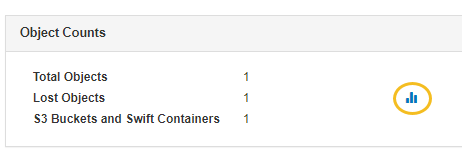

= Utilice tablas y gráficos
:allow-uri-read: 
:icons: font
:imagesdir: ../media/

[role="lead"]
Puede utilizar gráficos e informes para supervisar el estado del sistema StorageGRID y solucionar problemas.

NOTE: El Grid Manager se actualiza con cada versión y es posible que no coincida con las capturas de pantalla de ejemplo en esta página.

== Tipos de gráficos

Los gráficos y tablas resumen los valores de métricas y atributos específicos de StorageGRID .

El panel de control de Grid Manager incluye tarjetas que resumen el almacenamiento disponible para la red y cada sitio.

image::../media/dashboard_data_and_metadata_space_usage_breakdown.png[Desglose del uso del espacio de metadatos y datos del panel]

El panel de uso de almacenamiento en el tablero del Administrador de inquilinos muestra lo siguiente:

* Una lista de los depósitos (S3) o contenedores (Swift) más grandes para el inquilino
* Un gráfico de barras que representa los tamaños relativos de los cubos o contenedores más grandes
* La cantidad total de espacio utilizado y, si se establece una cuota, la cantidad y el porcentaje de espacio restante

image::../media/tenant_dashboard_with_buckets.png[Panel de control del inquilino]

Además, los gráficos que muestran cómo las métricas y los atributos de StorageGRID cambian con el tiempo están disponibles en la página Nodos y en la página *SOPORTE* > *Herramientas* > *Topología de cuadrícula*.

Hay cuatro tipos de gráficos:

* *Gráficos de Grafana*: Los gráficos de Grafana, que se muestran en la página Nodos, se utilizan para trazar los valores de las métricas de Prometheus a lo largo del tiempo.  Por ejemplo, la pestaña *NODOS* > *Red* de un nodo de almacenamiento incluye un gráfico de Grafana para el tráfico de red.
+
image::../media/nodes_page_network_tab.png[Página Nodos Pestaña Red]

+

NOTE: Los gráficos de Grafana también se incluyen en los paneles prediseñados disponibles en la página *SOPORTE* > *Herramientas* > *Métricas*.

* *Gráficos de líneas*: Disponibles en la página Nodos y en la página *SOPORTE* > *Herramientas* > *Topología de cuadrícula* (seleccione el ícono del gráficoimage:../media/icon_chart_new_for_11_5.png["Gráfico de iconos (nuevo)"] después de un valor de datos), los gráficos de líneas se utilizan para trazar los valores de los atributos de StorageGRID que tienen un valor unitario (como el desplazamiento de frecuencia NTP, en ppm).  Los cambios en el valor se grafican en intervalos de datos regulares (contenedores) a lo largo del tiempo.
+
image::../media/line_graph.gif[Gráfico de líneas]

* *Gráficos de área*: Disponibles en la página Nodos y en la página *SOPORTE* > *Herramientas* > *Topología de cuadrícula* (seleccione el ícono del gráficoimage:../media/icon_chart_new_for_11_5.png["Gráfico de iconos (nuevo)"] después de un valor de datos), los gráficos de área se utilizan para trazar cantidades de atributos volumétricos, como recuentos de objetos o valores de carga de servicio.  Los gráficos de área son similares a los gráficos de líneas, pero incluyen un sombreado marrón claro debajo de la línea.  Los cambios en el valor se grafican en intervalos de datos regulares (contenedores) a lo largo del tiempo.
+
image::../media/area_graph.gif[Gráfico de área]

* Algunos gráficos se indican con un tipo de icono de gráfico diferente.image:../media/icon_chart_new_for_11_5.png["Icono de gráfico"] y tienen un formato diferente:
+
image::../media/charts_lost_object_detected.png[Gráficos de objetos perdidos detectados]

* *Gráfico de estado*: Disponible en la página *SOPORTE* > *Herramientas* > *Topología de cuadrícula* (seleccione el ícono del gráficoimage:../media/icon_chart_new_for_11_5.png["Gráfico de iconos (nuevo)"] después de un valor de datos), los gráficos de estado se utilizan para trazar valores de atributos que representan estados distintos, como un estado de servicio que puede ser en línea, en espera o fuera de línea.  Los gráficos de estados son similares a los gráficos de líneas, pero la transición es discontinua; es decir, el valor salta de un valor de estado a otro.
+
image::../media/state_graph.gif[Gráfico de estado]

.Información relacionada
* link:viewing-nodes-page.html["Ver la página de Nodos"]
* link:viewing-grid-topology-tree.html["Ver el árbol de topología de la cuadrícula"]
* link:reviewing-support-metrics.html["Revisar las métricas de soporte"]

== Leyenda del gráfico

Las líneas y colores utilizados para dibujar gráficos tienen un significado específico.

[cols="1a,3a"]
|===
| Ejemplo | Significado 

 a| 
image:../media/dark_green_chart_line.gif["captura de pantalla que muestra una línea verde oscura"]
 a| 
Los valores de los atributos informados se representan mediante líneas de color verde oscuro.

 a| 
image:../media/light_green_chart_line.gif["Captura de pantalla que muestra el sombreado que indica la agrupación de datos."]
 a| 
El sombreado verde claro alrededor de las líneas verde oscuro indica que los valores reales en ese rango de tiempo varían y han sido agrupados para un trazado más rápido.  La línea oscura representa el promedio ponderado.  El rango en verde claro indica los valores máximo y mínimo dentro del contenedor.  El sombreado marrón claro se utiliza en los gráficos de área para indicar datos volumétricos.

 a| 
image:../media/no_data_plotted_chart.gif["Captura de pantalla que muestra áreas en blanco en la línea de la trama."]
 a| 
Las áreas en blanco (sin datos representados) indican que los valores de los atributos no estaban disponibles.  El fondo puede ser azul, gris o una mezcla de gris y azul, según el estado del servicio que informa el atributo.

 a| 
image:../media/light_blue_chart_shading.gif["Captura de pantalla que muestra un sombreado azul claro que indica valores indeterminados."]
 a| 
El sombreado azul claro indica que algunos o todos los valores de los atributos en ese momento eran indeterminados; el atributo no informaba valores porque el servicio estaba en un estado desconocido.

 a| 
image:../media/gray_chart_shading.gif["Captura de pantalla que muestra sombreado gris debido a valores desconocidos."]
 a| 
El sombreado gris indica que algunos o todos los valores de los atributos en ese momento no se conocían porque el servicio que informaba los atributos no estaba disponible administrativamente.

 a| 
image:../media/gray_blue_chart_shading.gif["Captura de pantalla que muestra una combinación de valores indeterminados y desconocidos."]
 a| 
Una mezcla de sombreado gris y azul indica que algunos de los valores de los atributos en ese momento eran indeterminados (porque el servicio estaba en un estado desconocido), mientras que otros no se conocían porque el servicio que informaba los atributos estaba administrativamente inactivo.

|===

== Mostrar gráficos y tablas

La página Nodos contiene gráficos y tablas a los que debe acceder periódicamente para monitorear atributos como la capacidad de almacenamiento y el rendimiento.  En algunos casos, especialmente cuando se trabaja con soporte técnico, puede utilizar la página *SOPORTE* > *Herramientas* > *Topología de cuadrícula* para acceder a gráficos adicionales.

.Antes de empezar
Debe iniciar sesión en Grid Manager mediante unlink:../admin/web-browser-requirements.html["navegador web compatible"] .

.Pasos
. Seleccione *NODOS*.  Luego, seleccione un nodo, un sitio o toda la cuadrícula.
. Seleccione la pestaña de la que desea ver información.
+
Algunas pestañas incluyen uno o más gráficos de Grafana, que se utilizan para trazar los valores de las métricas de Prometheus a lo largo del tiempo.  Por ejemplo, la pestaña *NODOS* > *Hardware* de un nodo incluye dos gráficos de Grafana.

+
image::../media/nodes_page_hardware_tab_graphs.png[Pestaña Hardware de la página Nodos Gráficos]

. Opcionalmente, coloque el cursor sobre el gráfico para ver valores más detallados para un punto particular en el tiempo.
+
image::../media/nodes_page_memory_usage_details.png[Detalles del uso de memoria de la página de nodos]

. Según sea necesario, a menudo puede mostrar un gráfico para un atributo o métrica específicos.  Desde la tabla en la página Nodos, seleccione el ícono del gráficoimage:../media/icon_chart_new_for_11_5.png["Icono de gráfico"] a la derecha del nombre del atributo.
+

NOTE: Los gráficos no están disponibles para todas las métricas y atributos.

+
*Ejemplo 1*: Desde la pestaña Objetos de un nodo de almacenamiento, puede seleccionar el ícono del gráficoimage:../media/icon_chart_new_for_11_5.png["Icono de gráfico"] para ver el número total de consultas exitosas al almacén de metadatos para el nodo de almacenamiento.

+
image::../media/nodes_page_objects_successful_metadata_queries.png[Consultas de metadatos exitosas]

+
image::../media/nodes_page-objects_chart_successful_metadata_queries.png[Gráficos de consultas de metadatos exitosas]

+
*Ejemplo 2*: Desde la pestaña Objetos de un nodo de almacenamiento, puede seleccionar el ícono del gráficoimage:../media/icon_chart_new_for_11_5.png["Icono de gráfico"] para ver el gráfico de Grafana del recuento de objetos perdidos detectados a lo largo del tiempo.

+

+
image::../media/charts_lost_object_detected.png[Gráficos de objetos perdidos detectados]

. Para mostrar gráficos de atributos que no se muestran en la página Nodo, seleccione *SOPORTE* > *Herramientas* > *Topología de cuadrícula*.
. Seleccione *_nodo de cuadrícula_* > *_componente o servicio_* > *Descripción general* > *Principal*.
+
image::../media/nms_chart.gif[captura de pantalla descrita por el texto circundante]

. Seleccione el icono del gráficoimage:../media/icon_chart_new_for_11_5.png["Icono de gráfico"] junto al atributo.
+
La pantalla cambia automáticamente a la página *Informes* > *Gráficos*.  El gráfico muestra los datos del atributo durante el último día.

== Generar gráficos

Los gráficos muestran una representación gráfica de los valores de los datos de atributos.  Puede informar sobre un sitio de centro de datos, un nodo de red, un componente o un servicio.

.Antes de empezar
* Debe iniciar sesión en Grid Manager mediante unlink:../admin/web-browser-requirements.html["navegador web compatible"] .
* Tieneslink:../admin/admin-group-permissions.html["permisos de acceso específicos"] .

.Pasos
. Seleccione *SOPORTE* > *Herramientas* > *Topología de cuadrícula*.
. Seleccione *_nodo de cuadrícula_* > *_componente o servicio_* > *Informes* > *Gráficos*.
. Seleccione el atributo sobre el que desea informar de la lista desplegable *Atributo*.
. Para forzar que el eje Y comience en cero, desmarque la casilla de verificación *Escala vertical*.
. Para mostrar valores con total precisión, seleccione la casilla de verificación *Datos sin procesar*, o para redondear los valores a un máximo de tres decimales (por ejemplo, para atributos informados como porcentajes), desmarque la casilla de verificación *Datos sin procesar*.
. Seleccione el período de tiempo sobre el que desea informar en la lista desplegable *Consulta rápida*.
+
Seleccione la opción Consulta personalizada para seleccionar un rango de tiempo específico.

+
El gráfico aparece después de unos momentos.  Deje pasar varios minutos para la tabulación de rangos de tiempo largos.

. Si seleccionó Consulta personalizada, personalice el período de tiempo para el gráfico ingresando la *Fecha de inicio* y la *Fecha de finalización*.
+
Utilice el formato `_YYYY/MM/DDHH:MM:SS_` en hora local.  Se requieren ceros a la izquierda para que coincida con el formato.  Por ejemplo, 2017/4/6 7:30:00 no pasa la validación.  El formato correcto es: 2017/04/06 07:30:00.

. Seleccione *Actualizar*.
+
Se genera un gráfico después de unos segundos.  Deje pasar varios minutos para la tabulación de rangos de tiempo largos.  Dependiendo del período de tiempo establecido para la consulta, se muestra un informe de texto sin procesar o un informe de texto agregado.

