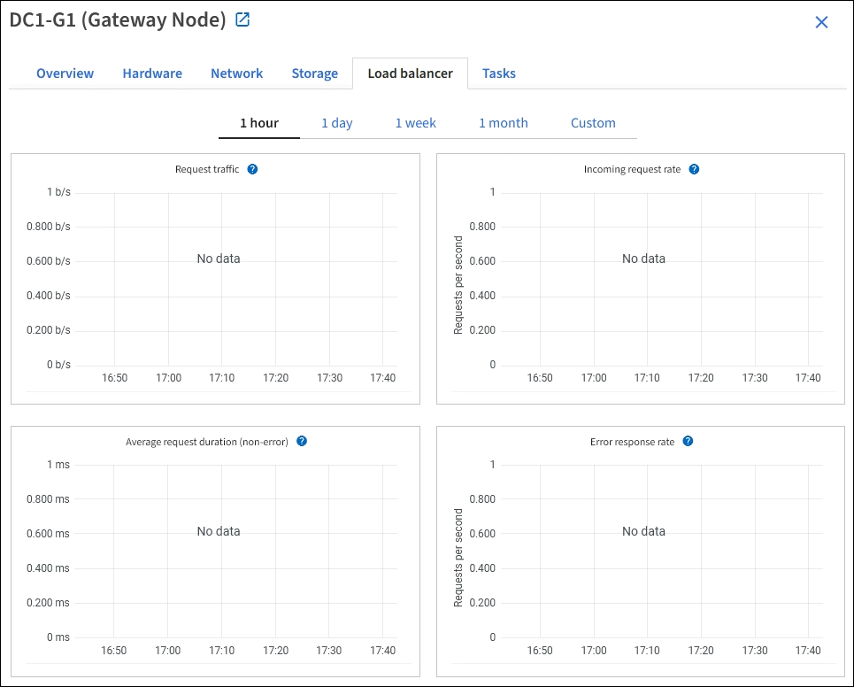

= Ver la pestaña Balanceador de carga
:allow-uri-read: 
:icons: font
:imagesdir: ../media/

[role="lead"]
La pestaña Load Balancer incluye gráficos de rendimiento y diagnóstico relacionados con el funcionamiento del servicio Load Balancer.

La pestaña Balanceador de carga se muestra para los nodos de administración y los nodos de puerta de enlace, cada sitio y toda la red.  Para cada sitio, la pestaña Balanceador de carga proporciona un resumen agregado de las estadísticas de todos los nodos de ese sitio.  Para toda la cuadrícula, la pestaña Balanceador de carga proporciona un resumen agregado de las estadísticas de todos los sitios.

Si no se ejecuta ninguna operación de E/S a través del servicio Load Balancer, o no hay ningún balanceador de carga configurado, los gráficos muestran "No hay datos".

== Solicitar tráfico

Este gráfico proporciona un promedio móvil de 3 minutos del rendimiento de los datos transmitidos entre los puntos finales del balanceador de carga y los clientes que realizan las solicitudes, en bits por segundo.

NOTE: Este valor se actualiza al finalizar cada solicitud.  Como resultado, este valor puede diferir del rendimiento en tiempo real en tasas de solicitud bajas o para solicitudes de duración muy larga.  Puede consultar la pestaña Red para obtener una visión más realista del comportamiento actual de la red.

== Tasa de solicitudes entrantes

Este gráfico proporciona un promedio móvil de 3 minutos de la cantidad de nuevas solicitudes por segundo, desglosadas por tipo de solicitud (GET, PUT, HEAD y DELETE).  Este valor se actualiza cuando se han validado los encabezados de una nueva solicitud.

== Duración promedio de la solicitud (sin errores)

Este gráfico proporciona un promedio móvil de 3 minutos de duraciones de solicitudes, desglosado por tipo de solicitud (GET, PUT, HEAD y DELETE).  La duración de cada solicitud comienza cuando el servicio Load Balancer analiza un encabezado de solicitud y finaliza cuando se devuelve el cuerpo de respuesta completo al cliente.

== Tasa de respuesta de error

Este gráfico proporciona un promedio móvil de 3 minutos de la cantidad de respuestas de error devueltas a los clientes por segundo, desglosado por el código de respuesta de error.

.Información relacionada
* link:monitoring-load-balancing-operations.html["Supervisar las operaciones de equilibrio de carga"]
* link:../admin/index.html["Administrar StorageGRID"]

