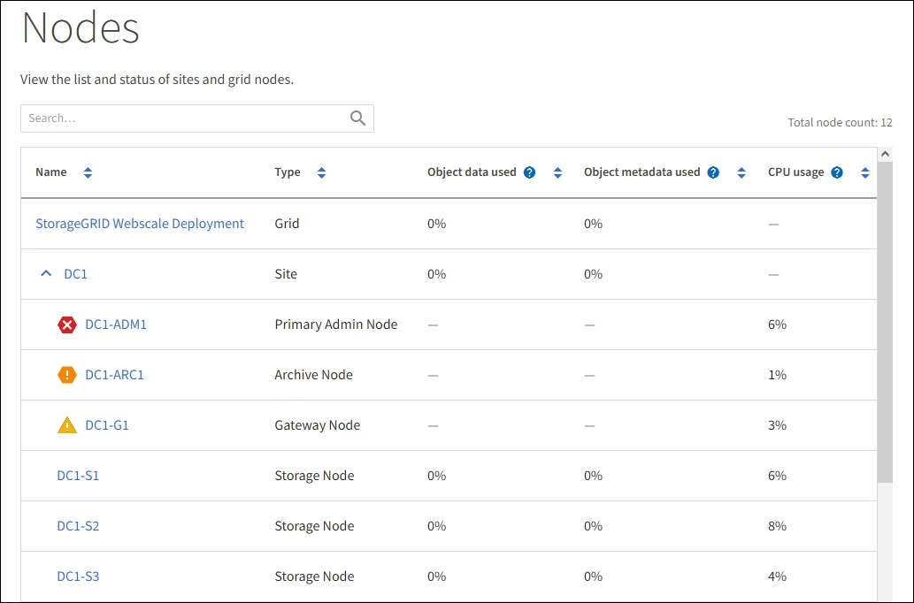

= Ver la página de Nodos
:allow-uri-read: 
:icons: font
:imagesdir: ../media/

[role="lead"]
Cuando necesite información más detallada sobre su sistema StorageGRID que la que proporciona el panel, puede usar la página Nodos para ver las métricas de toda la red, cada sitio de la red y cada nodo de un sitio.

La tabla Nodos enumera información resumida de toda la red, cada sitio y cada nodo.  Si un nodo está desconectado o tiene una alerta activa, aparece un ícono junto al nombre del nodo.  Si el nodo está conectado y no tiene alertas activas, no se muestra ningún ícono.

NOTE: Cuando un nodo no está conectado a la red, como durante una actualización o en un estado desconectado, ciertas métricas podrían no estar disponibles o estar excluidas de los totales del sitio y de la red.  Después de que un nodo se vuelva a conectar a la red, espere varios minutos para que los valores se estabilicen.

NOTE: Para cambiar las unidades de los valores de almacenamiento que se muestran en el Administrador de cuadrícula, seleccione el menú desplegable de usuario en la parte superior derecha del Administrador de cuadrícula y luego seleccione *Preferencias de usuario*.

NOTE: Las capturas de pantalla que se muestran son ejemplos.  Los resultados pueden variar según la versión de StorageGRID .

== Iconos de estado de conexión

Si un nodo se desconecta de la red, aparecerá cualquiera de los siguientes íconos junto al nombre del nodo.

[cols="1a,3a,3a"]
|===
| Icono | Descripción | Acción requerida 

 a| 
image:../media/icon_alarm_blue_unknown.png["icono de signo de interrogación azul"]
 a| 
*No conectado - Desconocido*

Por una razón desconocida, un nodo se desconecta o los servicios en el nodo dejan de funcionar inesperadamente.  Por ejemplo, es posible que se haya detenido un servicio en el nodo o que el nodo haya perdido su conexión a la red debido a un corte de energía o una interrupción inesperada.

También podría activarse la alerta *No se puede comunicar con el nodo*.  También podrían estar activas otras alertas.
 a| 
Requiere atención inmediata. link:monitoring-system-health.html#view-current-and-resolved-alerts["Seleccione cada alerta"] y siga las acciones recomendadas.

Por ejemplo, es posible que necesite reiniciar un servicio que se ha detenido o reiniciar el host del nodo.

*Nota*: Un nodo puede aparecer como Desconocido durante las operaciones de apagado administrado.  Puedes ignorar el estado Desconocido en estos casos.

 a| 
image:../media/icon_alarm_gray_administratively_down.png["icono de signo de interrogación gris"]
 a| 
*No conectado - Administrativamente caído*

Por una razón esperada, el nodo no está conectado a la red.

Por ejemplo, el nodo, o los servicios en el nodo, se han apagado correctamente, el nodo se está reiniciando o se está actualizando el software.  También podrían estar activas una o más alertas.

Dependiendo del problema subyacente, estos nodos a menudo vuelven a estar en línea sin ninguna intervención.
 a| 
Determinar si hay alguna alerta que afecte a este nodo.

Si una o más alertas están activas,link:monitoring-system-health.html#view-current-and-resolved-alerts["Seleccione cada alerta"] y siga las acciones recomendadas.

|===
Si un nodo está desconectado de la red, puede tener una alerta subyacente, pero solo aparece el ícono "No conectado".  Para ver las alertas activas de un nodo, seleccione el nodo.

== Iconos de alerta

Si hay una alerta activa para un nodo, aparece uno de los siguientes íconos junto al nombre del nodo:

image:../media/icon_alert_red_critical.png["Icono de alerta rojo crítico"]*Crítico*: Existe una condición anormal que ha detenido las operaciones normales de un nodo o servicio de StorageGRID .  Debes abordar el problema subyacente inmediatamente.  Si no se resuelve el problema podría producirse una interrupción del servicio y pérdida de datos.

image:../media/icon_alert_orange_major.png["Icono de alerta naranja mayor"]*Importante*: Existe una condición anormal que está afectando las operaciones actuales o acercándose al umbral de una alerta crítica.  Debe investigar las alertas principales y abordar cualquier problema subyacente para garantizar que la condición anormal no detenga el funcionamiento normal de un nodo o servicio de StorageGRID .

image:../media/icon_alert_yellow_minor.png["Icono de alerta amarillo menor"]*Menor*: El sistema está funcionando normalmente, pero existe una condición anormal que podría afectar la capacidad del sistema para funcionar si continúa.  Debes supervisar y resolver las alertas menores que no desaparecen por sí solas para garantizar que no provoquen un problema más grave.

== Ver detalles de un sistema, sitio o nodo

Para filtrar la información que se muestra en la tabla Nodos, ingrese una cadena de búsqueda en el campo *Buscar*.  Puede buscar por nombre del sistema, nombre para mostrar o tipo (por ejemplo, ingrese *gat* para localizar rápidamente todos los nodos de puerta de enlace).

Para ver la información de la cuadrícula, el sitio o el nodo:

* Seleccione el nombre de la cuadrícula para ver un resumen agregado de las estadísticas de todo su sistema StorageGRID .
* Seleccione un sitio de centro de datos específico para ver un resumen agregado de las estadísticas de todos los nodos en ese sitio.
* Seleccione un nodo específico para ver información detallada de ese nodo.

