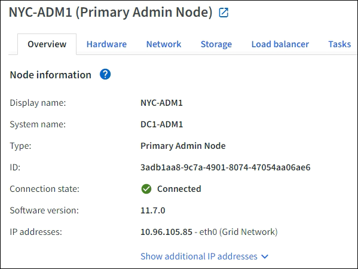

= Ver la pestaña Descripción general
:allow-uri-read: 
:icons: font
:imagesdir: ../media/

[role="lead"]
La pestaña Descripción general proporciona información básica sobre cada nodo.  También muestra cualquier alerta que afecte actualmente al nodo.

La pestaña Descripción general se muestra para todos los nodos.

== Información del nodo

La sección Información del nodo de la pestaña Descripción general enumera información básica sobre el nodo.

La información general de un nodo incluye lo siguiente:

* *Nombre para mostrar* (se muestra solo si se ha cambiado el nombre del nodo): el nombre para mostrar actual del nodo.  Utilice ellink:../maintain/rename-grid-site-node-overview.html["Cambiar el nombre de la cuadrícula, los sitios y los nodos"] procedimiento para actualizar este valor.
* *Nombre del sistema*: el nombre que ingresó para el nodo durante la instalación.  Los nombres del sistema se utilizan para operaciones internas de StorageGRID y no se pueden cambiar.
* *Tipo*: El tipo de nodo: nodo de administración, nodo de administración principal, nodo de almacenamiento o nodo de puerta de enlace.
* *ID*: El identificador único del nodo, también conocido como UUID.
* *Estado de conexión*: Uno de tres estados.  Se muestra el icono del estado más grave.
+
** *Desconocido*image:../media/icon_alarm_blue_unknown.png["icono de signo de interrogación azul"] :Por alguna razón desconocida, el nodo no está conectado a la red o uno o más servicios están inactivos inesperadamente.  Por ejemplo, se ha perdido la conexión de red entre los nodos, se ha cortado la energía o se ha caído un servicio.  También podría activarse la alerta *No se puede comunicar con el nodo*.  También podrían estar activas otras alertas.  Esta situación requiere atención inmediata.
+

NOTE: Un nodo podría aparecer como Desconocido durante las operaciones de apagado administrado.  Puedes ignorar el estado Desconocido en estos casos.

** *Administrativamente caído*image:../media/icon_alarm_gray_administratively_down.png["icono de signo de interrogación gris"] :El nodo no está conectado a la red por una razón esperada.  Por ejemplo, el nodo, o los servicios en el nodo, se han apagado correctamente, el nodo se está reiniciando o se está actualizando el software.  También podrían estar activas una o más alertas.
** *Conectado*image:../media/icon_alert_green_checkmark.png["Icono de alerta de marca de verificación verde"] :El nodo está conectado a la red.

* *Almacenamiento utilizado*: Solo para nodos de almacenamiento.
+
** *Datos de objeto*: el porcentaje del espacio total utilizable para datos de objeto que se ha utilizado en el nodo de almacenamiento.
** *Metadatos del objeto*: el porcentaje del espacio total permitido para los metadatos del objeto que se ha utilizado en el nodo de almacenamiento.

* *Versión de software*: la versión de StorageGRID que está instalada en el nodo.
* *Grupos HA*: solo para nodos de administración y nodos de puerta de enlace.  Se muestra si una interfaz de red en el nodo está incluida en un grupo de alta disponibilidad y si esa interfaz es la interfaz principal.
* *Direcciones IP*: Las direcciones IP del nodo.  Haga clic en *Mostrar direcciones IP adicionales* para ver las direcciones IPv4 e IPv6 del nodo y las asignaciones de interfaz.

== Alertas

La sección Alertas de la pestaña Descripción general enumera todas laslink:monitoring-system-health.html#view-current-and-resolved-alerts["alertas que actualmente afectan a este nodo y que no han sido silenciadas"] .  Seleccione el nombre de la alerta para ver detalles adicionales y acciones recomendadas.

image::../media/nodes_page_alerts_table.png[Tabla de alertas de la página de nodos]

También se incluyen alertas paralink:monitoring-system-health.html#monitor-node-connection-states["estados de conexión de nodos"] .
