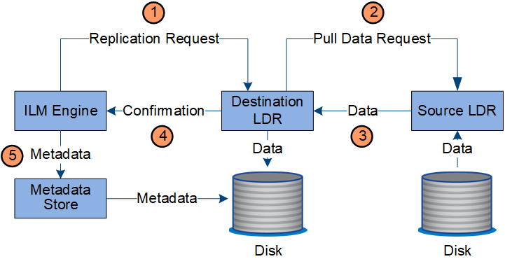

= Gestión de copias
:allow-uri-read: 
:icons: font
:imagesdir: ../media/

[role="lead"]
Los datos de los objetos se administran mediante las políticas ILM activas y las reglas ILM asociadas.  Las reglas ILM realizan copias replicadas o con código de borrado para proteger los datos de los objetos contra pérdidas.

Es posible que se requieran distintos tipos o ubicaciones de copias de objetos en distintos momentos de la vida del objeto.  Las reglas de ILM se evalúan periódicamente para garantizar que los objetos se coloquen según lo requerido.

Los datos de los objetos son administrados por el servicio LDR.

== Protección de contenido: replicación

Si las instrucciones de ubicación de contenido de una regla ILM requieren copias replicadas de datos de objetos, los nodos de almacenamiento que conforman el grupo de almacenamiento configurado realizan copias y las almacenan en el disco.

El motor ILM del servicio LDR controla la replicación y garantiza que se almacene la cantidad correcta de copias en las ubicaciones correctas y durante el tiempo correcto.

. El motor ILM consulta al servicio ADC para determinar el mejor servicio LDR de destino dentro del grupo de almacenamiento especificado por la regla ILM.  Luego envía a ese servicio LDR un comando para iniciar la replicación.
. El servicio LDR de destino consulta al servicio ADC para obtener la mejor ubicación de origen.  Luego envía una solicitud de replicación al servicio LDR de origen.
. El servicio LDR de origen envía una copia al servicio LDR de destino.
. El servicio LDR de destino notifica al motor ILM que se han almacenado los datos del objeto.
. El motor ILM actualiza el almacén de metadatos con metadatos de ubicación de objetos.

== Protección de contenido: codificación de borrado

Si una regla ILM incluye instrucciones para realizar copias codificadas de borrado de datos de objetos, el esquema de codificación de borrado aplicable divide los datos de objetos en fragmentos de datos y paridad y distribuye estos fragmentos entre los nodos de almacenamiento configurados en el perfil de codificación de borrado.

El motor ILM, que es un componente del servicio LDR, controla la codificación de borrado y garantiza que el perfil de codificación de borrado se aplique a los datos del objeto.

image::../media/erasure_coding_data_flow.png[Flujo de datos de codificación de borrado]

. El motor ILM consulta al servicio ADC para determinar qué servicio DDS puede realizar mejor la operación de codificación de borrado.  Cuando se determina, el motor ILM envía una solicitud de "inicio" a ese servicio.
. El servicio DDS instruye a un LDR a codificar el borrado de los datos del objeto.
. El servicio LDR de origen envía una copia al servicio LDR seleccionado para la codificación de borrado.
. Después de crear la cantidad adecuada de fragmentos de paridad y datos, el servicio LDR distribuye estos fragmentos entre los nodos de almacenamiento (servicios de fragmentos) que conforman el grupo de almacenamiento del perfil de codificación de borrado.
. El servicio LDR notifica al motor ILM, confirmando que los datos del objeto se distribuyeron correctamente.
. El motor ILM actualiza el almacén de metadatos con metadatos de ubicación de objetos.

== Protección de contenido: Cloud Storage Pool

Si las instrucciones de ubicación de contenido de una regla ILM requieren que se almacene una copia replicada de los datos del objeto en un grupo de almacenamiento en la nube, los datos del objeto se duplican en el bucket S3 externo o en el contenedor de almacenamiento de blobs de Azure que se especificó para el grupo de almacenamiento en la nube.

El motor ILM, que es un componente del servicio LDR, y el servicio Data Mover controlan el movimiento de objetos al grupo de almacenamiento en la nube.

image::../media/cloud_storage_pool_data_flow.png[Flujo de datos del grupo de almacenamiento en la nube]

. El motor ILM selecciona un servicio Data Mover para replicar en el grupo de almacenamiento en la nube.
. El servicio Data Mover envía los datos del objeto al grupo de almacenamiento en la nube.
. El servicio Data Mover notifica al motor ILM que los datos del objeto se han almacenado.
. El motor ILM actualiza el almacén de metadatos con metadatos de ubicación de objetos.

