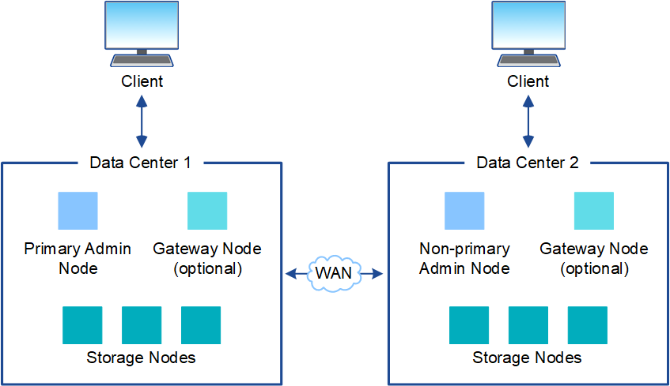

= Arquitectura y topología de red de StorageGRID
:allow-uri-read: 
:icons: font
:imagesdir: ../media/

[role="lead"]
Un sistema StorageGRID consta de varios tipos de nodos de red en uno o más sitios de centros de datos.

Ver ellink:nodes-and-services.html["descripciones de los tipos de nodos de la cuadrícula"] .

Para obtener información adicional sobre la topología de red, los requisitos y las comunicaciones de red de StorageGRID , consultelink:../network/index.html["Pautas para establecer redes"] .

== Topologías de implementación

El sistema StorageGRID se puede implementar en un solo sitio de centro de datos o en varios sitios de centros de datos.

=== Sitio único

En una implementación con un solo sitio, la infraestructura y las operaciones del sistema StorageGRID están centralizadas.

image::../media/data_center_site_single.png[Sitio de centro de datos único]

=== Múltiples sitios

En una implementación con varios sitios, se pueden instalar distintos tipos y cantidades de recursos StorageGRID en cada sitio.  Por ejemplo, podría requerirse más almacenamiento en un centro de datos que en otro.

A menudo, los distintos sitios se ubican en lugares geográficamente diferentes a lo largo de distintos dominios de falla, como una falla sísmica o una llanura aluvial. El intercambio de datos y la recuperación ante desastres se logran mediante la distribución automatizada de datos a otros sitios.

También pueden existir múltiples sitios lógicos dentro de un solo centro de datos para permitir el uso de replicación distribuida y codificación de borrado para aumentar la disponibilidad y la resiliencia.

=== Redundancia de nodos de red

En una implementación de un solo sitio o de varios sitios, puede incluir opcionalmente más de un nodo de administración o nodo de puerta de enlace para redundancia.  Por ejemplo, puede instalar más de un nodo de administración en un solo sitio o en varios sitios.  Sin embargo, cada sistema StorageGRID solo puede tener un nodo de administración principal.

== Arquitectura del sistema

Este diagrama muestra cómo se organizan los nodos de la red dentro de un sistema StorageGRID .

image::../media/grid_nodes_and_components.png[Diagrama descrito por el texto circundante]

Los clientes S3 almacenan y recuperan objetos en StorageGRID.  Se utilizan otros clientes para enviar notificaciones por correo electrónico, acceder a la interfaz de administración de StorageGRID y, opcionalmente, acceder al recurso compartido de auditoría.

Los clientes S3 pueden conectarse a un nodo de puerta de enlace o a un nodo de administración para utilizar la interfaz de equilibrio de carga para los nodos de almacenamiento.  Alternativamente, los clientes S3 pueden conectarse directamente a los nodos de almacenamiento mediante HTTPS.

Los objetos se pueden almacenar dentro de StorageGRID en nodos de almacenamiento basados ​​en software o hardware, o en grupos de almacenamiento en la nube, que consisten en depósitos S3 externos o contenedores de almacenamiento de blobs de Azure.
