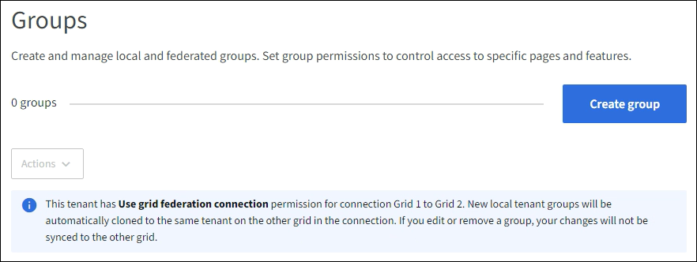

= Crear grupos para un inquilino de S3
:allow-uri-read: 
:icons: font
:imagesdir: ../media/

[role="lead"]
Puede administrar permisos para grupos de usuarios de S3 importando grupos federados o creando grupos locales.

.Antes de empezar
* Ha iniciado sesión en el Administrador de inquilinos mediante unlink:../admin/web-browser-requirements.html["navegador web compatible"] .
* Perteneces a un grupo de usuarios que tiene lalink:tenant-management-permissions.html["Permiso de acceso root"] .
* Si planea importar un grupo federado, debelink:using-identity-federation.html["federación de identidad configurada"] , y el grupo federado ya existe en la fuente de identidad configurada.
* Si su cuenta de inquilino tiene el permiso *Usar conexión de federación de red*, ha revisado el flujo de trabajo y las consideraciones paralink:grid-federation-account-clone.html["Clonación de grupos de inquilinos y usuarios"] , y ha iniciado sesión en la red de origen del inquilino.

== Acceder al asistente para crear grupos

Como primer paso, acceda al asistente para crear grupos.

.Pasos
. Seleccione *GESTIÓN DE ACCESO* > *Grupos*.
. Si su cuenta de inquilino tiene el permiso *Usar conexión de federación de red*, confirme que aparece un banner azul que indica que los nuevos grupos creados en esta red se clonarán en el mismo inquilino en la otra red de la conexión.  Si este banner no aparece, es posible que haya iniciado sesión en la cuadrícula de destino del inquilino.
+

. Seleccione *Crear grupo*.

== Elija un tipo de grupo

Puede crear un grupo local o importar un grupo federado.

.Pasos
. Seleccione la pestaña *Grupo local* para crear un grupo local, o seleccione la pestaña *Grupo federado* para importar un grupo desde la fuente de identidad configurada previamente.
+
Si el inicio de sesión único (SSO) está habilitado para su sistema StorageGRID , los usuarios que pertenecen a grupos locales no podrán iniciar sesión en el Administrador de inquilinos, aunque podrán usar aplicaciones cliente para administrar los recursos del inquilino, según los permisos del grupo.

. Introduzca el nombre del grupo.
+
** *Grupo local*: Ingrese un nombre para mostrar y un nombre único.  Podrás editar el nombre para mostrar más tarde.
+

NOTE: Si su cuenta de inquilino tiene el permiso *Usar conexión de federación de red*, se producirá un error de clonación si ya existe el mismo *Nombre único* para el inquilino en la red de destino.

** *Grupo federado*: Ingrese el nombre único.  Para Active Directory, el nombre único es el nombre asociado con el `sAMAccountName` atributo.  Para OpenLDAP, el nombre único es el nombre asociado con el `uid` atributo.

. Seleccione *Continuar*.

== Administrar permisos de grupo

Los permisos de grupo controlan qué tareas pueden realizar los usuarios en el Administrador de inquilinos y la API de administración de inquilinos.

.Pasos
. Para *Modo de acceso*, seleccione una de las siguientes opciones:
+
** *Lectura y escritura* (predeterminado): los usuarios pueden iniciar sesión en Tenant Manager y administrar la configuración del inquilino.
** *Solo lectura*: los usuarios solo pueden ver configuraciones y funciones.  No pueden realizar ningún cambio ni realizar ninguna operación en el Administrador de inquilinos ni en la API de administración de inquilinos.  Los usuarios locales de solo lectura pueden cambiar sus propias contraseñas.
+

NOTE: Si un usuario pertenece a varios grupos y alguno de ellos está configurado como de solo lectura, el usuario tendrá acceso de solo lectura a todas las configuraciones y funciones seleccionadas.

. Seleccione uno o más permisos para este grupo.
+
Ver link:../tenant/tenant-management-permissions.html["Permisos de gestión de inquilinos"] .

. Seleccione *Continuar*.

== Establecer la política de grupo de S3

La política de grupo determina qué permisos de acceso a S3 tendrán los usuarios.

.Pasos
. Seleccione la política que desea utilizar para este grupo.
+
[cols="1a,2a"]
|===
| Política de grupo | Descripción 

 a| 
Sin acceso a S3
 a| 
Por defecto.  Los usuarios de este grupo no tienen acceso a los recursos de S3, a menos que se les conceda acceso con una política de bucket.  Si selecciona esta opción, solo el usuario root tendrá acceso a los recursos de S3 de forma predeterminada.

 a| 
Acceso de solo lectura
 a| 
Los usuarios de este grupo tienen acceso de solo lectura a los recursos de S3.  Por ejemplo, los usuarios de este grupo pueden enumerar objetos y leer datos de objetos, metadatos y etiquetas.  Cuando selecciona esta opción, la cadena JSON para una política de grupo de solo lectura aparece en el cuadro de texto.  No puedes editar esta cadena.

 a| 
Acceso completo
 a| 
Los usuarios de este grupo tienen acceso completo a los recursos de S3, incluidos los buckets.  Cuando selecciona esta opción, la cadena JSON para una política de grupo de acceso completo aparece en el cuadro de texto.  No puedes editar esta cadena.

 a| 
Mitigación de ransomware
 a| 
Esta política de ejemplo se aplica a todos los depósitos de este inquilino.  Los usuarios de este grupo pueden realizar acciones comunes, pero no pueden eliminar de forma permanente objetos de los depósitos que tienen habilitada la versión de objetos.

Los usuarios del administrador de inquilinos que tienen el permiso *Administrar todos los depósitos* pueden anular esta política de grupo.  Limite el permiso Administrar todos los depósitos a usuarios de confianza y utilice la autenticación multifactor (MFA) cuando esté disponible.

 a| 
Costumbre
 a| 
A los usuarios del grupo se les conceden los permisos que especifique en el cuadro de texto.

|===
. Si seleccionó *Personalizado*, ingrese la política de grupo.  Cada política de grupo tiene un límite de tamaño de 5120 bytes.  Debe ingresar una cadena con formato JSON válida.
+
Para obtener información detallada sobre las políticas de grupo, incluida la sintaxis del lenguaje y ejemplos, consultelink:../s3/example-group-policies.html["Políticas de grupo de ejemplo"] .

. Si está creando un grupo local, seleccione *Continuar*.  Si está creando un grupo federado, seleccione *Crear grupo* y *Finalizar*.

== Agregar usuarios (solo grupos locales)

Puede guardar el grupo sin agregar usuarios o, opcionalmente, puede agregar cualquier usuario local que ya exista.

NOTE: Si su cuenta de inquilino tiene el permiso *Usar conexión de federación de red*, cualquier usuario que seleccione al crear un grupo local en la red de origen no se incluirá cuando el grupo se clone en la red de destino.  Por este motivo, no seleccione usuarios al crear el grupo.  En su lugar, seleccione el grupo cuando cree los usuarios.

.Pasos
. Opcionalmente, seleccione uno o más usuarios locales para este grupo.
. Seleccione *Crear grupo* y *Finalizar*.
+
El grupo que usted creó aparece en la lista de grupos.

+
Si su cuenta de inquilino tiene el permiso *Usar conexión de federación de red* y usted está en la red de origen del inquilino, el nuevo grupo se clona en la red de destino del inquilino.  *Éxito* aparece como *Estado de clonación* en la sección Descripción general de la página de detalles del grupo.

