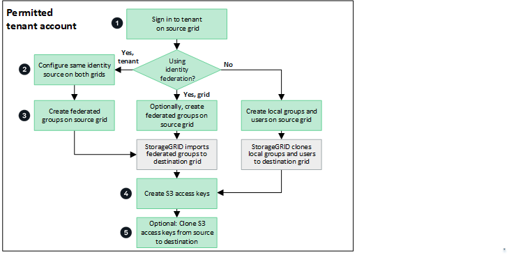
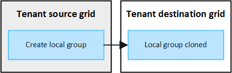
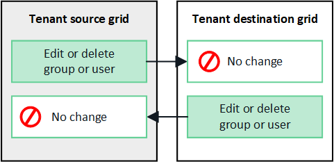

= Clonar grupos de inquilinos y usuarios
:allow-uri-read: 
:icons: font
:imagesdir: ../media/

[role="lead"]
Si se creó o editó un inquilino para usar una conexión de federación de red, ese inquilino se replica desde un sistema StorageGRID (el inquilino de origen) a otro sistema StorageGRID (el inquilino de réplica).  Una vez replicado el inquilino, todos los grupos y usuarios agregados al inquilino de origen se clonan en el inquilino de réplica.

El sistema StorageGRID donde se crea originalmente el inquilino es la _cuadrícula de origen_ del inquilino.  El sistema StorageGRID donde se replica el inquilino es la _red de destino_ del inquilino.  Ambas cuentas de inquilino tienen el mismo ID de cuenta, nombre, descripción, cuota de almacenamiento y permisos asignados, pero el inquilino de destino no tiene inicialmente una contraseña de usuario raíz.  Para más detalles, véaselink:../admin/grid-federation-what-is-account-clone.html["¿Qué es la clonación de cuenta?"] ylink:../admin/grid-federation-manage-tenants.html["Gestionar inquilinos permitidos"] .

La clonación de la información de la cuenta del inquilino es necesaria paralink:../admin/grid-federation-what-is-cross-grid-replication.html["replicación entre redes"] de objetos de cubo.  Tener los mismos grupos de inquilinos y usuarios en ambas redes garantiza que pueda acceder a los depósitos y objetos correspondientes en cualquiera de las redes.

== Flujo de trabajo del inquilino para la clonación de cuentas

Si su cuenta de inquilino tiene el permiso *Usar conexión de federación de red*, revise el diagrama de flujo de trabajo para ver los pasos que realizará para clonar grupos, usuarios y claves de acceso S3.

Estos son los pasos principales del flujo de trabajo:

.image:https://raw.githubusercontent.com/NetAppDocs/common/main/media/number-1.png["1"]Sign in en el inquilino
[role="quick-margin-para"]
Sign in en la cuenta del inquilino en la cuadrícula de origen (la cuadrícula donde se creó inicialmente el inquilino).

.image:https://raw.githubusercontent.com/NetAppDocs/common/main/media/number-2.png["Dos"]Opcionalmente, configure la federación de identidad
[role="quick-margin-para"]
Si su cuenta de inquilino tiene el permiso *Usar fuente de identidad propia* para usar grupos y usuarios federados, configure la misma fuente de identidad (con la misma configuración) para las cuentas de inquilino de origen y de destino.  Los grupos y usuarios federados no se pueden clonar a menos que ambas redes utilicen la misma fuente de identidad. Para obtener instrucciones, consultelink:using-identity-federation.html["Utilizar la federación de identidades"] .

.image:https://raw.githubusercontent.com/NetAppDocs/common/main/media/number-3.png["Tres"]Crear grupos y usuarios
[role="quick-margin-para"]
Al crear grupos y usuarios, comience siempre desde la cuadrícula de origen del inquilino.  Cuando agrega un nuevo grupo, StorageGRID lo clona automáticamente en la cuadrícula de destino.

[role="quick-margin-list"]
* Si la federación de identidad está configurada para todo el sistema StorageGRID o para su cuenta de inquilino,link:creating-groups-for-s3-tenant.html["crear nuevos grupos de inquilinos"] importando grupos federados desde la fuente de identidad.

[role="quick-margin-list"]
* Si no está utilizando la federación de identidad,link:creating-groups-for-s3-tenant.html["crear nuevos grupos locales"] y luegolink:managing-local-users.html["crear usuarios locales"] .

.image:https://raw.githubusercontent.com/NetAppDocs/common/main/media/number-4.png["Cuatro"]Crear claves de acceso S3
[role="quick-margin-para"]
Puedelink:creating-your-own-s3-access-keys.html["crea tus propias claves de acceso"] o alink:creating-another-users-s3-access-keys.html["crear las claves de acceso de otro usuario"] en la red de origen o en la red de destino para acceder a los contenedores en esa red.

.image:https://raw.githubusercontent.com/NetAppDocs/common/main/media/number-5.png["Cinco"]Opcionalmente, clonar claves de acceso S3
[role="quick-margin-para"]
Si necesita acceder a depósitos con las mismas claves de acceso en ambas cuadrículas, cree las claves de acceso en la cuadrícula de origen y luego use la API de Tenant Manager para clonarlas manualmente en la cuadrícula de destino. Para obtener instrucciones, consultelink:../tenant/grid-federation-clone-keys-with-api.html["Clonar claves de acceso S3 usando la API"] .

== ¿Cómo se clonan grupos, usuarios y claves de acceso S3?

Revise esta sección para comprender cómo se clonan los grupos, los usuarios y las claves de acceso de S3 entre la red de origen del inquilino y la red de destino del inquilino.

=== Los grupos locales creados en la red de origen se clonan

Una vez que se crea una cuenta de inquilino y se replica en la red de destino, StorageGRID clona automáticamente cualquier grupo local que agregue a la red de origen del inquilino en la red de destino del inquilino.

Tanto el grupo original como su clon tienen el mismo modo de acceso, permisos de grupo y política de grupo S3. Para obtener instrucciones, consultelink:creating-groups-for-s3-tenant.html["Crear grupos para el inquilino S3"] .

NOTE: Cualquier usuario que seleccione al crear un grupo local en la cuadrícula de origen no se incluirá cuando el grupo se clone en la cuadrícula de destino.  Por este motivo, no seleccione usuarios al crear el grupo.  En su lugar, seleccione el grupo cuando cree los usuarios.

=== Los usuarios locales creados en la red de origen se clonan

Cuando crea un nuevo usuario local en la red de origen, StorageGRID clona automáticamente ese usuario en la red de destino. Tanto el usuario original como su clon tienen el mismo nombre completo, nombre de usuario y configuración *Denegar acceso*. Ambos usuarios también pertenecen a los mismos grupos. Para obtener instrucciones, consultelink:managing-local-users.html["Administrar usuarios locales"] .

Por razones de seguridad, las contraseñas de los usuarios locales no se clonan en la red de destino. Si un usuario local necesita acceder a Tenant Manager en la red de destino, el usuario raíz de la cuenta de inquilino debe agregar una contraseña para ese usuario en la red de destino. Para obtener instrucciones, consultelink:managing-local-users.html["Administrar usuarios locales"] .

image::../media/grid-federation-local-user-clone.png[Imagen que muestra que los usuarios locales se clonan de la red de origen a la red de destino.]

=== Los grupos federados creados en la red de origen se clonan

Suponiendo que se cumplen los requisitos para usar la clonación de cuenta conlink:../admin/grid-federation-what-is-account-clone.html#account-clone-sso["inicio de sesión único"] ylink:../admin/grid-federation-what-is-account-clone.html#account-clone-identity-federation["federación de identidades"] Una vez cumplidos, los grupos federados que cree (importe) para el inquilino en la red de origen se clonan automáticamente en el inquilino en la red de destino.

Ambos grupos tienen el mismo modo de acceso, permisos de grupo y política de grupo S3.

Una vez creados los grupos federados para el inquilino de origen y clonados en el inquilino de destino, los usuarios federados pueden iniciar sesión en el inquilino en cualquiera de las cuadrículas.

image::../media/grid-federation-federated-group-clone.png[Imagen que muestra que los grupos federados se clonan desde la red de origen a la red de destino.]

=== Las claves de acceso S3 se pueden clonar manualmente

StorageGRID no clona automáticamente las claves de acceso de S3 porque la seguridad se mejora al tener claves diferentes en cada cuadrícula.

Para administrar las claves de acceso en las dos cuadrículas, puede realizar una de las siguientes acciones:

* Si no necesita utilizar las mismas claves para cada cuadrícula, puedelink:creating-your-own-s3-access-keys.html["crea tus propias claves de acceso"] olink:creating-another-users-s3-access-keys.html["crear las claves de acceso de otro usuario"] en cada cuadrícula.
* Si necesita usar las mismas claves en ambas cuadrículas, puede crear claves en la cuadrícula de origen y luego usar la API de Tenant Manager para hacerlo manualmente.link:../tenant/grid-federation-clone-keys-with-api.html["clonar las claves"] a la red de destino.

image::../media/grid-federation-s3-access-key.png[Imagen que muestra que las claves de acceso s3 se pueden clonar opcionalmente desde la red de origen a la red de destino.]

NOTE: Cuando se clonan claves de acceso S3 para un usuario federado, tanto el usuario como las claves de acceso S3 se clonan en el inquilino de destino.

=== Los grupos y usuarios agregados a la cuadrícula de destino no se clonan

La clonación se produce únicamente desde la red de origen del inquilino a la red de destino del inquilino.  Si crea o importa grupos y usuarios en la cuadrícula de destino del inquilino, StorageGRID no clonará estos elementos en la cuadrícula de origen del inquilino.

image::../media/grid-federation-account-not-cloned.png[Imagen que muestra que los detalles de la cuadrícula de destino no se clonan en la cuadrícula de origen.]

=== Los grupos, usuarios y claves de acceso editados o eliminados no se clonan

La clonación ocurre solo cuando se crean nuevos grupos y usuarios.

Si edita o elimina grupos, usuarios o claves de acceso en cualquiera de las cuadrículas, sus cambios no se clonarán en la otra cuadrícula.

