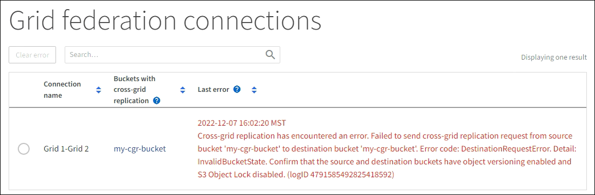

= Ver las conexiones de la federación de red
:allow-uri-read: 
:icons: font
:imagesdir: ../media/

[role="lead"]
Si su cuenta de inquilino tiene el permiso *Usar conexión de federación de red*, puede ver las conexiones permitidas.

.Antes de empezar
* La cuenta de inquilino tiene el permiso *Usar conexión de federación de red*.
* Ha iniciado sesión en el Administrador de inquilinos mediante unlink:../admin/web-browser-requirements.html["navegador web compatible"] .
* Perteneces a un grupo de usuarios que tiene lalink:tenant-management-permissions.html["Permiso de acceso root"] .

.Pasos
. Seleccione *ALMACENAMIENTO (S3)* > *Conexiones de federación de red*.
+
Aparece la página de conexión de la federación Grid e incluye una tabla que resume la siguiente información:

+
[cols="1a,2a"]
|===
| Columna | Descripción 

 a| 
Nombre de la conexión
 a| 
Las conexiones de la federación de red que este inquilino tiene permiso para utilizar.

 a| 
Cubos con replicación entre redes
 a| 
Para cada conexión de federación de red, los grupos de inquilinos que tienen habilitada la replicación entre redes.  Los objetos agregados a estos depósitos se replicarán en la otra cuadrícula de la conexión.

 a| 
Último error
 a| 
Para cada conexión de federación de red, el error más reciente que ocurrió, si lo hubo, cuando se replicaron los datos a la otra red. Ver <<clear-last-error,Borrar el último error>> .

|===
. Opcionalmente, seleccione un nombre de depósito paralink:viewing-s3-bucket-details.html["ver detalles del depósito"] .

== [[clear-last-error]]Borrar el último error

Podría aparecer un error en la columna *Último error* por uno de estos motivos:

* No se encontró la versión del objeto de origen.
* No se encontró el depósito de origen.
* Se eliminó el depósito de destino.
* El depósito de destino fue recreado por una cuenta diferente.
* El bucket de destino tiene la versión suspendida.
* El depósito de destino fue recreado por la misma cuenta pero ahora no tiene versión.

NOTE: Esta columna solo muestra el último error de replicación entre redes que ocurrió; no se mostrarán los errores anteriores que pudieran haber ocurrido.

.Pasos
. Si aparece un mensaje en la columna *Último error*, vea el texto del mensaje.
+
Por ejemplo, este error indica que el depósito de destino para la replicación entre redes estaba en un estado no válido, posiblemente porque se suspendió el control de versiones o se habilitó el bloqueo de objetos S3.

+

. Realice cualquier acción recomendada.  Por ejemplo, si se suspendió el control de versiones en el depósito de destino para la replicación entre redes, vuelva a habilitar el control de versiones para ese depósito.
. Seleccione la conexión de la tabla.
. Seleccione *Borrar error*.
. Seleccione *Sí* para borrar el mensaje y actualizar el estado del sistema.
. Espere 5-6 minutos y luego ingiera un nuevo objeto en el balde.  Confirme que el mensaje de error no vuelva a aparecer.
+

NOTE: Para garantizar que se borre el mensaje de error, espere al menos 5 minutos después de la marca de tiempo en el mensaje antes de ingerir un nuevo objeto.

. Para determinar si algún objeto no se pudo replicar debido al error del depósito, consultelink:../admin/grid-federation-retry-failed-replication.html["Identificar y reintentar operaciones de replicación fallidas"] .

