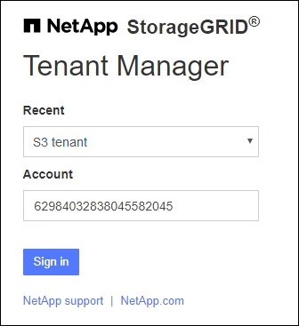

= Sign in en el Administrador de inquilinos
:allow-uri-read: 
:icons: font
:imagesdir: ../media/

[role="lead"]
Puede acceder al Administrador de inquilinos ingresando la URL del inquilino en la barra de direcciones de unlink:../admin/web-browser-requirements.html["navegador web compatible"] .

.Antes de empezar
* Tienes tus credenciales de inicio de sesión.
* Tiene una URL para acceder al Administrador de inquilinos, proporcionada por su administrador de red.  La URL se verá como uno de estos ejemplos:
+
`\https://FQDN_or_Admin_Node_IP/`

+
`\https://FQDN_or_Admin_Node_IP:port/`

+
`\https://FQDN_or_Admin_Node_IP/?accountId=20-digit-account-id`

+
`\https://FQDN_or_Admin_Node_IP:port/?accountId=20-digit-account-id`

+
La URL siempre incluye un nombre de dominio completo (FQDN), la dirección IP de un nodo de administración o la dirección IP virtual de un grupo de alta disponibilidad de nodos de administración.  También podría incluir un número de puerto, el ID de la cuenta del inquilino de 20 dígitos o ambos.

* Si la URL no incluye el ID de cuenta de 20 dígitos del inquilino, tendrá este ID de cuenta.
* Estás usando unlink:../admin/web-browser-requirements.html["navegador web compatible"] .
* Las cookies están habilitadas en su navegador web.
* Perteneces a un grupo de usuarios que tienelink:tenant-management-permissions.html["permisos de acceso específicos"] .

.Pasos
. Lanzar unlink:../admin/web-browser-requirements.html["navegador web compatible"] .
. En la barra de direcciones del navegador, ingrese la URL para acceder al Administrador de inquilinos.
. Si aparece una alerta de seguridad, instale el certificado utilizando el asistente de instalación del navegador.
. Sign in en el Administrador de inquilinos.
+
La pantalla de inicio de sesión que aparece depende de la URL ingresada y de si se ha configurado el inicio de sesión único (SSO) para StorageGRID.

+
[role="tabbed-block"]
====
.No usar SSO
--
Si StorageGRID no utiliza SSO, aparecerá una de las siguientes pantallas:

** La página de inicio de sesión de Grid Manager.  Seleccione el enlace *Inicio de sesión de inquilino*.
+
image::../media/tenant_login_link.png[Enlace de inicio de sesión del inquilino en la página de inicio de sesión de Grid Manager]

** La página de inicio de sesión del administrador de inquilinos. Es posible que el campo *Cuenta* ya esté completado, como se muestra a continuación.
+
image::../media/tenant_user_sign_in.png[Página de inicio de sesión del administrador de inquilinos]

+
... Si no se muestra el ID de cuenta de 20 dígitos del inquilino, seleccione el nombre de la cuenta del inquilino si aparece en la lista de cuentas recientes o ingrese el ID de cuenta.
... Introduzca su nombre de usuario y contraseña.
... Seleccionar * Sign in*.
+
Aparece el panel del Administrador de inquilinos.

... Si recibió una contraseña inicial de otra persona, seleccione *_nombre de usuario_* > *Cambiar contraseña* para proteger su cuenta.

--
.Usando SSO
--
Si StorageGRID utiliza SSO, aparecerá una de las siguientes pantallas:

** La página SSO de su organización. Por ejemplo:
+
image::../media/sso_organization_page.gif[Ejemplo de página de inicio de sesión de organización para SSO]

+
Ingrese sus credenciales SSO estándar y seleccione * Sign in*.

** La página de inicio de sesión SSO del administrador de inquilinos.
+

+
... Si no se muestra el ID de cuenta de 20 dígitos del inquilino, seleccione el nombre de la cuenta del inquilino si aparece en la lista de cuentas recientes o ingrese el ID de cuenta.
... Seleccionar * Sign in*.
... Sign in con sus credenciales SSO estándar en la página de inicio de sesión SSO de su organización.
+
Aparece el panel del Administrador de inquilinos.

--
====

