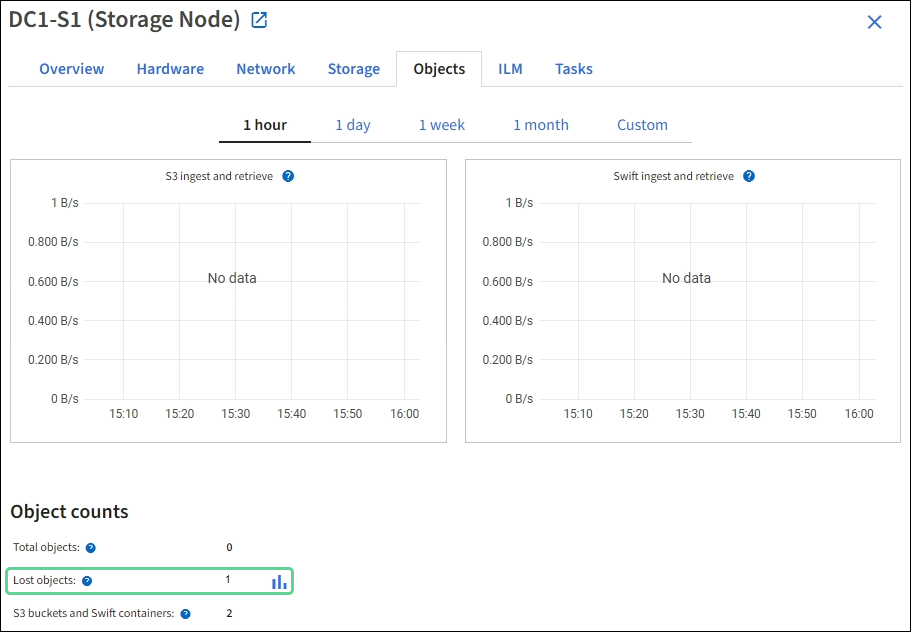

= Investigar objetos perdidos
:allow-uri-read: 
:icons: font
:imagesdir: ../media/

[role="lead"]
Cuando se activa la alerta *Objetos perdidos*, debes investigar de inmediato. Recopile información sobre los objetos afectados y comuníquese con el soporte técnico.

.Antes de empezar
* Debe iniciar sesión en Grid Manager mediante unlink:../admin/web-browser-requirements.html["navegador web compatible"] .
* Tieneslink:../admin/admin-group-permissions.html["permisos de acceso específicos"] .
* Debes tener el `Passwords.txt` archivo.

.Acerca de esta tarea
La alerta *Objetos perdidos* indica que StorageGRID cree que no hay copias de un objeto en la red. Es posible que se hayan perdido datos de forma permanente.

Investigar inmediatamente las alertas de objetos perdidos.  Es posible que sea necesario tomar medidas para evitar una mayor pérdida de datos.  En algunos casos, es posible que puedas recuperar un objeto perdido si actúas con rapidez.

.Pasos
. Seleccione *NODOS*.
. Seleccione *_Nodo de almacenamiento_* > *Objetos*.
. Revise la cantidad de objetos perdidos que se muestran en la tabla de recuento de objetos.
+
Este número indica la cantidad total de objetos que este nodo de la cuadrícula detecta como faltantes en todo el sistema StorageGRID .  El valor es la suma de los contadores de objetos perdidos del componente Almacén de datos dentro de los servicios LDR y DDS.

+

. Desde un nodo de administración,link:../audit/accessing-audit-log-file.html["acceder al registro de auditoría"] para determinar el identificador único (UUID) del objeto que activó la alerta *Objetos perdidos*:
+
.. Inicie sesión en el nodo de la red:
+
... Introduzca el siguiente comando: `ssh admin@grid_node_IP`
... Introduzca la contraseña que aparece en el `Passwords.txt` archivo.
... Introduzca el siguiente comando para cambiar a root: `su -`
... Introduzca la contraseña que aparece en el `Passwords.txt` archivo.  Cuando inicia sesión como root, el mensaje cambia de `$` a `#` .

.. Cambie al directorio donde se encuentran los registros de auditoría.
+
--
El directorio del registro de auditoría y los nodos aplicables dependen de la configuración de destino de auditoría.

[cols="1a,2a"]
|===
| Opción | Destino 

 a| 
Nodos locales (predeterminado)
 a| 
`/var/local/log/localaudit.log`

 a| 
Nodos de administración/nodos locales
 a| 
*** Nodos de administración (principales y no principales): `/var/local/audit/export/audit.log`
*** Todos los nodos: El `/var/local/log/localaudit.log` En este modo, el archivo normalmente está vacío o falta.

 a| 
Servidor syslog externo
 a| 
`/var/local/log/localaudit.log`

|===
Dependiendo de la configuración de destino de su auditoría, ingrese: `cd /var/local/log` o `/var/local/audit/export/`

Para obtener más información, consultelink:../monitor/configure-audit-messages.html#select-audit-information-destinations["Seleccionar destinos de información de auditoría"] .

--
.. Utilice grep para extraer los mensajes de auditoría de Objeto Perdido (OLST).  Ingresar: `grep OLST audit_file_name`
.. Tenga en cuenta el valor UUID incluido en el mensaje.
+
[listing]
----
Admin: # grep OLST audit.log
2020-02-12T19:18:54.780426 [AUDT:[CBID(UI64):0x38186FE53E3C49A5][UUID(CSTR):"926026C4-00A4-449B-AC72-BCCA72DD1311"]
[PATH(CSTR):"source/cats"][NOID(UI32):12288733][VOLI(UI64):3222345986][RSLT(FC32):NONE][AVER(UI32):10]
[ATIM(UI64):1581535134780426][ATYP(FC32):OLST][ANID(UI32):12448208][AMID(FC32):ILMX][ATID(UI64):7729403978647354233]]
----

. Busque los metadatos del objeto perdido utilizando el UUID:
+
.. Seleccione *ILM* > *Búsqueda de metadatos de objetos*.
.. Ingrese el UUID y seleccione *Buscar*.
.. Revise las ubicaciones en los metadatos y tome la acción adecuada:
+
[cols="2a,4a"]
|===
| Metadatos | Conclusión 

 a| 
Objeto <object_identifier> no encontrado
 a| 
Si no se encuentra el objeto, se devuelve el mensaje "ERROR":"".

Si no se encuentra el objeto, puede restablecer el recuento de *Objetos perdidos* para borrar la alerta. La falta de un objeto indica que el objeto fue eliminado intencionalmente.

 a| 
Ubicaciones > 0
 a| 
Si hay ubicaciones enumeradas en la salida, la alerta *Objetos perdidos* podría ser un falso positivo.

Confirmar que los objetos existen.  Utilice el ID de nodo y la ruta de archivo que aparecen en la salida para confirmar que el archivo de objeto se encuentra en la ubicación indicada.

(El procedimiento paralink:searching-for-and-restoring-potentially-lost-objects.html["buscando objetos potencialmente perdidos"] (Explica cómo utilizar el ID de nodo para encontrar el nodo de almacenamiento correcto).

Si los objetos existen, puede restablecer el recuento de *Objetos perdidos* para borrar la alerta.

 a| 
Ubicaciones = 0
 a| 
Si no hay ubicaciones enumeradas en la salida, es posible que el objeto no esté presente. Puedes intentarlolink:searching-for-and-restoring-potentially-lost-objects.html["buscar y restaurar el objeto"] usted mismo o puede ponerse en contacto con el soporte técnico.

Es posible que el soporte técnico le pida que determine si hay un procedimiento de recuperación de almacenamiento en curso.  Ver la información sobrelink:../maintain/restoring-volume.html["Restaurar datos de objetos mediante Grid Manager"] ylink:../maintain/restoring-object-data-to-storage-volume.html["restaurar datos de objetos a un volumen de almacenamiento"] .

|===

