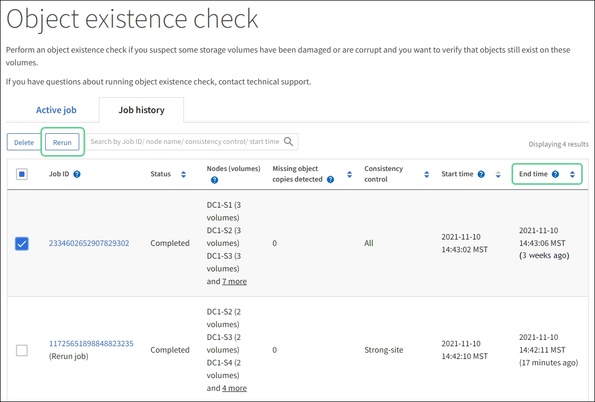

= Verificar la integridad del objeto
:allow-uri-read: 
:icons: font
:imagesdir: ../media/

[role="lead"]
El sistema StorageGRID verifica la integridad de los datos de los objetos en los nodos de almacenamiento, comprobando si hay objetos dañados o faltantes.

Hay dos procesos de verificación: verificación en segundo plano y verificación de existencia de objetos (antes llamada verificación en primer plano).  Trabajan juntos para garantizar la integridad de los datos.  La verificación de antecedentes se ejecuta automáticamente y verifica continuamente la exactitud de los datos del objeto.  Un usuario puede activar la verificación de existencia de objetos para verificar más rápidamente la existencia (aunque no la exactitud) de los objetos.

== ¿Qué es la verificación de antecedentes?

El proceso de verificación en segundo plano verifica de manera automática y continua los nodos de almacenamiento en busca de copias corruptas de datos de objetos e intenta reparar automáticamente cualquier problema que encuentre.

La verificación de antecedentes verifica la integridad de los objetos replicados y los objetos codificados por borrado, de la siguiente manera:

* *Objetos replicados*: si el proceso de verificación en segundo plano encuentra un objeto replicado que está dañado, la copia dañada se elimina de su ubicación y se pone en cuarentena en otro lugar del nodo de almacenamiento.  Luego, se genera una nueva copia no dañada y se coloca para satisfacer las políticas ILM activas.  Es posible que la nueva copia no se coloque en el nodo de almacenamiento que se utilizó para la copia original.

NOTE: Los datos de objetos dañados se ponen en cuarentena en lugar de eliminarse del sistema, de modo que aún se pueda acceder a ellos.  Para obtener más información sobre cómo acceder a los datos de objetos en cuarentena, comuníquese con el soporte técnico.

* *Objetos con código de borrado*: si el proceso de verificación en segundo plano detecta que un fragmento de un objeto con código de borrado está dañado, StorageGRID intenta automáticamente reconstruir el fragmento faltante en su lugar en el mismo nodo de almacenamiento, utilizando los datos restantes y los fragmentos de paridad.  Si no se puede reconstruir el fragmento dañado, se intenta recuperar otra copia del objeto.  Si la recuperación es exitosa, se realiza una evaluación ILM para crear una copia de reemplazo del objeto codificado por borrado.
+
El proceso de verificación de fondo verifica objetos únicamente en los nodos de almacenamiento.  No verifica objetos en un grupo de almacenamiento en la nube.  Los objetos deben tener más de cuatro días para calificar para la verificación de antecedentes.

La verificación de antecedentes se ejecuta a un ritmo continuo que está diseñado para no interferir con las actividades normales del sistema.  La verificación de antecedentes no se puede detener.  Sin embargo, puede aumentar la tasa de verificación de fondo para verificar más rápidamente el contenido de un nodo de almacenamiento si sospecha que hay un problema.

=== Alertas relacionadas con la verificación de antecedentes

Si el sistema detecta un objeto corrupto que no puede corregir automáticamente (porque la corrupción impide identificar el objeto), se activa la alerta *Objeto corrupto no identificado detectado*.

Si la verificación de antecedentes no puede reemplazar un objeto dañado porque no puede localizar otra copia, se activa la alerta *Objetos perdidos*.

=== Cambiar la tasa de verificación de antecedentes

Puede cambiar la velocidad a la que la verificación de fondo verifica los datos de objetos replicados en un nodo de almacenamiento si tiene inquietudes sobre la integridad de los datos.

.Antes de empezar
* Debe iniciar sesión en Grid Manager mediante unlink:../admin/web-browser-requirements.html["navegador web compatible"] .
* Tieneslink:../admin/admin-group-permissions.html["permisos de acceso específicos"] .

.Acerca de esta tarea
Puede cambiar la tasa de verificación para la verificación de antecedentes en un nodo de almacenamiento:

* Adaptable: configuración predeterminada.  La tarea está diseñada para verificar a un máximo de 4 MB/s o 10 objetos/s (lo que se exceda primero).
* Alto: la verificación del almacenamiento se realiza rápidamente, a un ritmo que puede ralentizar las actividades normales del sistema.

Utilice la tasa de verificación alta solo cuando sospeche que una falla de hardware o software podría haber dañado los datos del objeto.  Una vez completada la verificación de antecedentes de alta prioridad, la tasa de verificación se restablece automáticamente a Adaptable.

.Pasos
. Seleccione *SOPORTE* > *Herramientas* > *Topología de cuadrícula*.
. Seleccione *_Nodo de almacenamiento_* > *LDR* > *Verificación*.
. Seleccione *Configuración* > *Principal*.
. Vaya a *LDR* > *Verificación* > *Configuración* > *Principal*.
. En Verificación de antecedentes, seleccione *Tasa de verificación* > *Alta* o *Tasa de verificación* > *Adaptativa*.
+
image::../media/background_verification_rate.png[Configuración de la tasa de verificación]

. Haga clic en *Aplicar cambios*.
. Supervisar los resultados de la verificación en segundo plano de los objetos replicados.
+
.. Vaya a *NODOS* > *_Nodo de almacenamiento_* > *Objetos*.
.. En la sección Verificación, supervise los valores de *Objetos corruptos* y *Objetos corruptos no identificados*.
+
Si la verificación en segundo plano encuentra datos de objetos replicados corruptos, se incrementa la métrica *Objetos corruptos* y StorageGRID intenta extraer el identificador del objeto de los datos, de la siguiente manera:

+
*** Si se puede extraer el identificador del objeto, StorageGRID crea automáticamente una nueva copia de los datos del objeto.  La nueva copia se puede realizar en cualquier lugar del sistema StorageGRID que satisfaga las políticas ILM activas.
*** Si no se puede extraer el identificador del objeto (porque está dañado), se incrementa la métrica *Objetos dañados no identificados* y se activa la alerta *Objeto dañado no identificado detectado*.

.. Si se encuentran datos de objetos replicados dañados, comuníquese con el soporte técnico para determinar la causa raíz de la corrupción.

. Supervisar los resultados de la verificación de antecedentes para objetos con código de borrado.
+
Si la verificación de fondo encuentra fragmentos corruptos de datos de objetos codificados para borrado, se incrementa el atributo Fragmentos corruptos detectados.  StorageGRID se recupera reconstruyendo el fragmento dañado en el mismo nodo de almacenamiento.

+
.. Seleccione *SOPORTE* > *Herramientas* > *Topología de cuadrícula*.
.. Seleccione *_Nodo de almacenamiento_* > *LDR* > *Codificación de borrado*.
.. En la tabla Resultados de verificación, supervise el atributo Fragmentos corruptos detectados (ECCD).

. Una vez que el sistema StorageGRID haya restaurado automáticamente los objetos corruptos, restablezca el recuento de objetos corruptos.
+
.. Seleccione *SOPORTE* > *Herramientas* > *Topología de cuadrícula*.
.. Seleccione *_Nodo de almacenamiento_* > *LDR* > *Verificación* > *Configuración*.
.. Seleccione *Restablecer recuento de objetos corruptos*.
.. Haga clic en *Aplicar cambios*.

. Si está seguro de que los objetos en cuarentena no son necesarios, puede eliminarlos.
+

NOTE: Si se activó la alerta *Objetos perdidos*, es posible que el soporte técnico desee acceder a los objetos en cuarentena para ayudar a depurar el problema subyacente o intentar recuperar datos.

+
.. Seleccione *SOPORTE* > *Herramientas* > *Topología de cuadrícula*.
.. Seleccione *_Nodo de almacenamiento_* > *LDR* > *Verificación* > *Configuración*.
.. Seleccione *Eliminar objetos en cuarentena*.
.. Seleccione *Aplicar cambios*.

== ¿Qué es la comprobación de existencia de objetos?

La verificación de existencia de objetos verifica si todas las copias replicadas esperadas de objetos y fragmentos codificados de borrado existen en un nodo de almacenamiento.  La verificación de existencia de objetos no verifica los datos del objeto en sí (la verificación en segundo plano lo hace); en cambio, proporciona una manera de verificar la integridad de los dispositivos de almacenamiento, especialmente si un problema de hardware reciente pudo haber afectado la integridad de los datos.

A diferencia de la verificación de antecedentes, que se realiza automáticamente, debe iniciar manualmente un trabajo de verificación de existencia de objetos.

La verificación de existencia de objetos lee los metadatos de cada objeto almacenado en StorageGRID y verifica la existencia de copias de objetos replicados y fragmentos de objetos codificados para borrado.  Cualquier dato faltante se gestiona de la siguiente manera:

* *Copias replicadas*: si falta una copia de los datos del objeto replicado, StorageGRID intenta automáticamente reemplazar la copia desde una copia almacenada en otra parte del sistema.  El nodo de almacenamiento ejecuta una copia existente a través de una evaluación ILM, que determinará que la política ILM actual ya no se cumple para este objeto porque falta otra copia.  Se genera una nueva copia y se coloca para satisfacer las políticas ILM activas del sistema.  Es posible que esta nueva copia no esté colocada en el mismo lugar donde se almacenó la copia faltante.
* *Fragmentos codificados por borrado*: si falta un fragmento de un objeto codificado por borrado, StorageGRID intenta automáticamente reconstruir el fragmento faltante en su lugar en el mismo nodo de almacenamiento usando los fragmentos restantes.  Si el fragmento faltante no se puede reconstruir (porque se han perdido demasiados fragmentos), ILM intenta encontrar otra copia del objeto, que puede usar para generar un nuevo fragmento con código de borrado.

=== Ejecutar comprobación de existencia de objeto

Crea y ejecuta un trabajo de verificación de existencia de objeto a la vez.  Cuando crea un trabajo, selecciona los nodos de almacenamiento y los volúmenes que desea verificar.  También selecciona la consistencia del trabajo.

.Antes de empezar
* Ha iniciado sesión en Grid Manager mediante unlink:../admin/web-browser-requirements.html["navegador web compatible"] .
* Tú tienes ellink:../admin/admin-group-permissions.html["Permiso de mantenimiento o acceso root"] .
* Se ha asegurado de que los nodos de almacenamiento que desea comprobar estén en línea. Seleccione *NODOS* para ver la tabla de nodos. Asegúrese de que no aparezcan íconos de alerta junto al nombre del nodo que desea verificar.
* Se ha asegurado de que los siguientes procedimientos *no* se estén ejecutando en los nodos que desea comprobar:
+
** Expansión de la red para agregar un nodo de almacenamiento
** Desmantelamiento del nodo de almacenamiento
** Recuperación de un volumen de almacenamiento fallido
** Recuperación de un nodo de almacenamiento con una unidad de sistema defectuosa
** Reequilibrio de la CE
** Clon de nodo de dispositivo

La verificación de existencia de objetos no proporciona información útil mientras estos procedimientos están en curso.

.Acerca de esta tarea
Una tarea de verificación de existencia de un objeto puede tardar días o semanas en completarse, dependiendo de la cantidad de objetos en la cuadrícula, los nodos y volúmenes de almacenamiento seleccionados y la consistencia seleccionada.  Puede ejecutar solo un trabajo a la vez, pero puede seleccionar varios nodos de almacenamiento y volúmenes al mismo tiempo.

.Pasos
. Seleccione *MANTENIMIENTO* > *Tareas* > *Comprobación de existencia de objetos*.
. Seleccione *Crear trabajo*.  Aparece el asistente para crear un trabajo de verificación de existencia de objetos.
. Seleccione los nodos que contienen los volúmenes que desea verificar.  Para seleccionar todos los nodos en línea, seleccione la casilla de verificación *Nombre del nodo* en el encabezado de la columna.
+
Puede buscar por nombre de nodo o sitio.

+
No puedes seleccionar nodos que no estén conectados a la red.

. Seleccione *Continuar*.
. Seleccione uno o más volúmenes para cada nodo de la lista.  Puede buscar volúmenes utilizando el número de volumen de almacenamiento o el nombre del nodo.
+
Para seleccionar todos los volúmenes de cada nodo seleccionado, seleccione la casilla de verificación *Volumen de almacenamiento* en el encabezado de la columna.

. Seleccione *Continuar*.
. Seleccione la consistencia para el trabajo.
+
La consistencia determina cuántas copias de metadatos del objeto se utilizan para la verificación de existencia del objeto.

+
** *Sitio fuerte*: Dos copias de metadatos en un solo sitio.
** *Fuerte-global*: Dos copias de metadatos en cada sitio.
** *Todos* (predeterminado): las tres copias de metadatos en cada sitio.
+
Para obtener más información sobre la consistencia, consulte las descripciones en el asistente.

. Seleccione *Continuar*.
. Revise y verifique sus selecciones.  Puede seleccionar *Anterior* para ir a un paso anterior en el asistente para actualizar sus selecciones.
+
Se genera un trabajo de verificación de existencia de objeto y se ejecuta hasta que ocurre una de las siguientes situaciones:

+
** El trabajo está terminado.
** Pausa o cancela el trabajo.  Puedes reanudar un trabajo que hayas pausado, pero no puedes reanudar un trabajo que hayas cancelado.
** El trabajo se estanca.  Se activa la alerta *La comprobación de existencia del objeto se ha estancado*.  Siga las acciones correctivas especificadas para la alerta.
** El trabajo falla.  Se activa la alerta *La comprobación de existencia del objeto ha fallado*.  Siga las acciones correctivas especificadas para la alerta.
** Aparece un mensaje de "Servicio no disponible" o "Error interno del servidor".  Después de un minuto, actualice la página para continuar monitoreando el trabajo.
+

NOTE: Según sea necesario, puede salir de la página de verificación de existencia de objetos y regresar para continuar monitoreando el trabajo.

. A medida que se ejecuta el trabajo, observe la pestaña *Trabajo activo* y anote el valor de Copias de objetos faltantes detectadas.
+
Este valor representa el número total de copias faltantes de objetos replicados y objetos con código de borrado con uno o más fragmentos faltantes.

+
Si la cantidad de copias de objetos faltantes detectadas es mayor a 100, es posible que haya un problema con el almacenamiento del nodo de almacenamiento.

+
image::../media/oec_active.png[Trabajo activo de la OEC]

. Una vez finalizado el trabajo, tome las medidas adicionales necesarias:
+
** Si las copias de objetos faltantes detectadas son cero, entonces no se encontraron problemas.  No se requiere ninguna acción
** Si la cantidad de copias de objetos faltantes detectadas es mayor que cero y no se ha activado la alerta *Objetos perdidos*, el sistema habrá reparado todas las copias faltantes. Verifique que se hayan corregido todos los problemas de hardware para evitar daños futuros a las copias de objetos.
** Si la cantidad de copias de objetos faltantes detectadas es mayor que cero y se ha activado la alerta *Objetos perdidos*, la integridad de los datos podría verse afectada. Póngase en contacto con el soporte técnico.
** Puede investigar copias de objetos perdidos utilizando grep para extraer los mensajes de auditoría de LLST: `grep LLST audit_file_name` .
+
Este procedimiento es similar al delink:../troubleshoot/investigating-lost-objects.html["investigando objetos perdidos"] , aunque para las copias de objetos se busca `LLST` en lugar de `OLST` .

. Si seleccionó la consistencia de sitio fuerte o global fuerte para el trabajo, espere aproximadamente tres semanas para que haya consistencia de metadatos y luego vuelva a ejecutar el trabajo en los mismos volúmenes.
+
Cuando StorageGRID haya tenido tiempo de lograr la consistencia de metadatos para los nodos y volúmenes incluidos en el trabajo, volver a ejecutar el trabajo podría borrar copias de objetos faltantes informadas erróneamente o hacer que se verifiquen copias de objetos adicionales si se omitieron.

+
.. Seleccione *MANTENIMIENTO* > *Verificación de existencia de objetos* > *Historial de trabajos*.
.. Determinar qué trabajos están listos para volver a ejecutarse:
+
... Mire la columna *Hora de finalización* para determinar qué trabajos se ejecutaron hace más de tres semanas.
... Para esos trabajos, escanee la columna de control de consistencia en busca de sitios fuertes o globales fuertes.

.. Seleccione la casilla de verificación para cada trabajo que desee volver a ejecutar y luego seleccione *Reejecutar*.
+

.. En el asistente para volver a ejecutar trabajos, revise los nodos y volúmenes seleccionados y la consistencia.
.. Cuando esté listo para volver a ejecutar los trabajos, seleccione *Reejecutar*.

Aparece la pestaña Trabajo activo.  Todos los trabajos que seleccionó se vuelven a ejecutar como un solo trabajo con una consistencia de sitio sólido.  Un campo *Trabajos relacionados* en la sección Detalles enumera los ID de los trabajos originales.

.Después de terminar
Si aún tiene inquietudes sobre la integridad de los datos, vaya a *SOPORTE* > *Herramientas* > *Topología de cuadrícula* > *_sitio_* > *_Nodo de almacenamiento_* > *LDR* > *Verificación* > *Configuración* > *Principal* y aumente la tasa de verificación en segundo plano.  La verificación de antecedentes verifica la exactitud de todos los datos de los objetos almacenados y repara cualquier problema que encuentre.  Encontrar y reparar problemas potenciales lo más rápido posible reduce el riesgo de pérdida de datos.
