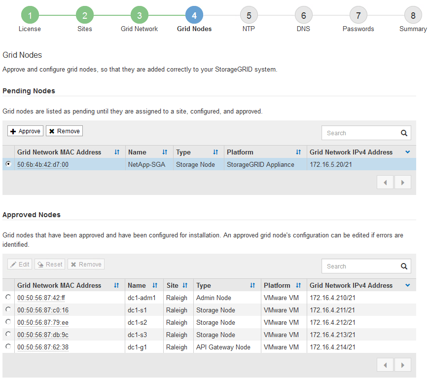

= Aprobar nodos de red pendientes
:allow-uri-read: 
:icons: font
:imagesdir: ../media/

[role="lead"]
Debe aprobar cada nodo de la red antes de que pueda unirse al sistema StorageGRID .

.Antes de empezar
Ha implementado todos los nodos de red del dispositivo virtual y StorageGRID .

NOTE: Es más eficiente realizar una única instalación de todos los nodos, en lugar de instalar algunos nodos ahora y otros más tarde.

.Pasos
. Revise la lista de Nodos pendientes y confirme que muestra todos los nodos de la red que implementó.
+

NOTE: Si falta un nodo de la red, confirme que se haya implementado correctamente y que tenga la IP de red de la red correcta del nodo de administración principal configurada para ADMIN_IP.

. Seleccione el botón de opción junto al nodo pendiente que desea aprobar.
+

. Haga clic en *Aprobar*.
. En Configuración general, modifique la configuración de las siguientes propiedades, según sea necesario:
+
** *Sitio*: El nombre del sistema del sitio para este nodo de la cuadrícula.
** *Nombre*: El nombre del sistema para el nodo.  El nombre predeterminado es el nombre que especificó cuando configuró el nodo.
+
Los nombres de sistema son necesarios para las operaciones internas de StorageGRID y no se pueden cambiar después de completar la instalación.  Sin embargo, durante este paso del proceso de instalación, puede cambiar los nombres del sistema según sea necesario.

** *Rol NTP*: El rol del Protocolo de tiempo de red (NTP) del nodo de la red.  Las opciones son *Automático*, *Principal* y *Cliente*.  Al seleccionar *Automático* se asigna la función principal a los nodos de administración, nodos de almacenamiento con servicios ADC, nodos de puerta de enlace y cualquier nodo de red que tenga direcciones IP no estáticas.  A todos los demás nodos de la red se les asigna el rol de Cliente.
+

NOTE: Asegúrese de que al menos dos nodos en cada sitio puedan acceder al menos a cuatro fuentes NTP externas.  Si solo un nodo en un sitio puede acceder a las fuentes NTP, se producirán problemas de sincronización si ese nodo deja de funcionar.  Además, designar dos nodos por sitio como fuentes NTP primarias garantiza una sincronización precisa si un sitio está aislado del resto de la red.

** *Tipo de almacenamiento* (solo nodos de almacenamiento): especifique que un nuevo nodo de almacenamiento se use exclusivamente para datos únicamente, solo metadatos o ambos.  Las opciones son *Datos y metadatos* ("combinados"), *Solo datos* y *Solo metadatos*.
+

CAUTION: Verlink:../primer/what-storage-node-is.html#types-of-storage-nodes["Tipos de nodos de almacenamiento"] para obtener información sobre los requisitos para estos tipos de nodos.

** *Servicio ADC* (solo nodos de almacenamiento): seleccione *Automático* para permitir que el sistema determine si el nodo requiere el servicio de controlador de dominio administrativo (ADC). El servicio ADC realiza un seguimiento de la ubicación y la disponibilidad de los servicios de la red. Al menos tres nodos de almacenamiento en cada sitio deben incluir el servicio ADC.  No se puede agregar el servicio ADC a un nodo después de implementarlo.

. En Grid Network, modifique la configuración de las siguientes propiedades según sea necesario:
+
** *Dirección IPv4 (CIDR)*: La dirección de red CIDR para la interfaz de red Grid (eth0 dentro del contenedor).  Por ejemplo: 192.168.1.234/21
** *Puerta de enlace*: La puerta de enlace de la red Grid.  Por ejemplo: 192.168.0.1
+
La puerta de enlace es necesaria si hay varias subredes de la red.

+

NOTE: Si seleccionó DHCP para la configuración de la red Grid y cambia el valor aquí, el nuevo valor se configurará como una dirección estática en el nodo.  Debe asegurarse de que la dirección IP configurada no esté dentro de un grupo de direcciones DHCP.

. Si desea configurar la red de administración para el nodo de la red, agregue o actualice las configuraciones en la sección Red de administración según sea necesario.
+
Introduzca las subredes de destino de las rutas que salen de esta interfaz en el cuadro de texto *Subredes (CIDR)*.  Si hay varias subredes de administración, se requiere la puerta de enlace de administración.

+

NOTE: Si seleccionó DHCP para la configuración de la red de administración y cambia el valor aquí, el nuevo valor se configurará como una dirección estática en el nodo.  Debe asegurarse de que la dirección IP configurada no esté dentro de un grupo de direcciones DHCP.

+
*Dispositivos:* Para un dispositivo StorageGRID , si la red de administración no se configuró durante la instalación inicial mediante el instalador de dispositivos StorageGRID , no se podrá configurar en este cuadro de diálogo Administrador de red.  En su lugar, debes seguir estos pasos:

+
.. Reinicie el dispositivo: en el Instalador del dispositivo, seleccione *Avanzado* > *Reiniciar*.
+
El reinicio puede tardar varios minutos.

.. Seleccione *Configurar redes* > *Configuración de enlace* y habilite las redes adecuadas.
.. Seleccione *Configurar redes* > *Configuración IP* y configure las redes habilitadas.
.. Regrese a la página de inicio y haga clic en *Iniciar instalación*.
.. En el Administrador de cuadrícula: si el nodo figura en la tabla Nodos aprobados, elimine el nodo.
.. Eliminar el nodo de la tabla Nodos pendientes.
.. Espere a que el nodo vuelva a aparecer en la lista de Nodos pendientes.
.. Confirme que puede configurar las redes adecuadas.  Ya deberían estar completados con la información proporcionada en la página de Configuración de IP del Instalador del dispositivo.
+
Para obtener información adicional, consulte la https://docs.netapp.com/us-en/storagegrid-appliances/installconfig/index.html["Inicio rápido para la instalación de hardware"^] para localizar instrucciones para su electrodoméstico.

. Si desea configurar la red de cliente para el nodo de la red, agregue o actualice las configuraciones en la sección Red de cliente según sea necesario.  Si la red del cliente está configurada, se requiere la puerta de enlace y se convierte en la puerta de enlace predeterminada para el nodo después de la instalación.
+

NOTE: Si seleccionó DHCP para la configuración de la red del cliente y cambia el valor aquí, el nuevo valor se configurará como una dirección estática en el nodo.  Debe asegurarse de que la dirección IP configurada no esté dentro de un grupo de direcciones DHCP.

+
*Dispositivos:* Para un dispositivo StorageGRID , si la red del cliente no se configuró durante la instalación inicial mediante el instalador del dispositivo StorageGRID , no se podrá configurar en este cuadro de diálogo Administrador de Grid.  En su lugar, debes seguir estos pasos:

+
.. Reinicie el dispositivo: en el Instalador del dispositivo, seleccione *Avanzado* > *Reiniciar*.
+
El reinicio puede tardar varios minutos.

.. Seleccione *Configurar redes* > *Configuración de enlace* y habilite las redes adecuadas.
.. Seleccione *Configurar redes* > *Configuración IP* y configure las redes habilitadas.
.. Regrese a la página de inicio y haga clic en *Iniciar instalación*.
.. En el Administrador de cuadrícula: si el nodo figura en la tabla Nodos aprobados, elimine el nodo.
.. Eliminar el nodo de la tabla Nodos pendientes.
.. Espere a que el nodo vuelva a aparecer en la lista de Nodos pendientes.
.. Confirme que puede configurar las redes adecuadas.  Ya deberían estar completados con la información proporcionada en la página de Configuración de IP del Instalador del dispositivo.
+
Para obtener información sobre cómo instalar dispositivos StorageGRID , consulte la https://docs.netapp.com/us-en/storagegrid-appliances/installconfig/index.html["Inicio rápido para la instalación de hardware"^] para localizar instrucciones para su electrodoméstico.

. Haga clic en *Guardar*.
+
La entrada del nodo de la cuadrícula se mueve a la lista de Nodos aprobados.

+
image::../media/7_gmi_installer_grid_nodes_approved.gif[Esta imagen está explicada por el texto que la rodea.]

. Repita estos pasos para cada nodo de cuadrícula pendiente que desee aprobar.
+
Debes aprobar todos los nodos que quieras en la red.  Sin embargo, puede regresar a esta página en cualquier momento antes de hacer clic en *Instalar* en la página Resumen.  Puede modificar las propiedades de un nodo de cuadrícula aprobado seleccionando su botón de opción y haciendo clic en *Editar*.

. Cuando haya terminado de aprobar los nodos de la cuadrícula, haga clic en *Siguiente*.

